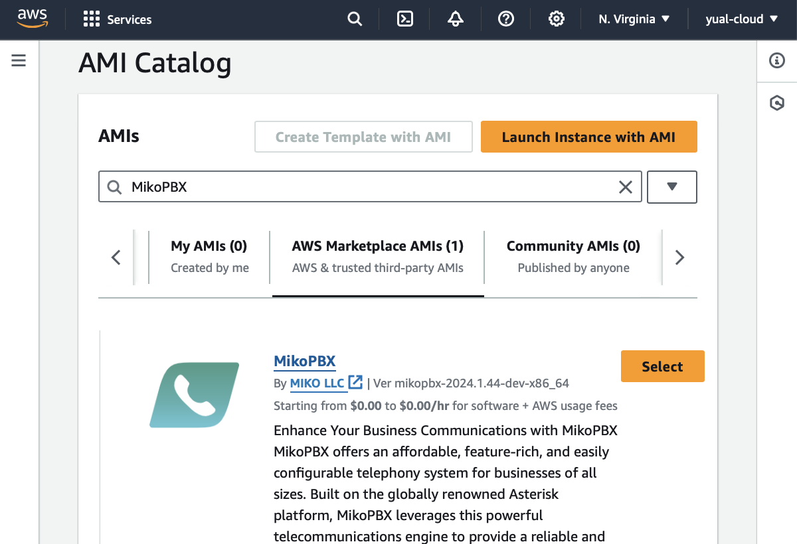

# AWS Marketplace

Sign in to the service Amazon Web Services [https://aws.amazon.com](https://aws.amazon.com/)

Let's get started with the setup


For quick and convenient navigation within the Amazon service, use the search panel


### Creating a virtual machine 

1. Open Services / Compute / **EC2** and navigate to Images / AMI Catalog
2. In the open tab enter **MikoPBX** in the search bar
3. In the AWS Marketplace AMIs section select the MikoPBX image by clicking the **Select** button
4. Click the **Launch an instance from AMI** button to create a virtual machine

<figure><figcaption></figcaption></figure>

5. Enter the virtual machine name, for example _mikopbx-vm_

<figure><figcaption></figcaption></figure>

If you have an SSH key

6. Specify the SSH key in the Key pair field

If you don't have an SSH key

6. Select **Create new key pair** and specify the key pair name, for example _mikopbx\_key_

<figure><figcaption></figcaption></figure>

<figure><figcaption></figcaption></figure>

Follow the instructions further


To deploy the PBX use **two** disks:

* A **1 Gb** disk for the main system
* A **50+ Gb** disk for storing call recordings


7. If necessary, change the size of the storage disk in Configure storage, default size is 50Gb

<figure><figcaption></figcaption></figure>

8. For other fields use default values
9. Click **Launch instance**

<figure><figcaption></figcaption></figure>

### Starting MikoPBX 

1. Go to the created virtual machine _mikopbx-vm_
2. On the opened tab, select Connect / EC2 serial console, wait for the system to fully load until the authentication parameters are displayed

<figure><figcaption></figcaption></figure>

3. Copy the external address of the created virtual machine and enter it in the browser's address bar
4. Use the login and password provided in EC2 serial console for login

<figure><figcaption></figcaption></figure>


Make sure to configure the Firewall on the MikoPBX

