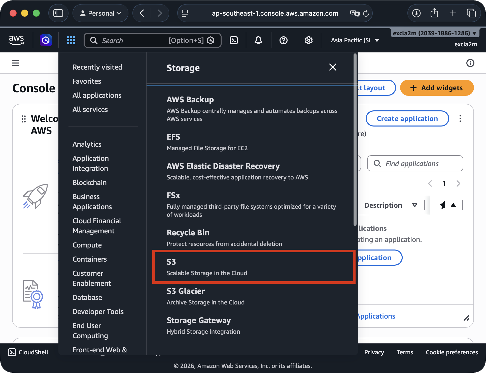
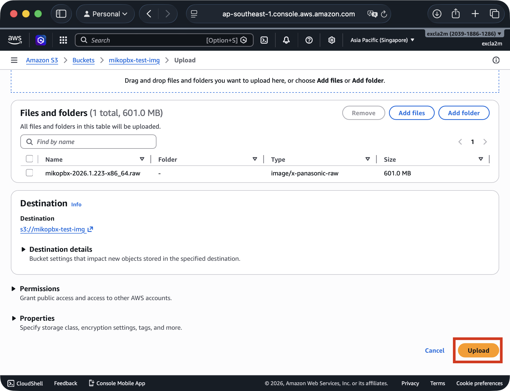
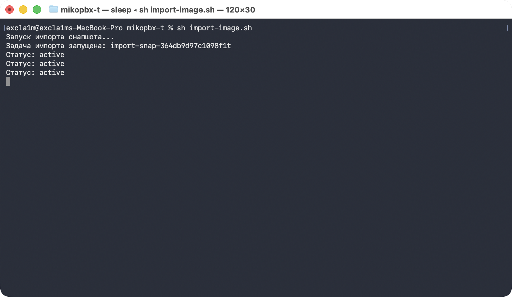

# AWS terraform скрипт (In dev)

Данное руководство описывает развёртывание MikoPBX в AWS по принципу **Infrastructure as Code (IaC)** с помощью Terraform. Вся инфраструктура: EC2-инстанс, сетевые правила, диски и IP-адрес - описывается декларативно в коде, что обеспечивает воспроизводимость, версионирование и возможность быстрого повторного развёртывания в любом окружении.

Общий процесс:

```
Скачать .raw  →  Загрузить в S3  →  Импортировать как AMI  →  Развернуть через Terraform
```


Импорт образа в AMI нельзя выполнить средствами Terraform напрямую — AWS не поддерживает этот процесс через Terraform-провайдер. Для импорта используется отдельный bash-скрипт, после чего Terraform использует созданный AMI.


### Предварительные требования

* **Terraform** >= 1.3.0
* **AWS CLI** настроенный с ключами доступа (`aws configure`)
* **Bash** (macOS / Linux)
* Права IAM: `ec2:*`, `s3:*`, `iam:CreateRole`, `iam:PutRolePolicy`

#### Настройка AWS CLI

```bash
aws configure
# AWS Access Key ID: ваш_ключ
# AWS Secret Access Key: ваш_секретный_ключ
# Default region name: us-southeast-1 (Ваш регион)
# Default output format: json
```

***

### Загрузка образа в S3 хранилище

1. Перейдите на страницу релизов MikoPBX: [https://github.com/mikopbx/Core/releases](https://github.com/mikopbx/Core/releases)&#x20;

Скачайте актуальный образ с расширением `.raw`

2. Перейдите в [консоль](https://console.aws.amazon.com) Amazon Web Services.

<figure><figcaption><p>Консоль Amazon Web Services</p></figcaption></figure>

3. Далее перейдите в "**Services**" -> "**Storage**" -> "**S3**"**.**

<figure><figcaption><p>Раздел "S3" в консоли MikoPBX</p></figcaption></figure>

4. Нажмите "**Create bucket**". Введите уникальное имя бакета (поле "**Bucket name**"). Для других полей используйте значения по умолчанию.

Подтвердите создание бакета, нажав на "**Create bucket**".

<figure><figcaption><p>Создание бакета для хранения образа</p></figcaption></figure>

5. Перейдите в созданный бакет, нажав на его название. Далее нажмите на "**Upload**" и выберите файл образа диска с расширением "**.raw**".

Для подтверждения, нажмите "**Upload**".

<figure><figcaption><p>Загрузка файла в бакет</p></figcaption></figure>

***

### Настройка IAM-роли для импорта

AWS требует специальную IAM-роль `vmimport` для импорта образов. Выполните эти шаги **один раз** для аккаунта.

Создайте файл `trust-policy.json` со следующим содержанием:

```json
{
  "Version": "2012-10-17",
  "Statement": [
    {
      "Effect": "Allow",
      "Principal": { "Service": "vmie.amazonaws.com" },
      "Action": "sts:AssumeRole",
      "Condition": {
        "StringEquals": { "sts:Externalid": "vmimport" }
      }
    }
  ]
}
```

Создайте файл `role-policy.json` со следующим содержанием:

> Замените `mikopbx-bucket` на имя вашего S3-бакета.

<pre class="language-json"><code class="lang-json">{
  "Version": "2012-10-17",
  "Statement": [
    {
      "Effect": "Allow",
      "Action": [
        "s3:GetBucketLocation",
        "s3:GetObject",
        "s3:ListBucket"
      ],
      "Resource": [
        "arn:aws:s3:::<a data-footnote-ref href="#user-content-fn-1">mikopbx-bucket</a>",
        "arn:aws:s3:::<a data-footnote-ref href="#user-content-fn-1">mikopbx-bucket</a>/*"
      ]
    },
    {
      "Effect": "Allow",
      "Action": [
        "ec2:ModifySnapshotAttribute",
        "ec2:CopySnapshot",
        "ec2:RegisterImage",
        "ec2:Describe*"
      ],
      "Resource": "*"
    }
  ]
}
</code></pre>

Выполните следующие команды для применения описанных политик:

```bash
# Создать роль
aws iam create-role \
  --role-name vmimport \
  --assume-role-policy-document "file://trust-policy.json"
```

```bash
# Привязать политику к роли
aws iam put-role-policy \
  --role-name vmimport \
  --policy-name vmimport \
  --policy-document "file://role-policy.json"
```

***

### Импорт образа как AMI

Сохраните скрипт ниже как `import-image.sh` и отредактируйте переменные `DEFAULT_BUCKET`, `DEFAULT_IMAGE`, `DEFAULT_NAME`

#### `import-image.sh`

```bash
#!/bin/bash

# -----------------------------------------------
# Настройки — измените под ваши значения
# -----------------------------------------------
DEFAULT_IMAGE="mikopbx-2026.1.223-x86_64.raw"
DEFAULT_BUCKET="mikopbx-bucket"
DEFAULT_DESCRIPTION="MikoPBX PBX on Asterisk"
DEFAULT_NAME="MikoPBX 2026.1.223"

# Переопределение через переменные окружения (опционально)
IMAGE="${IMAGE:-$DEFAULT_IMAGE}"
BUCKET="${BUCKET:-$DEFAULT_BUCKET}"
DESCRIPTION="${DESCRIPTION:-$DEFAULT_DESCRIPTION}"
NAME="${NAME:-$DEFAULT_NAME}"

# -----------------------------------------------
# Импорт снапшота из S3
# -----------------------------------------------
JSON_FILE="disk_container.json"

cat <<EOF > ${JSON_FILE}
{
  "Description": "${DESCRIPTION} image",
  "Format": "raw",
  "UserBucket": {
    "S3Bucket": "${BUCKET}",
    "S3Key": "${IMAGE}"
  }
}
EOF

echo "Запуск импорта снапшота..."
IMPORT_TASK_ID=$(aws ec2 import-snapshot \
  --description "${DESCRIPTION} image" \
  --disk-container "file://${JSON_FILE}" \
  --query 'ImportTaskId' \
  --output text)

echo "Задача импорта запущена: $IMPORT_TASK_ID"

# Ожидание завершения импорта
while true; do
  STATUS=$(aws ec2 describe-import-snapshot-tasks \
    --import-task-ids "$IMPORT_TASK_ID" \
    --query 'ImportSnapshotTasks[0].SnapshotTaskDetail.Status' \
    --output text)
  echo "Статус: $STATUS"
  if [ "$STATUS" == "completed" ]; then
    break
  elif [ "$STATUS" == "error" ]; then
    echo "Ошибка импорта!"
    exit 1
  fi
  sleep 30
done

# Получение ID снапшота
SNAPSHOT_ID=$(aws ec2 describe-import-snapshot-tasks \
  --import-task-ids "$IMPORT_TASK_ID" \
  --query 'ImportSnapshotTasks[0].SnapshotTaskDetail.SnapshotId' \
  --output text)

echo "Снапшот создан: $SNAPSHOT_ID"

# -----------------------------------------------
# Регистрация AMI из снапшота
# -----------------------------------------------
AMI_ID=$(aws ec2 register-image \
  --name "$NAME" \
  --description "$DESCRIPTION" \
  --architecture x86_64 \
  --sriov-net-support simple \
  --virtualization-type hvm \
  --ena-support \
  --boot-mode uefi \
  --root-device-name "/dev/sda1" \
  --block-device-mappings "[
    {\"DeviceName\": \"/dev/sda1\", \"Ebs\": {
      \"DeleteOnTermination\": true,
      \"VolumeSize\": 1,
      \"SnapshotId\": \"$SNAPSHOT_ID\"
    }},
    {\"DeviceName\": \"/dev/sdb\", \"Ebs\": {\"VolumeSize\": 50}}
  ]" \
  --query 'ImageId' \
  --output text)

echo ""
echo "=========================================="
echo "AMI успешно создан: $AMI_ID"
echo "Используйте этот ID в terraform.tfvars:"
echo "  custom_ami_id = \"$AMI_ID\""
echo "=========================================="

# Удаление временного файла
rm -f "$JSON_FILE"
```

Запустите скрипт:

```bash
sh import-image.sh
```

<figure><figcaption><p>Процесс выполенения скрипта по созданию AMI</p></figcaption></figure>

После завершения, скрипт выведет `AMI ID` — запишите его, он понадобится для Terraform.

```
==========================================
AMI успешно создан: ami-0c8820696110d0613
Используйте этот ID в terraform.tfvars:
  custom_ami_id = "ami-0c8820696110d0613"
==========================================
```

***

### Развёртывание через Terraform

Создайте все следующие файлы (структуру)

```
mikopbx-aws-custom/
├── main.tf
├── variables.tf
├── outputs.tf
├── terraform.tfvars
```

Далее мы пройдемся по каждому файлу и контенту, который необходимо добавить в каждый из них:

#### `main.tf`

Основной файл конфигурации, описывает все создаваемые ресурсы AWS: EC2-инстанс, Security Group, EBS-диски и Elastic IP.

```hcl
terraform {
  required_providers {
    aws = {
      source  = "hashicorp/aws"
      version = "~> 5.0"
    }
  }
  required_version = ">= 1.3.0"
}

provider "aws" {
  region = var.aws_region
}

# --------------------------------------------------
# Security Group
# --------------------------------------------------
resource "aws_security_group" "mikopbx_sg" {
  name        = "${var.instance_name}-sg"
  description = "Security group for MikoPBX"

  ingress {
    from_port   = 22
    to_port     = 22
    protocol    = "tcp"
    cidr_blocks = [var.allowed_ssh_cidr]
    description = "SSH"
  }

  ingress {
    from_port   = 443
    to_port     = 443
    protocol    = "tcp"
    cidr_blocks = ["0.0.0.0/0"]
    description = "HTTPS web UI"
  }

  ingress {
    from_port   = 80
    to_port     = 80
    protocol    = "tcp"
    cidr_blocks = ["0.0.0.0/0"]
    description = "HTTP"
  }

  ingress {
    from_port   = 5060
    to_port     = 5060
    protocol    = "udp"
    cidr_blocks = ["0.0.0.0/0"]
    description = "SIP UDP"
  }

  ingress {
    from_port   = 5060
    to_port     = 5060
    protocol    = "tcp"
    cidr_blocks = ["0.0.0.0/0"]
    description = "SIP TCP"
  }

  ingress {
    from_port   = 10000
    to_port     = 10200
    protocol    = "udp"
    cidr_blocks = ["0.0.0.0/0"]
    description = "RTP media"
  }

  egress {
    from_port   = 0
    to_port     = 0
    protocol    = "-1"
    cidr_blocks = ["0.0.0.0/0"]
  }

  tags = {
    Name = "${var.instance_name}-sg"
  }
}

# --------------------------------------------------
# SSH Key Pair (опционально)
# --------------------------------------------------
resource "aws_key_pair" "mikopbx_key" {
  count      = var.create_key_pair ? 1 : 0
  key_name   = "${var.instance_name}-key"
  public_key = file(var.public_key_path)
}

# --------------------------------------------------
# EC2 Instance с кастомным AMI
# --------------------------------------------------
resource "aws_instance" "mikopbx" {
  # Используем AMI, созданный скриптом import-image.sh
  ami           = var.custom_ami_id
  instance_type = var.instance_type

  key_name               = var.create_key_pair ? aws_key_pair.mikopbx_key[0].key_name : var.existing_key_pair_name
  vpc_security_group_ids = [aws_security_group.mikopbx_sg.id]

  # Системный диск (1 ГБ)
  root_block_device {
    volume_size = 1
    volume_type = "gp3"
  }

  tags = {
    Name = var.instance_name
  }
}

# --------------------------------------------------
# Диск для записей звонков (50+ ГБ)
# --------------------------------------------------
resource "aws_ebs_volume" "mikopbx_storage" {
  availability_zone = aws_instance.mikopbx.availability_zone
  size              = var.storage_disk_size
  type              = "gp3"

  tags = {
    Name = "${var.instance_name}-storage"
  }
}

resource "aws_volume_attachment" "storage_attach" {
  device_name = "/dev/sdb"
  volume_id   = aws_ebs_volume.mikopbx_storage.id
  instance_id = aws_instance.mikopbx.id
}

# --------------------------------------------------
# Elastic IP
# --------------------------------------------------
resource "aws_eip" "mikopbx_eip" {
  instance = aws_instance.mikopbx.id
  domain   = "vpc"

  tags = {
    Name = "${var.instance_name}-eip"
  }
}
```

***

#### `variables.tf`

```hcl
variable "aws_region" {
  description = "AWS регион"
  type        = string
  default     = "us-east-1"
}

variable "custom_ami_id" {
  description = "ID кастомного AMI, созданного скриптом import-image.sh"
  type        = string
  # Значение обязательно передать через terraform.tfvars
}

variable "instance_name" {
  description = "Имя EC2-инстанса"
  type        = string
  default     = "mikopbx-vm"
}

variable "instance_type" {
  description = "Тип EC2-инстанса"
  type        = string
  default     = "t3.micro"
}

variable "storage_disk_size" {
  description = "Размер диска для записей (ГБ)"
  type        = number
  default     = 50
}

variable "allowed_ssh_cidr" {
  description = "CIDR для SSH-доступа"
  type        = string
  default     = "0.0.0.0/0"
}

variable "create_key_pair" {
  description = "Создать SSH Key Pair (true) или использовать существующую (false)"
  type        = bool
  default     = true
}

variable "public_key_path" {
  description = "Путь к публичному SSH-ключу"
  type        = string
  default     = "~/.ssh/id_rsa.pub"
}

variable "existing_key_pair_name" {
  description = "Имя существующей Key Pair (если create_key_pair = false)"
  type        = string
  default     = ""
}
```

***

#### `outputs.tf`

```hcl
output "instance_id" {
  value = aws_instance.mikopbx.id
}

output "public_ip" {
  value = aws_eip.mikopbx_eip.public_ip
}

output "web_ui_url" {
  value = "https://${aws_eip.mikopbx_eip.public_ip}"
}

output "ami_used" {
  description = "AMI, который был использован для инстанса"
  value       = var.custom_ami_id
}
```

***

#### `terraform.tfvars`

```hcl
aws_region        = "us-east-1"
custom_ami_id     = "ami-0a1b2c3d4e5f67890"   # <- ID из скрипта import-image.sh
instance_name     = "mikopbx-vm"
instance_type     = "t3.micro"
storage_disk_size = 50
allowed_ssh_cidr  = "0.0.0.0/0"
create_key_pair   = true
public_key_path   = "~/.ssh/id_rsa.pub"
```

***

#### Запуск Terraform

```bash
cd mikopbx-aws-custom

terraform init
terraform plan
terraform apply
```

Введите `yes` для подтверждения.

***

### Подключение к MikoPBX

После успешного `terraform apply`:

1. Скопируйте `web_ui_url` из выходных значений
2. Откройте его в браузере: `https://<public_ip>`
3. Учётные данные первого входа — в **EC2 Serial Console**:
   * Откройте EC2 → ваш инстанс → **Connect → EC2 serial console**
   * Дождитесь полной загрузки системы
   * Скопируйте логин и пароль

> ⚠️ **После входа обязательно настройте Firewall в MikoPBX.**

***

### Удаление ресурсов

```bash
terraform destroy
```

> ⚠️ AMI и S3-бакет с образом **не удаляются** автоматически — их нужно удалить вручную через AWS Console или CLI, если они больше не нужны.

```bash
# Удалить AMI
aws ec2 deregister-image --image-id ami-0a1b2c3d4e5f67890

# Удалить снапшот (ID можно найти в AWS Console → EC2 → Snapshots)
aws ec2 delete-snapshot --snapshot-id snap-xxxxxxxxxxxxxxxxx

# Удалить файл из S3
aws s3 rm s3://mikopbx-bucket/mikopbx-2024.1.40-x86_64.raw

# Удалить бакет (если пустой)
aws s3 rb s3://mikopbx-bucket
```

***

### Возможные ошибки

#### Ошибка: `InvalidAMIID.NotFound`

```
Error: InvalidAMIID.NotFound: The image id 'ami-xxxx' does not exist
```

**Причина:** AMI существует в другом регионе.\
**Решение:** убедитесь, что регион в `terraform.tfvars` совпадает с регионом, в котором запускался скрипт импорта.

#### Ошибка: `OptInRequired` при импорте

```
Error: OptInRequired
```

**Причина:** роль `vmimport` не создана или не имеет нужных прав.\
**Решение:** повторите [Шаг 2](https://claude.ai/chat/871390b3-6646-4fdf-871a-9546496de293#%D1%88%D0%B0%D0%B3-2-%D0%BD%D0%B0%D1%81%D1%82%D1%80%D0%BE%D0%B9%D0%BA%D0%B0-iam-%D1%80%D0%BE%D0%BB%D0%B8-%D0%B4%D0%BB%D1%8F-%D0%B8%D0%BC%D0%BF%D0%BE%D1%80%D1%82%D0%B0).

#### Ошибка: статус импорта `error`

```
Статус: error
Ошибка импорта!
```

**Причина:** повреждённый `.raw`-файл или неправильный формат.\
**Решение:** проверьте, что скачан оригинальный образ, и укажите правильное имя файла в `DEFAULT_IMAGE`.

#### Долгий импорт снапшота

Импорт большого образа может занять **10–30 минут**. Скрипт автоматически ожидает завершения, опрашивая статус каждые 30 секунд.

***

[^1]: Замените на имя Вашего S3-бакета
