# Google Cloud

Authorize on the platform [https://console.cloud.google.com/](https://console.cloud.google.com/)

Let's start configuring


For quick and convenient navigation on the Google Cloud platform, use the search pane


### Creating Storage

1. Open Navigation menu / Products & solutions / Storage / **Cloud Storage**
2. On the Cloud Storage tab select **Create**
3. Enter the storage name, for example _miko-images_
4. Use default values for other fields
5. After entering the values, click the **Create** button

<figure><figcaption></figcaption></figure>

6. Open the created _miko-images_ storage
7. On the opened tab select **UPLOAD FILES**
8. Upload the file from the MikoPBX distribution with the **.vhd** extension
9. Wait for the file upload to complete

<figure>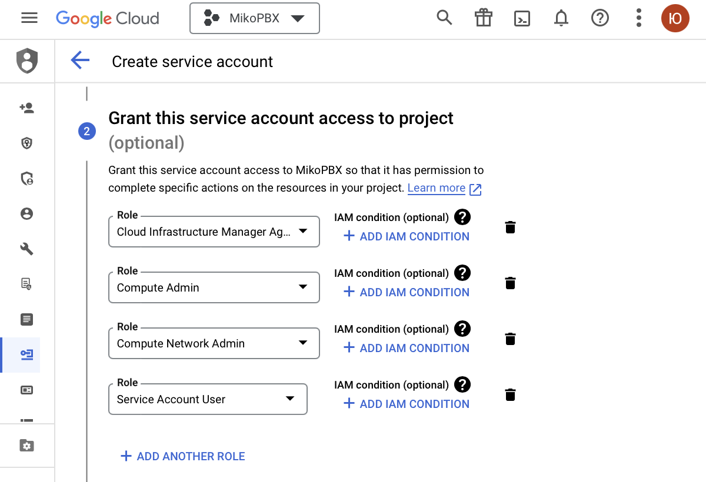<figcaption></figcaption></figure>

### Connecting Cloud Build API

1. Open Navigation menu / APIs & Services / Library / Google Enterprise API / **Cloud Build API**
2. On the opened tab select **ENABLE**


Check the roles for the Cloud Build service account:

1. Open the IAM page [https://console.cloud.google.com/projectselector2/iam-admin/iam](https://console.cloud.google.com/projectselector2/iam-admin/iam).
2. Select your Google Cloud project
3. Check the **Include Google-provided role grants** checkbox
4. In the table, find the row with the email address ending with @cloudbuild.gserviceaccount.com
5. Select Edit principal
6. The roles to be granted to the Cloud Build service account are **Compute Admin** and **Service Account User**

If the required roles are not present, add them and click **SAVE**


### Connecting Compute Engine API

1. Open Navigation menu / APIs & Services / Library / Google Enterprise API / **Compute Engine API**
2. On the opened tab select **ENABLE**

### Creating an Image

1. Open Navigation menu / Products & solutions / Compute / **Compute Engine**
2. Go to the Storage / Images section
3. Select **CREATE IMAGE** to create a new image
4. Enter the image name, for example _mikopbx-new-image_
5. Specify the source type - **Virtual disk (VMDK, VHD)**
6. Select Virtual disk file under the **BROWSE** link, _Browse / miko-images / .vhd_
7. Uncheck the Install guest packages checkbox
8. In the Operating system on virtual disk field specify - **No operating system. Data only.**
9. Use default values for other fields
10. After entering the values, click the **Create** button and wait for the image creation to complete

<figure>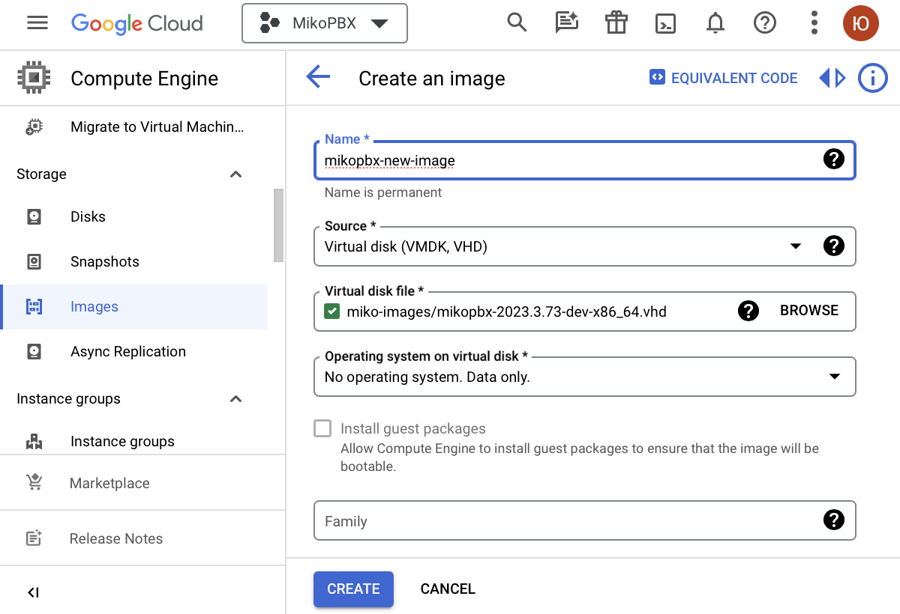<figcaption></figcaption></figure>

### Creating a Virtual Machine

1. In the **Compute Engine** tab go to the Virtual machines / VM Instance section
2. Select **CREATE INSTANCE**
3. Enter the virtual machine name, for example _mikopbx-vm_

<figure><figcaption></figcaption></figure>

4. In the Machine configuration / General purpose table select Series - **N1**

<figure>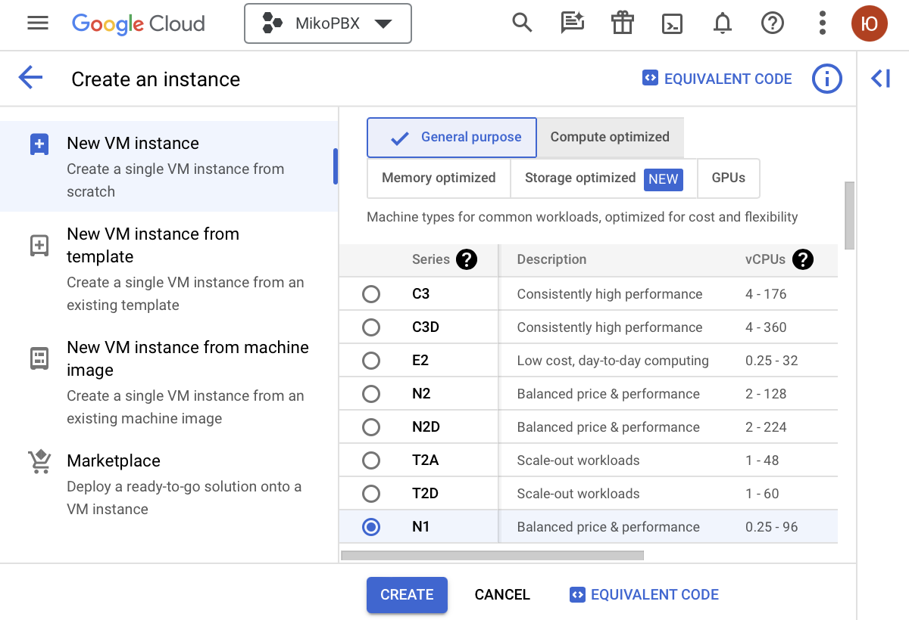<figcaption></figcaption></figure>

5. In the Machine type section choose **Shared-core / f1-micro** from the dropdown menu

<figure>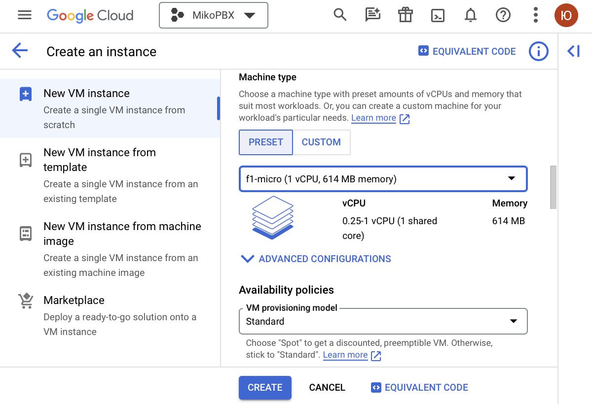<figcaption></figcaption></figure>

6. In the Boot disk section select **CHANGE**
7. On the opened tab go to CUSTOM IMAGES
8. In the Image field select the previously created _mikopbx-new-image_
9. Use default values for other fields on the tab
10. Click the **SELECT** button

<figure>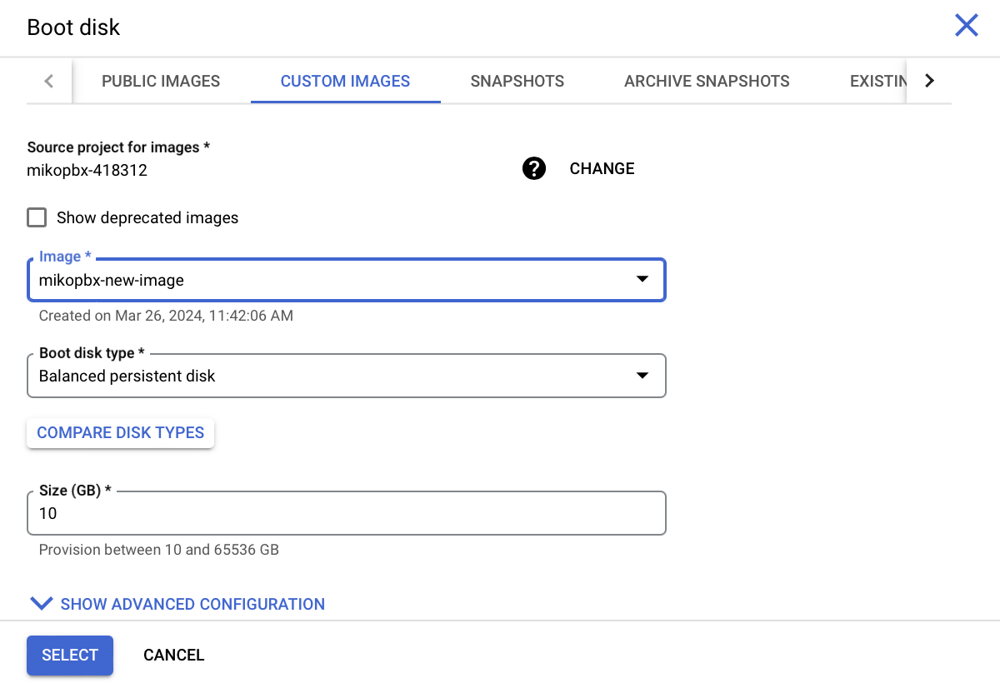<figcaption></figcaption></figure>

11. In the Advanced options / Disks section select **ADD NEW DISK**
12. On the opened tab enter the disk name for data storage, for example _disk-storage-mikopbx_
13. Specify the disk size of at least 50GB
14. Use default values for other fields on the tab
15. Click the **SAVE** button

<figure><figcaption></figcaption></figure>

<figure>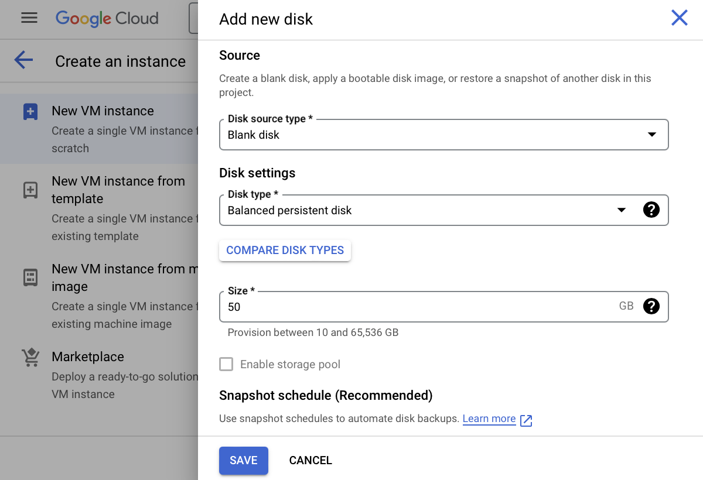<figcaption></figcaption></figure>

If you have an SSH key, proceed as follows:

16. In the Advanced options / Security / MANAGE ACCESS section, select **ADD ITEM**
17. Specify it in the SSH key field

If you don't have an SSH key, proceed directly to step 18.

18. Use default values for other fields
19. After entering the values, click the **CREATE** button

### Setting up ports for incoming connections.

1. Open Navigation menu / VPC network / **Firewall**
2. Select **CREATE FIREWALL RULE** to create a new rule for incoming connections
3. Enter the name of the new rule, for example _internal-allow_

<figure>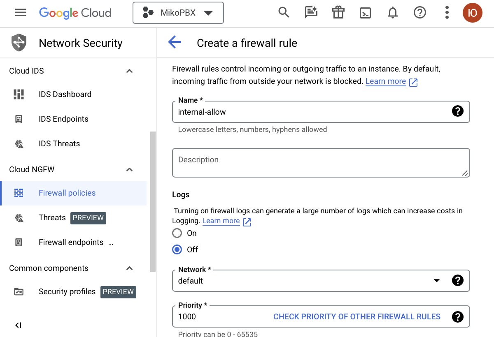<figcaption></figcaption></figure>

4. Specify Direction of traffic - **Ingress**
5. Specify Targets
6. From the Source filter dropdown menu select **IPV4 ranges** and in the Source IPv4 ranges field enter **0.0.0.0/0**

<figure>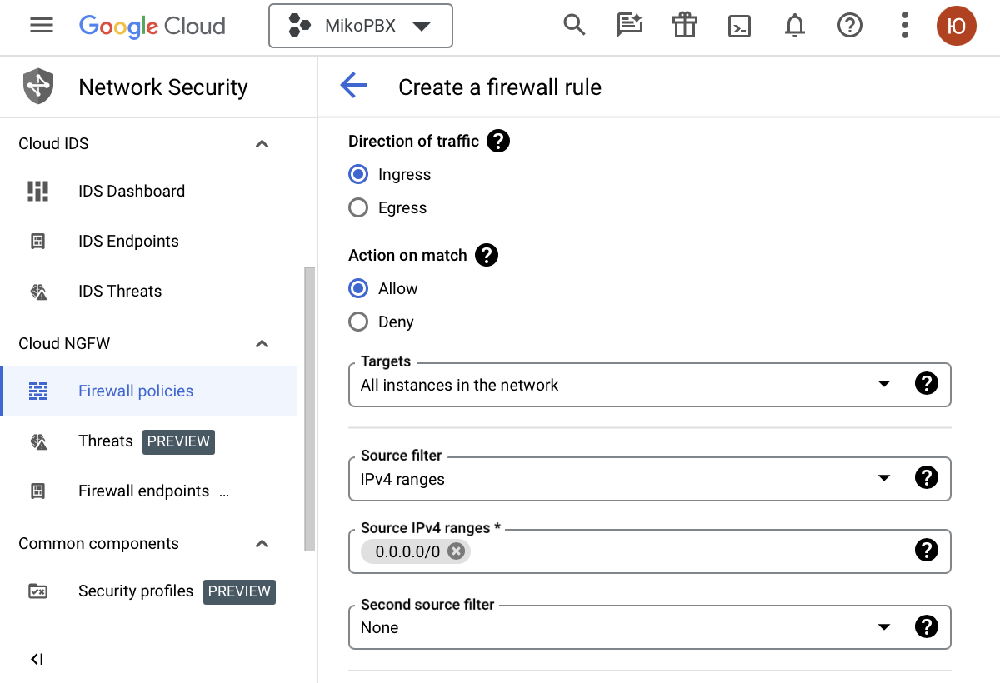<figcaption></figcaption></figure>

7. In the Protocols and ports section check the **TCP** (Ports - **0-65535**) and **UDP** (Ports - **0-65535**) checkboxes

<figure>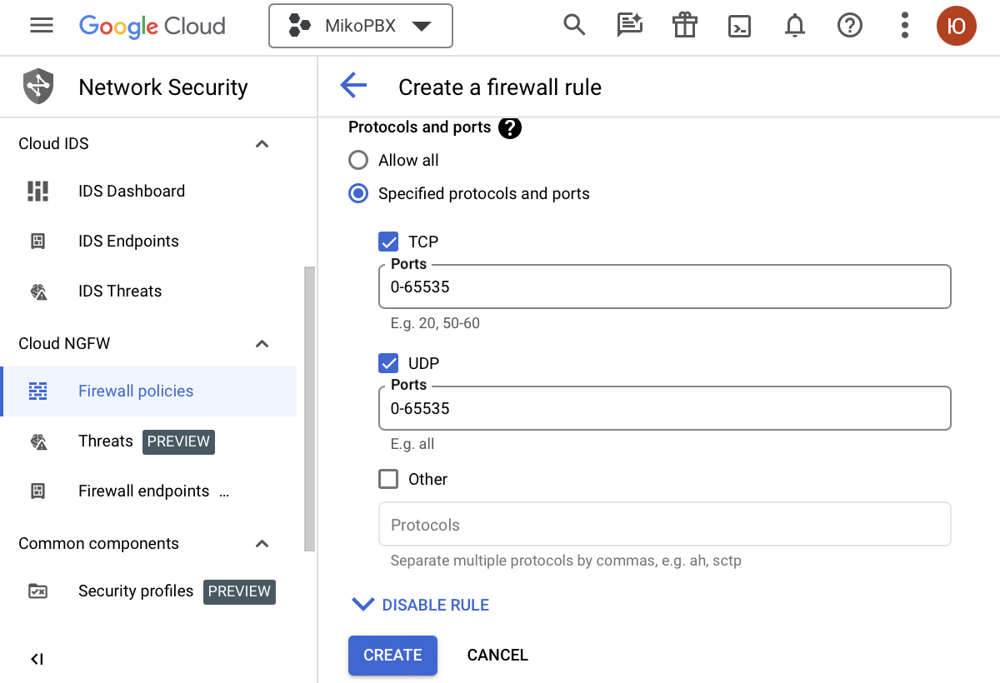<figcaption></figcaption></figure>

8. Use default values for other fields
9. After entering the values, click the **CREATE** button

<figure>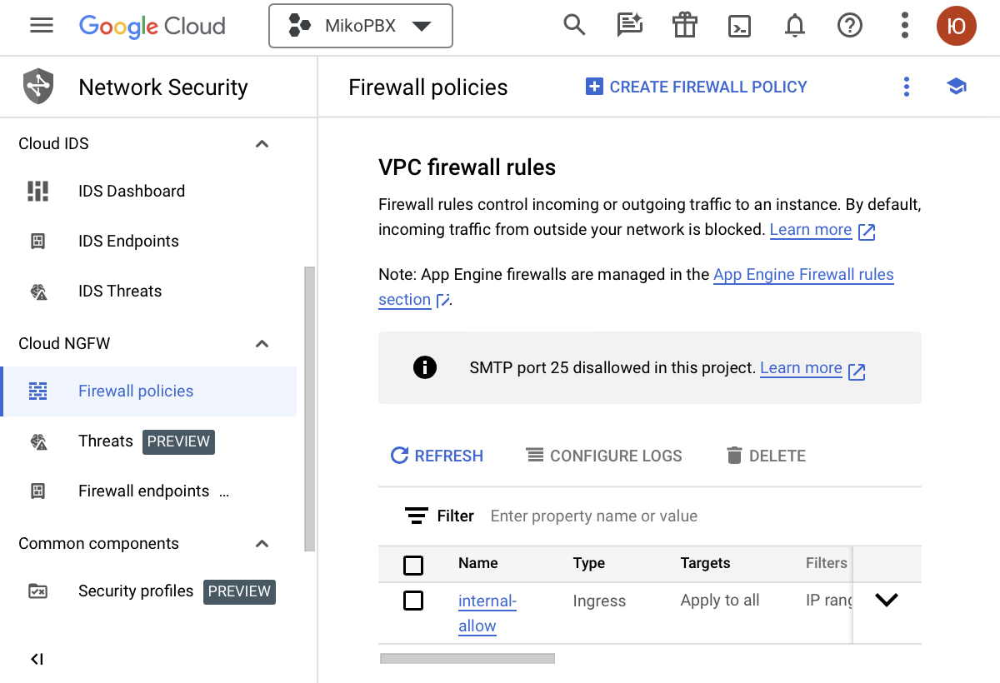<figcaption></figcaption></figure>


Make sure to configure the Firewall on the MikoPBX


### Launching MikoPBX.

1. Open the Compute Engine tab and go to the Virtual machines / VM Instance section
2. Copy the **External IP** of the created virtual machine

<figure>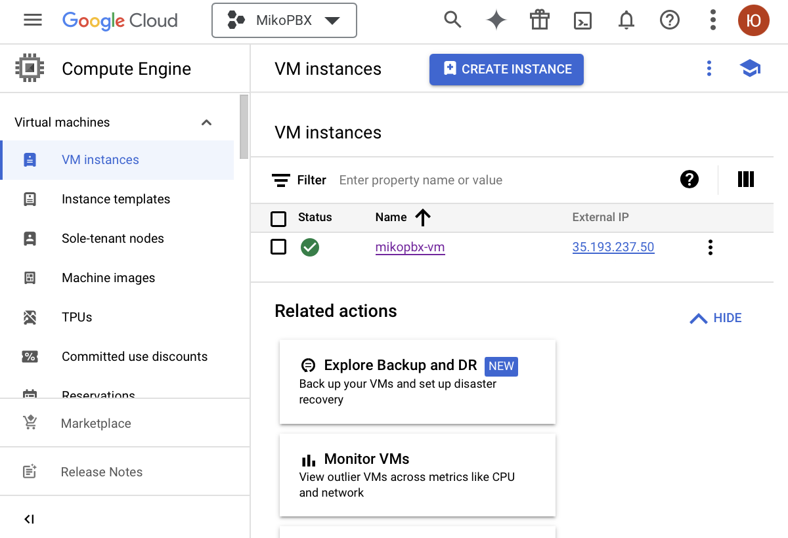<figcaption></figcaption></figure>

3. Enter the External IP in the browser's address bar
4. Open the created virtual machine
5. Copy the **Instance Id** - this is the default password for logging into MikoPBX

<figure>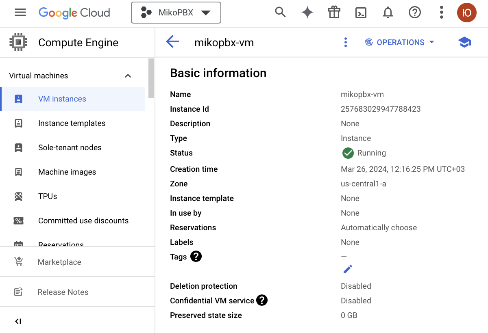<figcaption></figcaption></figure>

6. The default login is **admin**
