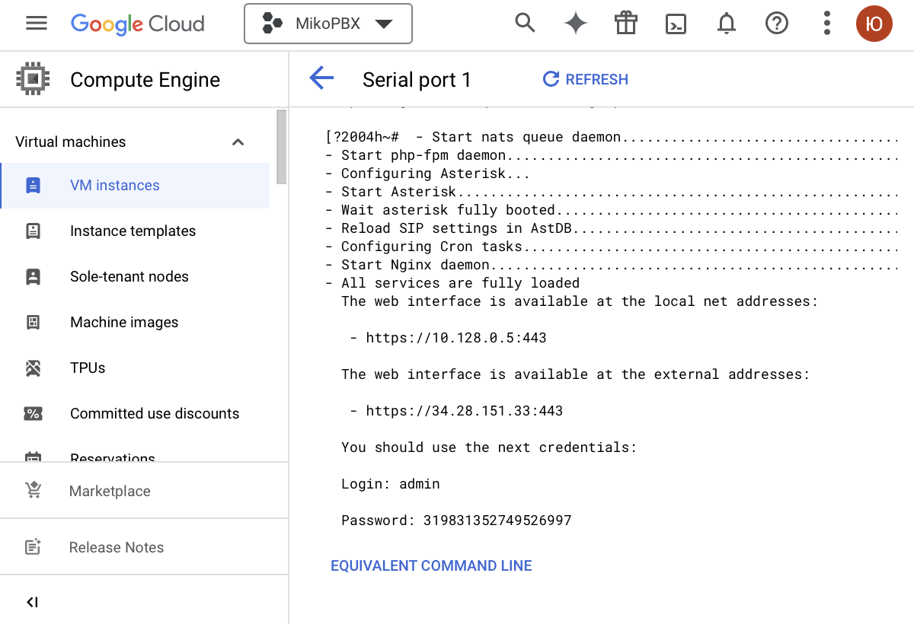

# Google Cloud

Авторизуйтесь на платформе [https://console.cloud.google.com/](https://console.cloud.google.com/)

Приступим к настройке


Для быстрого и удобного поиска на платформе Google Cloud используйте панель поиска


### **Создание** хранилища

1. Откройте Navigation menu / Products & solutions / Storage / **Cloud Storage**
2. На вкладке Cloud Storage выберите **Create**
3. Введите имя хранилища, например _miko-images_
4. Для других полей используйте значения по умолчанию
5. Завершив ввод значений, нажмите кнопку **Create**

<figure><figcaption></figcaption></figure>

6. Откройте созданное хранилище _miko-images_
7. На открывшейся вкладке выберите **UPLOAD FILES**
8. Загрузите файл из дистрибутива MikoPBX с расширением **.vhd**
9. Дождитесь окончания загрузки файла

<figure><figcaption></figcaption></figure>

### **Подключение C**loud Build API

1. Откройте Navigation menu / APIs & Services / Library / Google Enterprise API / **Cloud Build API**
2. На открывшейся вкладке выберите **ENABLE**


Проверьте роли учетной записи службы Cloud Build, для этого

1. Откройте страницу IAM [https://console.cloud.google.com/projectselector2/iam-admin/iam](https://console.cloud.google.com/projectselector2/iam-admin/iam)
2. Выберите свой проект Google Cloud
3. Установите флажок **Include Google-provided role grants**
4. В таблице найдите строку с адресом электронной почты, заканчивающимся на @cloudbuild.gserviceaccount.com
5. Выберите **Править (Edit principal)**
6. Роли, которые должны быть предоставлены учетной записи службы Cloud Build, - **Сompute Admin** и **Service Account User**

Если нужных ролей нет, добавьте и нажмите **SAVE**


### **Подключение Compute Engine** API

1. Откройте Navigation menu / APIs & Services / Library / Google Enterprise API / **Compute Engine API**
2. На открывшейся вкладке выберите **ENABLE**

### **Создание** образа

1. Откройте Navigation menu / Products & solutions / Compute / **Compute Engine**
2. Перейдите в раздел Storage / Images
3. Выберите **CREATE IMAGE** для создания нового образа
4. Введите имя образа (Name), например _mikopbx-new-image_
5. Укажите тип источника (Source) - **Virtual disk (VMDK, VHD)**
6. Выберите Virtual disk file по ссылке **BROWSE**, _Browse / miko-images / .vhd_
7. Уберите флажок Install guest packages
8. В поле Operating system on virtual disk укажите - **No operating system. Data only.**
9. Для других полей используйте значения по умолчанию
10. Завершив ввод значений, нажмите кнопку **Create** и дождитесь окончания создания образа

<figure><figcaption></figcaption></figure>

### **Создание виртуальной машины**

1. Во вкладке **Compute Engine** перейдите в раздел Virtual machines / VM Instance
2. Выберите **CREATE INSTANCE**
3. Введите имя виртуальной машины (Name), например _mikopbx-vm_

<figure><figcaption></figcaption></figure>

4. В таблице Machine configuration / General purpose выберите Series - **N1**

<figure><figcaption></figcaption></figure>

5. В разделе Machine type в выпадающем меню выберите **Shared-core / f1-micro**

<figure><figcaption></figcaption></figure>

6. В разделе Boot disk выберите **CHANGE**
7. На открытой вкладке перейдите к CUSTOM IMAGES
8. В поле Image выберите созданный ранее образ _mikopbx-new-image_
9. Для других полей на вкладке используйте значения по умолчанию
10. Нажмите кнопку **SELECT**

<figure><figcaption></figcaption></figure>

11. В разделе Advanced options / Disks выберите **ADD NEW DISK**
12. На открытой вкладке введите имя диска для хранения данных (Name), например _disk-storage-mikopbx_
13. Укажите размер диска (Size) не менее 50Гб
14. Для других полей на вкладке используйте значения по умолчанию
15. Нажмите кнопку **SAVE**

<figure><figcaption></figcaption></figure>

<figure><figcaption></figcaption></figure>

Если у вас есть ключ SSH, выполните следующее

16. В разделе Advanced options / Security / MANAGE ACCESS выберите **ADD ITEM**
17. Укажите его в поле SSH key

Если у вас есть нет ключа SSH, сразу перейдите к пункту 18

18. Для других полей используйте значения по умолчанию
19. Завершив ввод значений, нажмите кнопку **CREATE**

### **Настройка портов для входящих соединений**

1. Откройте Navigation menu / VPC network / **Firewall**
2. Выберите **CREATE FIREWALL RULE** для создания нового правила для входящего соединения
3. Введите имя нового правила (Name), например _internal-allow_

<figure><figcaption></figcaption></figure>

4. Укажите Direction of traffic - **Ingress**
5. Укажите Targets
6. Из выпадающего меню в поле Source filter выберите **IPV4 ranges** и в поле Source IPv4 ranges укажите **0.0.0.0/0**

<figure><figcaption></figcaption></figure>

7. В разделе Protocols and ports установите флажок **TCP** (Ports - **0-65535**) и флажок **UDP** (Ports - **0-65535**)

<figure><figcaption></figcaption></figure>

8. Для других полей используйте значения по умолчанию
9. Завершив ввод значений, нажмите кнопку **CREATE**

<figure><figcaption></figcaption></figure>


Обязательно выполните настройку Firewall на самой АТС MikoPBX


### **Запуск АТС MikoPBX**

1. Откройте вкладку Compute Engine и перейдите в раздел Virtual machines / VM Instance
2. Перейдите к созданной виртуальной машине _mikopbx-vm_
3. На открытой вкладке перейдите к Logs / Serial port 1 (console)

<figure><figcaption></figcaption></figure>

4. Скопируйте внешний адрес созданной виртуальной машины и введите его в строке браузера
5. Для входа используйте указанные в Serial port 1 (console) логин и пароль
