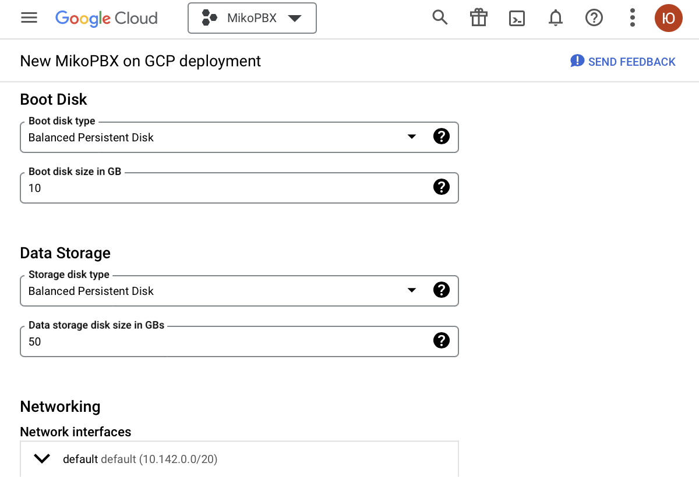

# Google Cloud Marketplace

Log in to the platform at [https://console.cloud.google.com/](https://console.cloud.google.com/)

MikoPBX on Google Cloud Marketplace: [https://console.cloud.google.com/marketplace/product/mikopbx-public/mikopbx](https://console.cloud.google.com/marketplace/product/mikopbx-public/mikopbx)

Let's start with the setup


For quick and easy search on the Google Cloud platform, use the search bar


### Adding roles to a Service account

If you have a service account, check if it has the necessary roles, and add them if needed

If you do not have a service account, create one and add the necessary roles

1. Open the Navigation menu / Products & solutions / Management / **IAM & Admin**
2. Go to the Service accounts tab and click on **CREATE SERVICE ACCOUNT**
3. Enter a name for the service account, for example _mikopbx-service-account_
4. Click the **CREATE AND CONTINUE** button

<figure><figcaption></figcaption></figure>

5. Add the roles **Cloud Infrastructure Manager Agent, Compute Admin, Compute Network Admin, Service Account User**

<figure><figcaption></figcaption></figure>

6. Click the **DONE** button

<figure><figcaption></figcaption></figure>

### Creating a virtual machine

1. Open the Marketplace and enter **MikoPBX** in the search bar
2. Select the [MikoPBX](https://console.cloud.google.com/marketplace/product/mikopbx-public/mikopbx) image
3. On the opened tab select **LAUNCH**

<figure><figcaption></figcaption></figure>

4. In the Deployment name field, enter a name, for example _mikopbx-vm_
5. In the Deployment Service Account section, check the Existing account option and select the previously created service account

<figure><figcaption></figcaption></figure>


To deploy the PBX, use **two** disks:

* A **1 GB** disk for the main system
* A **50+ GB** disk for storing call recordings


6. If necessary, change the size of the data storage disk in the Data Storage section. By default, its size is 50 GB

<figure><figcaption></figcaption></figure>

7. Under Networking, all required Firewall rules are configured automatically

<figure><figcaption></figcaption></figure>

8. For other fields, use the default values
9. After entering the values, click the **DEPLOY** button

<figure><figcaption></figcaption></figure>

<figure><figcaption></figcaption></figure>

### Starting MikoPBX

1. Open the Compute Engine tab and go to the Virtual machines / VM Instance section
2. Go to the created virtual machine _mikopbx-vm-mikopbx-vm_
3. On the opened tab, go to Logs / Serial port 1 (console)

<figure><figcaption></figcaption></figure>

4. Copy the external address of the created virtual machine and enter it in the browser address bar
5. Use the login and password provided in Serial port 1 (console) to log in

<figure><figcaption></figcaption></figure>
