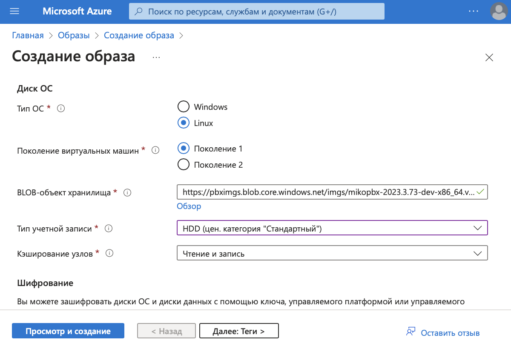
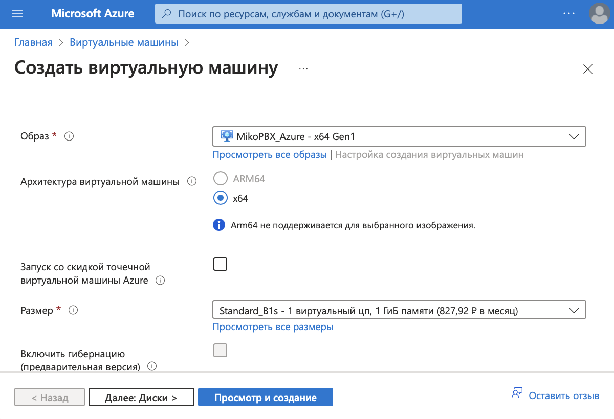
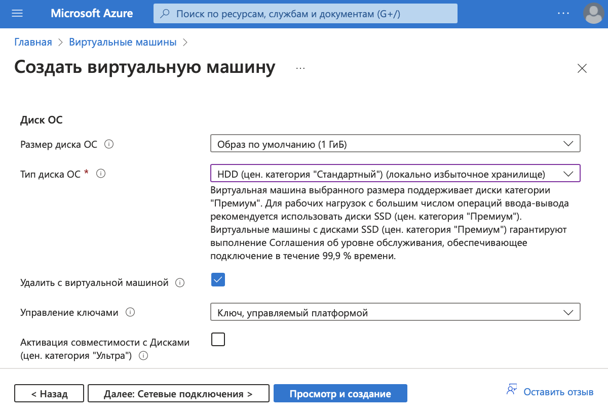
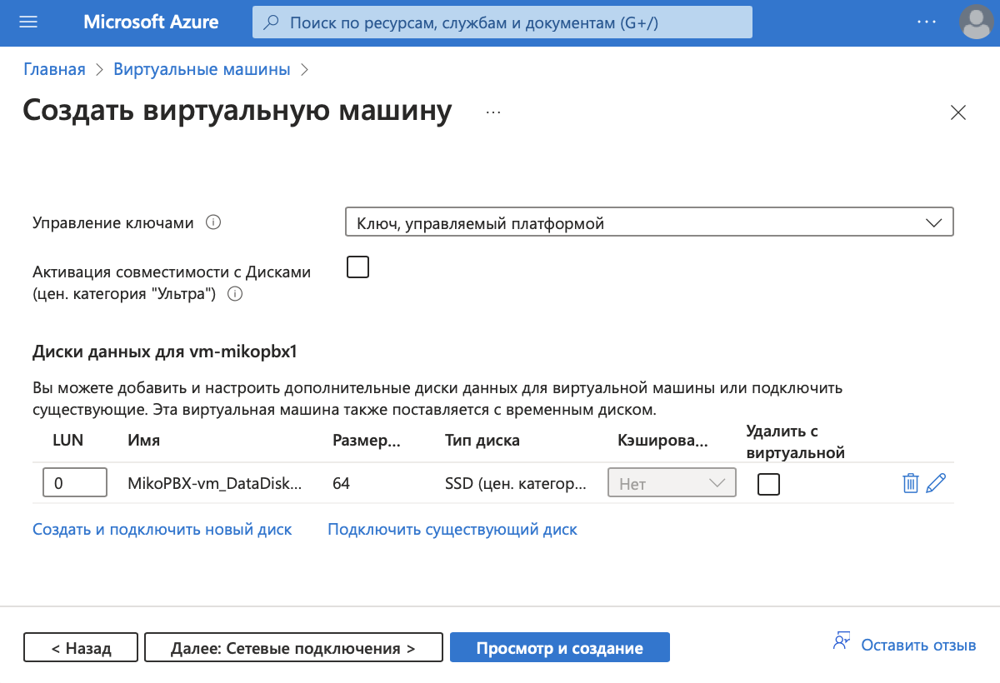
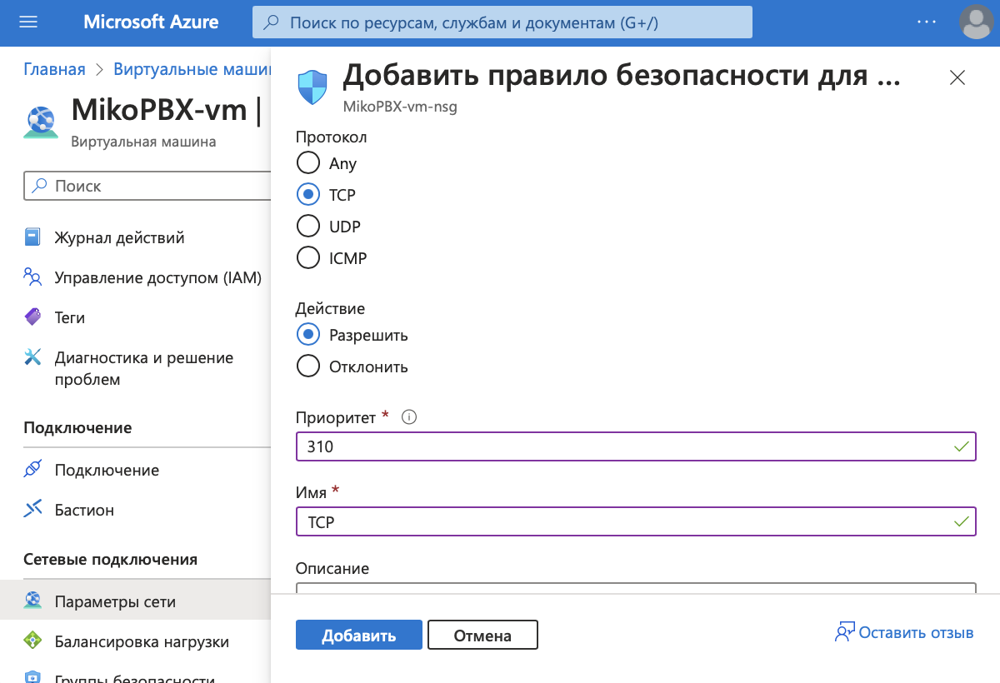
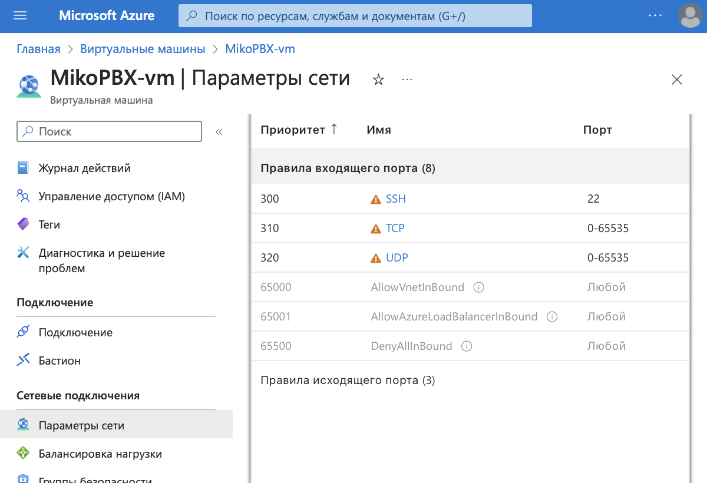
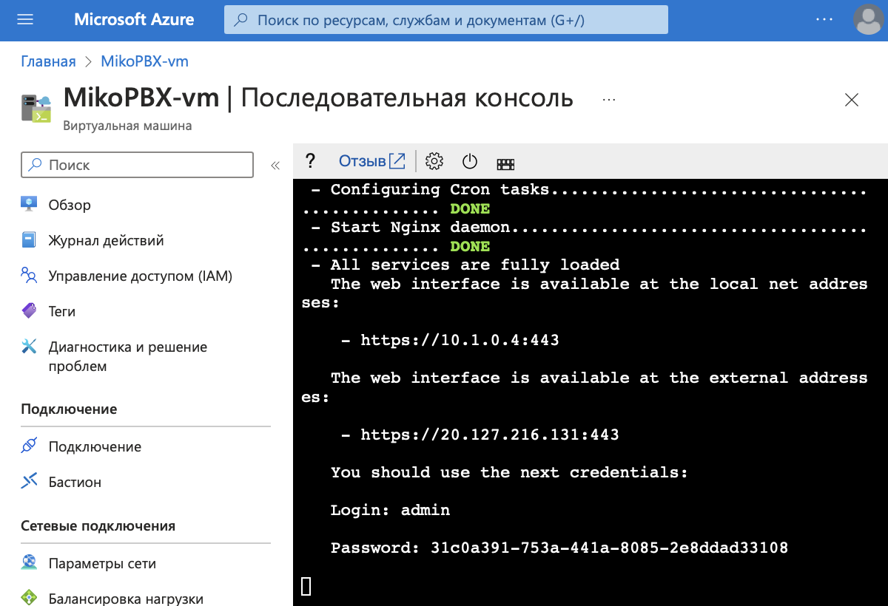

# Microsoft Azure

Для начала авторизуйтесь на портале Microsoft Azure [https://portal.azure.com/](https://portal.azure.com/)

Приступим к настройке.


Для быстрого и удобного поиска на портале Azure используйте панель поиска


### Создание группы ресурсов

1. Откройте Меню / Все службы / Общие / **Группы ресурсов**
2. На вкладке Группы ресурсов выберите **Создать**
3. Введите имя группы, например _MikoPBX\_group_
4. Для других полей используйте значения по умолчанию
5. Завершив ввод значений, нажмите кнопку **Просмотр и создание**, затем кнопку **Создать**

<figure><figcaption></figcaption></figure>

### Создание учетной записи хранения

1. Откройте Меню / Все службы / Интернет вещей / **Учетные записи хранения**
2. На вкладке Учетные записи хранения выберите **Создать**
3. Укажите созданную группу ресурсов _MikoPBX\_group_
4. Введите имя учетной записи, например _pbximgs_
5. Для других полей используйте значения по умолчанию
6. Завершив ввод значений, нажмите кнопку **Проверка**, затем кнопку **Создать**

<figure><figcaption></figcaption></figure>

### Настройка созданной учетной записи хранения

1. Перейдите к карточке созданной учетной записи хранения _pbximgs_
2. На открытой вкладке перейдите в меню Хранилище данных / Контейнеры
3. Добавьте новый контейнер
4. Введите имя контейнера, например _imgs_
5. Нажмите кнопку **Создать**

<figure><figcaption></figcaption></figure>

6. Откройте созданный контейнер _imgs_
7. На открывшейся вкладке выберите **Отправка**
8. Выберите файл из дистрибутива MikoPBX с расширением **.vhd**
9. Нажмите кнопку **Отправка**

<figure><figcaption></figcaption></figure>

### Создание образа

1. Откройте Меню / Все службы / Вычисление / **Образы**
2. На вкладке Образы выберите **Создать**, **с**оздадим новый образ на основе загруженного \*.**vhd** файла
3. Укажите группу ресурсов _MikoPBX\_group_
4. Введите уникальное имя для образа, например _MikoPBX\_Azure_

<figure><figcaption></figcaption></figure>

5. Укажите тип ОС - **Linux**
6. Укажите поколение виртуальных машин - **Поколение 1**
7. Выберите BLOB-объект хранилища по ссылке **Обзор**, _Обзор / pbximgs / imgs / \*.vhd_
8. Укажите тип учетной записи - **HDD (цен. категория "Стандартный")**
9. Для других полей используйте значения по умолчанию
10. Завершив ввод значений, нажмите кнопку **Просмотр и создание**, затем кнопку **Создать**

<figure><figcaption></figcaption></figure>

### Создание виртуальной машины

1. Откройте Меню / Все службы / Вычисление / **Виртуальные машины**
2. На вкладке Виртуальные машины выберите **Создать / Виртуальная машина Azure**
3. Укажите группу ресурсов _MikoPBX\_group_
4. Введите имя виртуальной машины, например _MikoPBX-vm_

<figure><figcaption></figcaption></figure>

5. Выберите созданный ранее образ, _Посмотреть все образы / Другие элементы / Мои изображения / MikoPBX\_Azure_
6. Укажите размер машины (совокупность параметров ЦП / ОЗУ не менее 1Гб / HDD)

<figure><figcaption></figcaption></figure>

7. Укажите имя пользователя для учетной записи администратора

Если у вас есть ключ SSH, выполните следующее

8. Выберите источник открытого ключа SSH - **Использовать существующий открытый ключ**
9. Укажите его в поле открытый ключ SSH

Если у вас есть нет ключа SSH, выполните следующее

8. Выберите источник открытого ключа SSH - **Создать новую пару ключей**
9. Укажите имя пары ключей, например _mikopbx\_key_

<figure><figcaption></figcaption></figure>

Следуйте дальше по инструкции

10. В поле тип лицензии укажите **Другое**
11. Для других полей используйте значения по умолчанию

<figure><figcaption></figcaption></figure>

12. Перейдите на вкладку **Диски**
13. Укажите тип диска ОС
14. Установите флажок **Удалить с виртуальной машиной**

<figure><figcaption></figcaption></figure>

15. Создайте новый диск данных
16. Укажите размер диска не менее 50Гб
17. Для других полей используйте значения по умолчанию, нажмите кнопку **ОК**

<figure><figcaption></figcaption></figure>

<figure><figcaption></figcaption></figure>

18. Завершив ввод значений, нажмите кнопку **Просмотр и создание**, затем кнопку **Создать**

### Настройка портов для входящих соединений

1. Откройте созданную виртуальную машину и перейдите в раздел Сетевые подключения / Параметры сети / Правила
2. На вкладке выберите **Создание правила для порта / Правило входящего порта**
3. Укажите диапазоны портов назначения - **0 - 65535**
4. Выберите протокол **TCP**

<figure><figcaption></figcaption></figure>

5. Укажите имя, например _TCP_
6. Для других полей используйте значения по умолчанию
7. Завершив ввод значений, нажмите кнопку **Добавить**

<figure><figcaption></figcaption></figure>

8. Аналогично создайте правило для UDP. Укажите диапазоны портов назначения - **0 - 65535,** протокол **UDP** и имя

<figure><figcaption></figcaption></figure>

### Запуск АТС MikoPBX

1. Откройте созданную виртуальную машину и перейдите в раздел Подключение
2. В выпадающем меню Дополнительные способы подключения выберите Серийная консоль

<figure><figcaption></figcaption></figure>

3. Скопируйте внешний адрес созданной виртуальной машины и введите его в строке браузера
4. Для входа используйте указанные во вкладке Последовательная консоль логин и пароль
