# Microsoft Azure

First, log in to the Microsoft Azure portal [https://portal.azure.com/](https://portal.azure.com/)

Let's proceed with the setup.


For quick and convenient searching on the Azure portal, use the search bar.


### Creating a resource group

1. Open Menu / All services / General / **Resource groups**
2. In the Resource groups tab, select **Create**
3. Enter the group name, for example _MikoPBX\_group_
4. Use default values for other fields
5. After entering the values, click the **Review + create** button, then the **Create** button

<figure>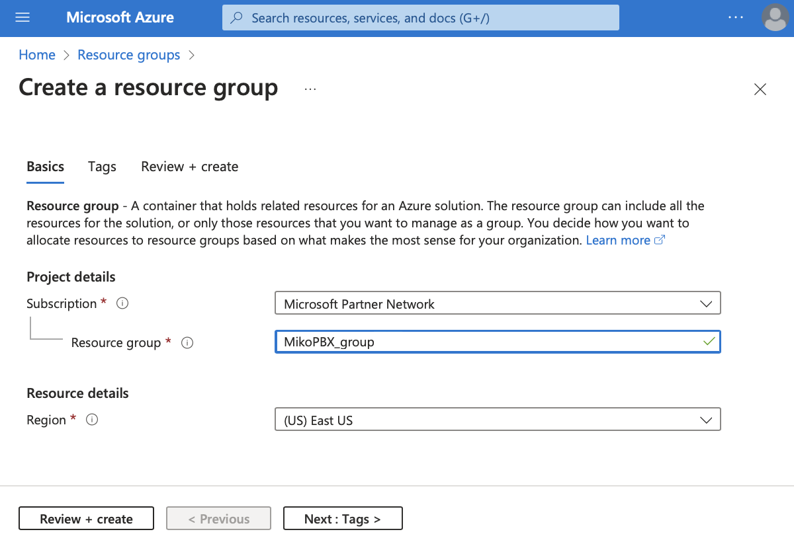<figcaption></figcaption></figure>

### Creating a storage account

1. Open Menu / All services / Analyze and transform data / **Storage accounts**
2. In the Storage accounts tab, select **Create**
3. Specify the created resource group _MikoPBX\_group_
4. Enter the storage account name, for example _pbximgs_
5. Use default values for other fields
6. After entering the values, click the **Review + create** button, then the **Create** button

<figure>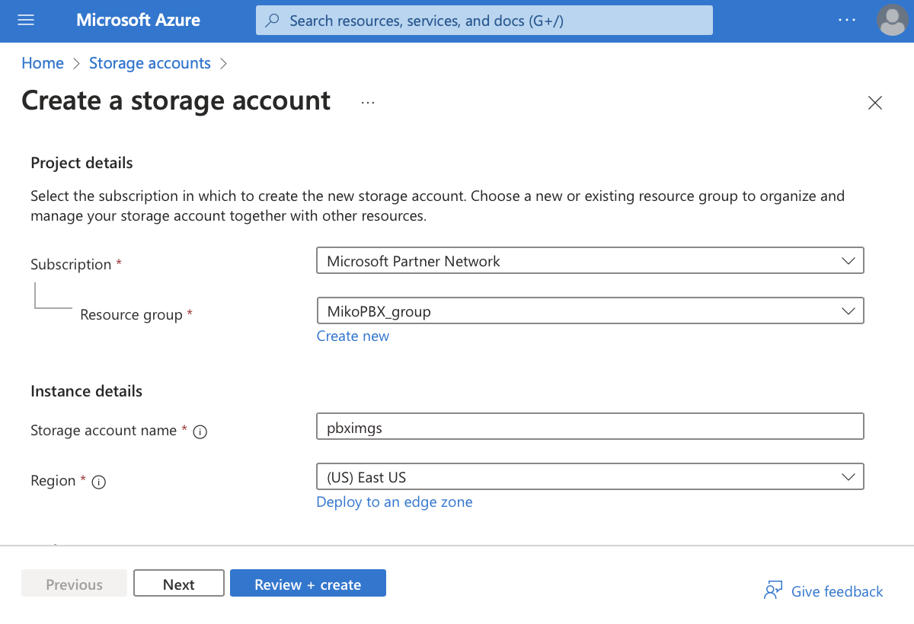<figcaption></figcaption></figure>

### Configuring the created storage account

1. Go to the card of the created storage account _pbximgs_
2. In the opened tab, go to the Data storage / Containers
3. Add a new container
4. Enter the container name, for example _imgs_
5. Click the **Create** button

<figure>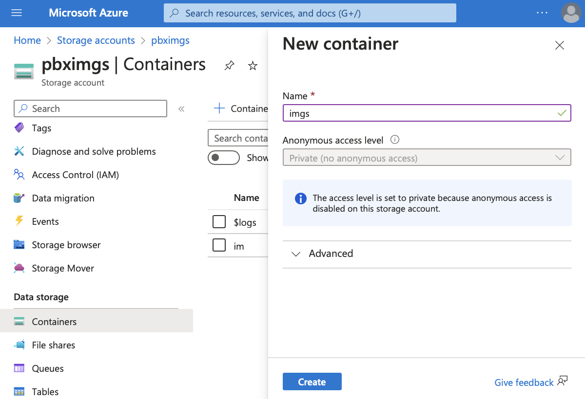<figcaption></figcaption></figure>

6. Open the created container _imgs_
7. In the opened tab, select **Upload**
8. Upload a file from the MikoPBX distribution with the **.vhd** extension
9. Wait for the file to upload, then click the **Create** button

<figure>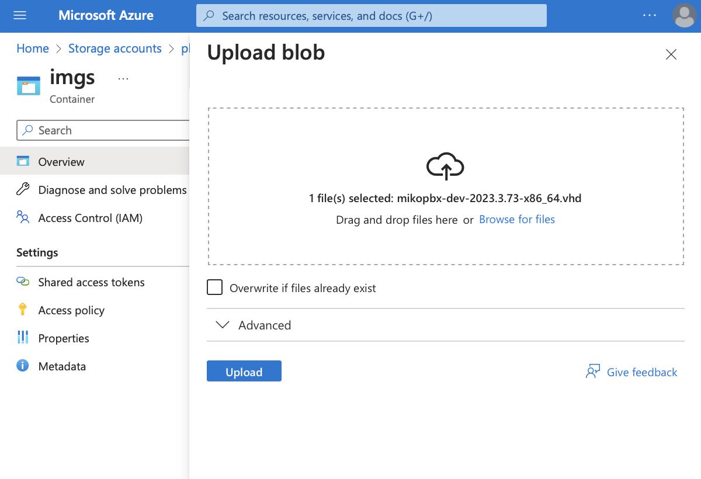<figcaption></figcaption></figure>

### Creating an image

1. Open Menu / All services / Compute / **Images**
2. In the Images tab, select **Create**, let's create a new image based on the uploaded \*.**vhd** file
3. Specify the resource group _MikoPBX\_group_
4. Enter a unique name for the image, for example _MikoPBX\_Azure_

<figure><figcaption></figcaption></figure>

5. Specify the OS type - **Linux**
6. Specify the generation of virtual machines - **Gen 1**
7. Select the blob storage object by clicking **Browse**, _Browse / pbximgs / imgs / \*.vhd_
8. Use default values for other fields
9. After entering the values, click the **Review + create** button, then the **Create** button

<figure>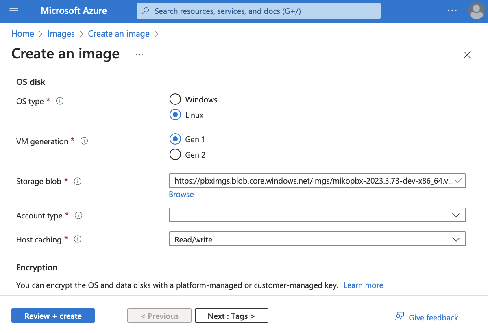<figcaption></figcaption></figure>

### Creating a virtual machine

1. Open Menu / All services / Compute / **Virtual machines**
2. In the Virtual machines tab, select **Create / Azure virtual machine**
3. Specify the resource group _MikoPBX\_group_
4. Enter the virtual machine name, for example _MikoPBX-vm_

<figure>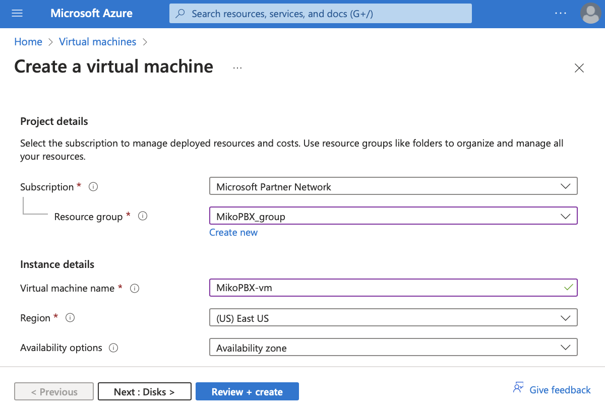<figcaption></figcaption></figure>

5. Choose the previously created image, _See all images / Other items / My images / MikoPBX\_Azure_
6. Specify the machine size (combination of CPU / RAM to be at least 1GB / HDD parameters)

<figure>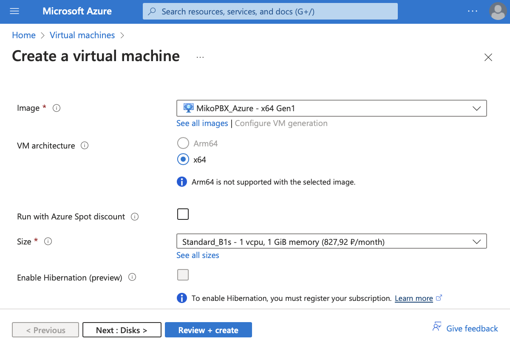<figcaption></figcaption></figure>

7. Specify the username for the administrator account

If you have an SSH key, do the following

8. Select the source of the SSH public key - **Use existing public key**
9. Specify it in the SSH public key field

If you do not have an SSH key, do the following

8. Select the source of the SSH public key - **Generate new key pair**
9. Specify the key pair name, for example _mikopbx\_key_

<figure>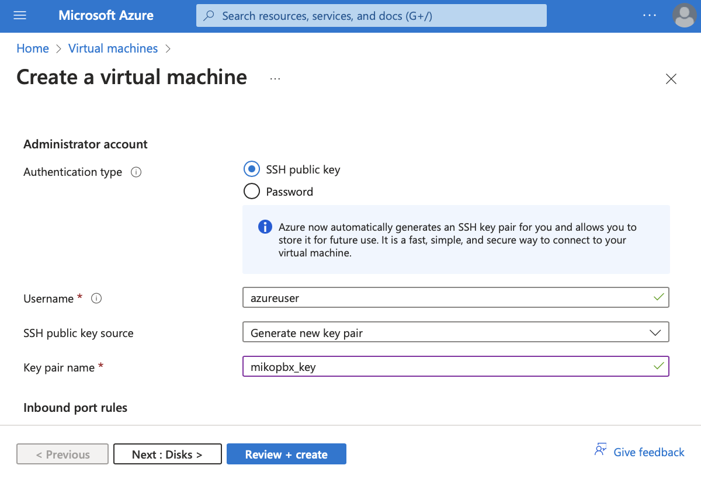<figcaption></figcaption></figure>

Continue with the following instructions:

10. In the license type field, specify **Other**
11. Use default values for the other fields

<figure>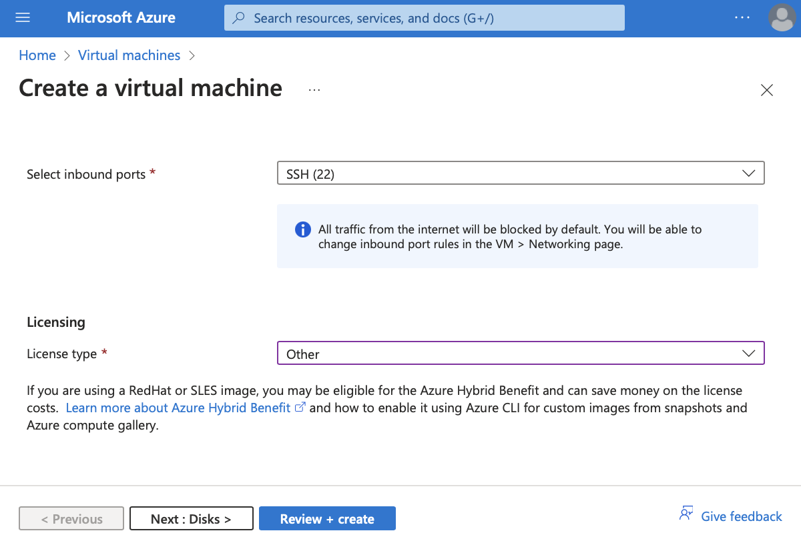<figcaption></figcaption></figure>

12. Go to the **Disks** tab
13. Specify the OS disk type

<figure>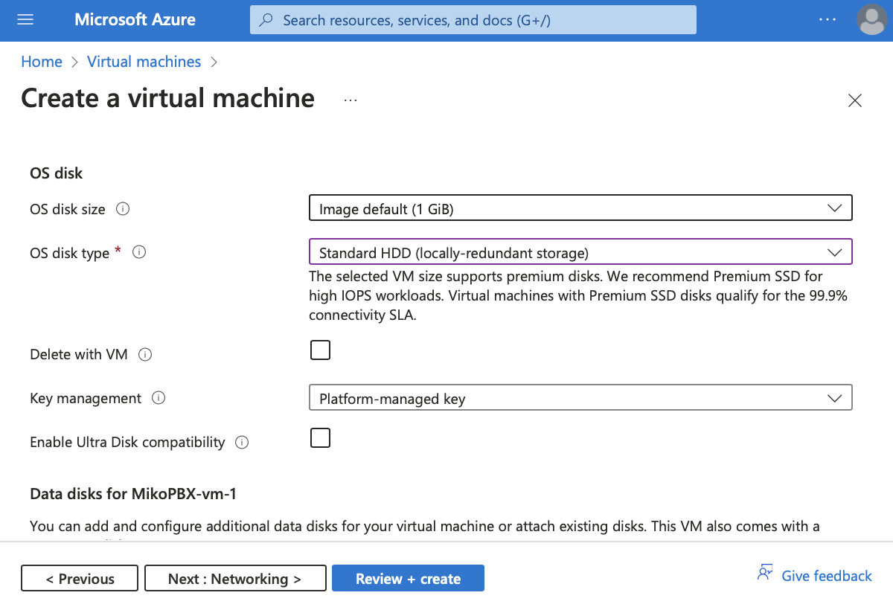<figcaption></figcaption></figure>

14. Create a new data disk
15. Specify the disk size to be at least 50GB
16. Use default values for the other fields

<figure>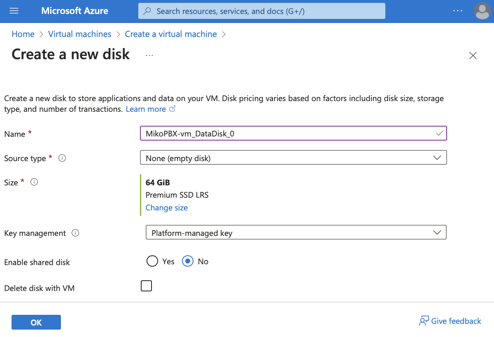<figcaption></figcaption></figure>

17. After entering the values, click the **Review + create** button, then click **Create**

### Configuring ports for incoming connections

1. Open the virtual machine you created and go to **Networking / Network settings / Rules**
2. In the tab, choose **Create inbound port rule**
3. Create a rule for the Web interface
4. Specify the destination port ranges - **80**
5. Choose the protocol **TCP**

<figure>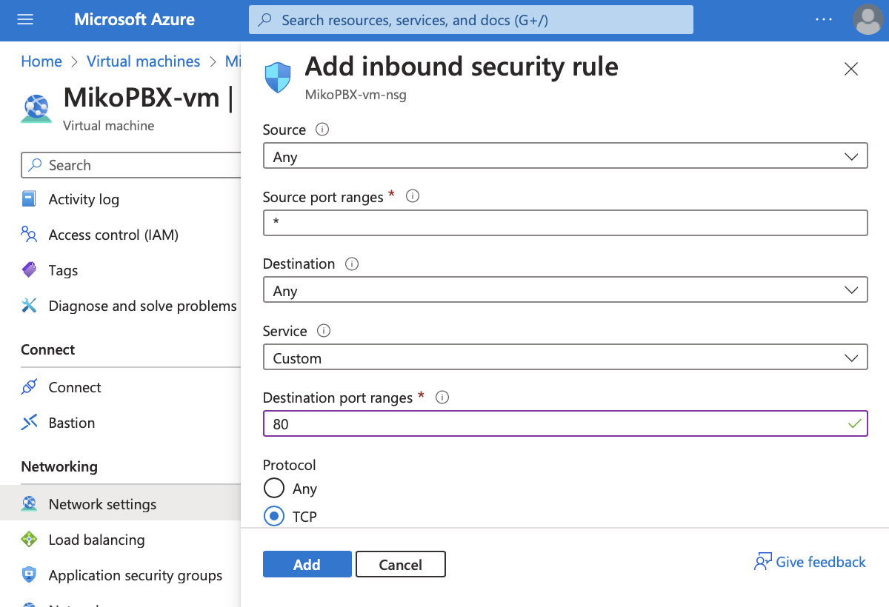<figcaption></figcaption></figure>

6. Specify a name, for example _HTTP\_80_
7. Use default values for the other fields
8. After entering the values, click the **Add** button

<figure>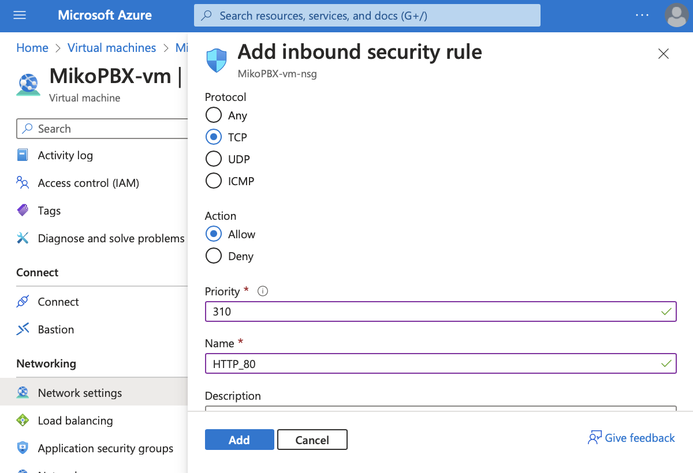<figcaption></figcaption></figure>

9. Similarly, create a rule for SIP signaling TCP. Specify the destination port ranges - **5060**, protocol **TCP**, and name
10. Similarly, create a rule for SIP signaling UDP. Specify the destination port ranges - **5060**, protocol **UDP**, and name
11. Similarly, create a rule for RTP audio streaming. Specify the destination port ranges - **10000-10200**, protocol **UDP**, and name

<figure>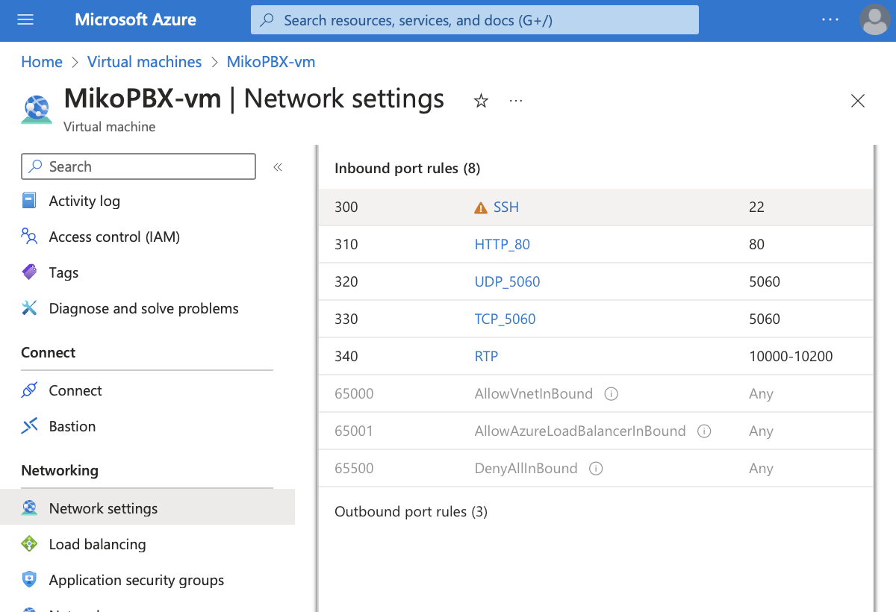<figcaption></figcaption></figure>

### Starting MikoPBX

1. Open the virtual machine you created and go to the **Connect** section
2. Copy the **Public IP address**

<figure>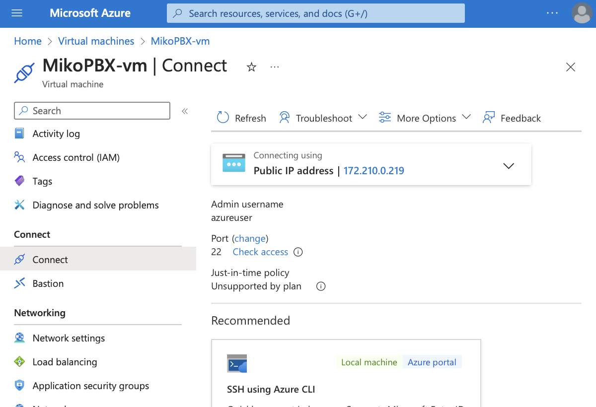<figcaption></figcaption></figure>

3. Enter the public IP address of your virtual machine in the browser's address bar
4. The default login and password for access are **admin**
5. In the PBX, under **Network and Firewall / Network interface**, it is mandatory to specify the **public IP address** of your router in the external IP address of your router field

<figure>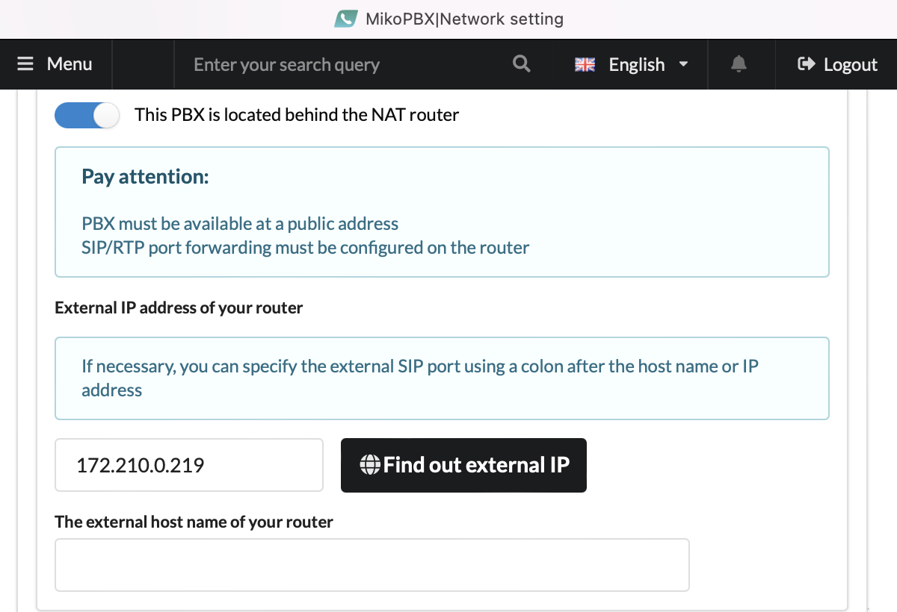<figcaption></figcaption></figure>

### Connecting a data storage disk

Connect to MikoPBX. You can use the built-in console for this

1. Open the virtual machine you created and go to the **Connect** section
2. In the drop-down menu under More ways to connect, select **Serial console**
3. Execute the command **/etc/rc/console\_menu**

<figure>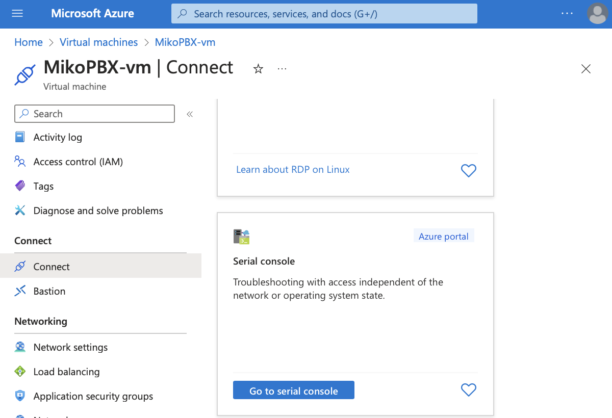<figcaption></figcaption></figure>

Alternatively, you can connect to the MikoPBX PBX using an SSH client following the instructions: [https://docs.mikopbx.com/mikopbx/v/english/faq/troubleshooting/connecting-to-a-pbx-using-an-ssh-client](https://docs.mikopbx.com/mikopbx/v/english/faq/troubleshooting/connecting-to-a-pbx-using-an-ssh-client)

After connecting to MikoPBX, proceed to connect a data storage disk

1. From the list select **Data Storage / Mount drive as data storage**

<figure>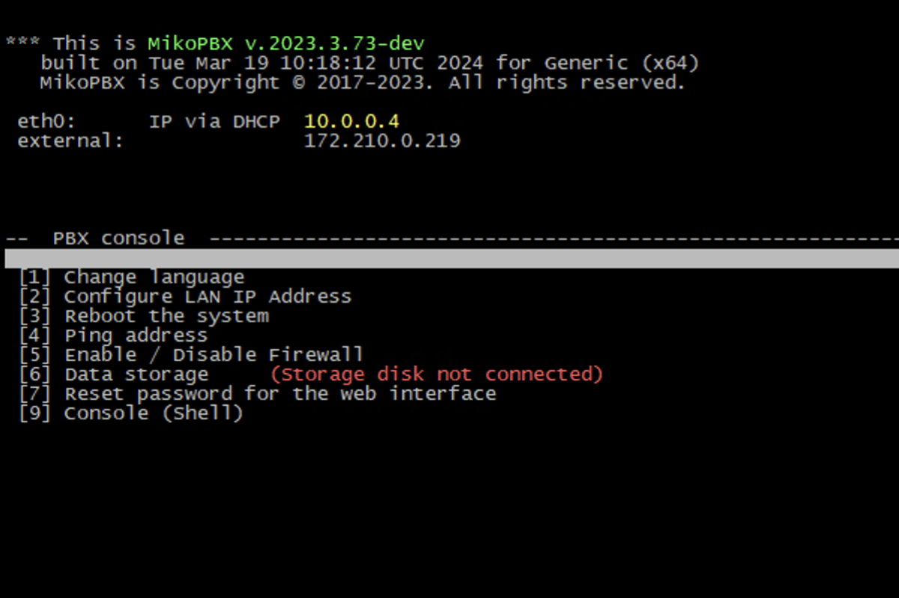<figcaption></figcaption></figure>

2. Choose the previously created disk (disk size of at least 50GB) for storing call recordings, in our case _sda_

<figure>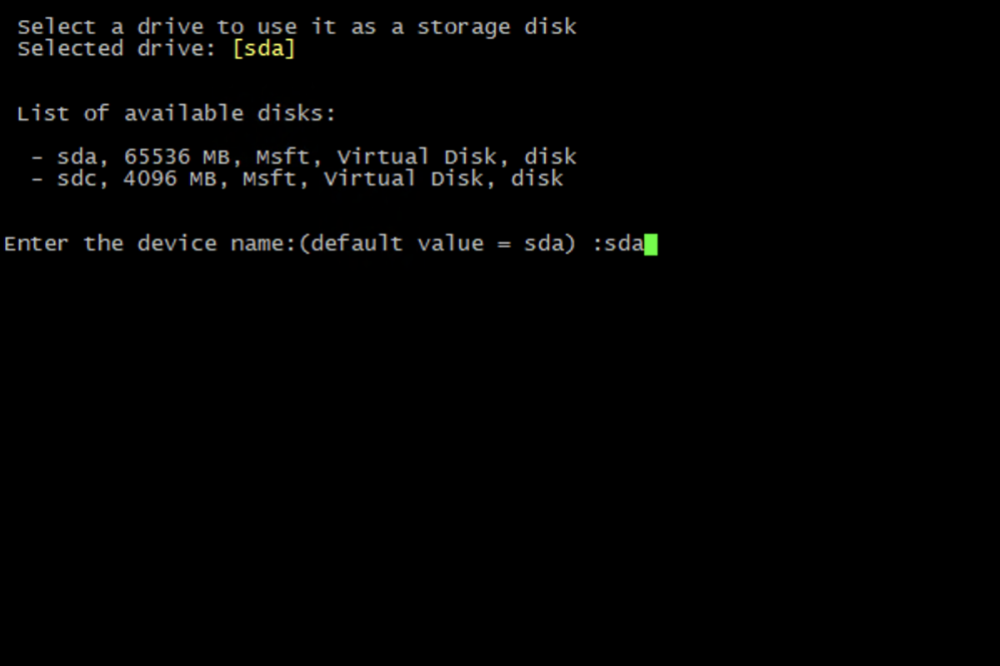<figcaption></figcaption></figure>

3. Restart the virtual machine
