# Microsoft Azure

Для начала авторизуйтесь на портале Microsoft Azure [https://portal.azure.com/](https://portal.azure.com/)

Приступим к настройке.


Для быстрого и удобного поиска на портале Azure используйте панель поиска


### Создание группы ресурсов

1. Откройте Меню / Все службы / Общие / **Группы ресурсов**
2. На вкладке Группы ресурсов выберите **Создать**
3. Введите имя группы, например _MikoPBX\_group_
4. Для других полей используйте значения по умолчанию
5. Завершив ввод значений, нажмите кнопку **Просмотр и создание**, затем кнопку **Создать**

<figure><figcaption></figcaption></figure>

### Создание учетной записи хранения

1. Откройте Меню / Все службы / Интернет вещей / **Учетные записи хранения**
2. На вкладке Учетные записи хранения выберите **Создать**
3. Укажите созданную группу ресурсов _MikoPBX\_group_
4. Введите имя учетной записи, например _pbximgs_
5. Для других полей используйте значения по умолчанию
6. Завершив ввод значений, нажмите кнопку **Проверка**, затем кнопку **Создать**

<figure>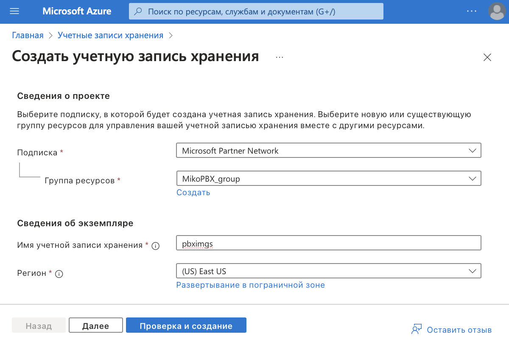<figcaption></figcaption></figure>

### Настройка созданной учетной записи хранения

1. Перейдите к карточке созданной учетной записи хранения _pbximgs_
2. На открытой вкладке перейдите в меню Хранилище данных / Контейнеры
3. Добавьте новый контейнер
4. Введите имя контейнера, например _imgs_
5. Нажмите кнопку **Создать**

<figure>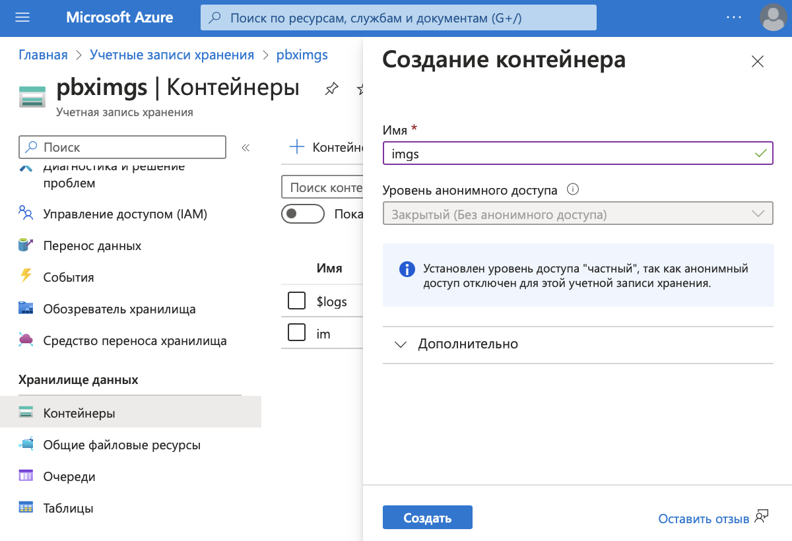<figcaption></figcaption></figure>

6. Откройте созданный контейнер _imgs_
7. На открывшейся вкладке выберите **Отправка**
8. Загрузите файл из дистрибутива MikoPBX с расширением **.vhd**
9. Дождитесь загрузки файла, затем нажмите кнопку **Создать**

<figure>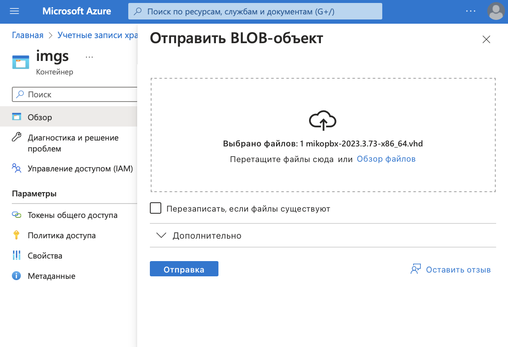<figcaption></figcaption></figure>

### Создание образа

1. Откройте Меню / Все службы / Вычисление / **Образы**
2. На вкладке Образы выберите **Создать**, **с**оздадим новый образ на основе загруженного \*.**vhd** файла
3. Укажите группу ресурсов _MikoPBX\_group_
4. Введите уникальное имя для образа, например _MikoPBX\_Azure_

<figure>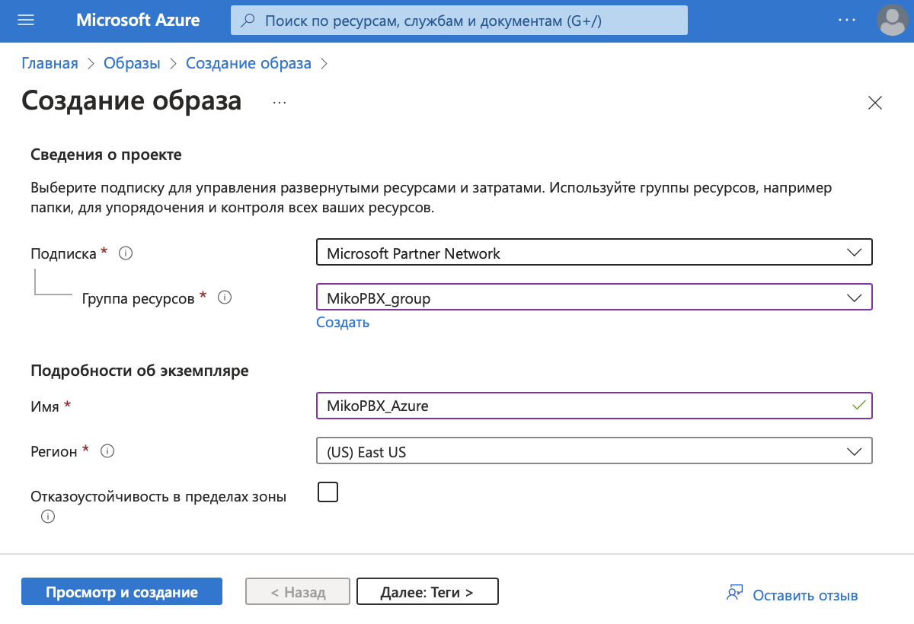<figcaption></figcaption></figure>

5. Укажите тип ОС - **Linux**
6. Укажите поколение виртуальных машин - **Поколение 1**
7. Выберите BLOB-объект хранилища по ссылке **Обзор**, _Обзор_ / pbximgs / imgs / \*_.vhd_
8. Для других полей используйте значения по умолчанию
9. Завершив ввод значений, нажмите кнопку **Просмотр и создание**, затем кнопку **Создать**

<figure>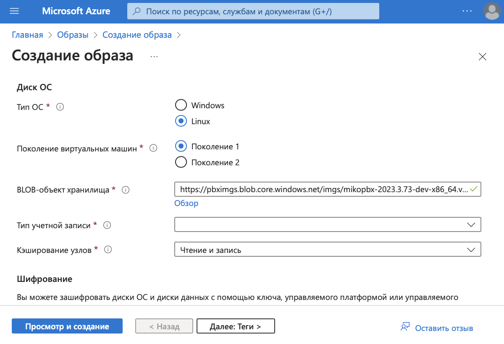<figcaption></figcaption></figure>

### Создание виртуальной машины

1. Откройте Меню / Все службы / Вычисление / **Виртуальные машины**
2. На вкладке Виртуальные машины ресурсов выберите **Создать / Виртуальная машина Azure**
3. Укажите группу ресурсов _MikoPBX\_group_
4. Введите имя виртуальной машины, например _MikoPBX-vm_

<figure><figcaption></figcaption></figure>

5. Выберите созданный ранее образ, _Посмотреть все образы / Другие элементы / Мои изображения / MikoPBX\_Azure_
6. Укажите размер машины (совокупность параметров ЦП / ОЗУ / HDD)

<figure><figcaption></figcaption></figure>

7. Укажите имя пользователя для учетной записи администратора

Если у вас есть ключ SSH, выполните следующее

8. Выберите источник открытого ключа SSH - **Использовать существующий открытый ключ**
9. Укажите его в поле открытый ключ SSH

Если у вас есть нет ключа SSH, выполните следующее

8. Выберите источник открытого ключа SSH - **Создать новую пару ключей**
9. Укажите имя пары ключей, например _mikopbx\_key_

<figure><figcaption></figcaption></figure>

Следуйте дальше по инструкции

10. В поле тип лицензии укажите **Другое**
11. Для других полей используйте значения по умолчанию

<figure>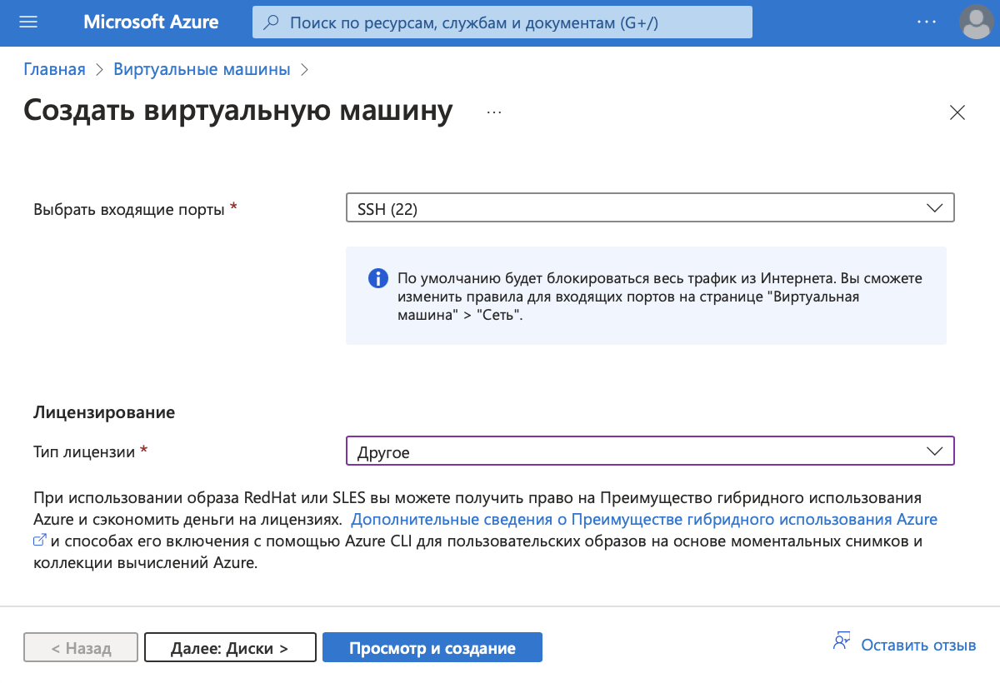<figcaption></figcaption></figure>

12. Перейдите на вкладку **Диски**
13. Укажите тип диска ОС

<figure><figcaption></figcaption></figure>

14. Создайте новый диск данных
15. Укажите размер диска не менее 50Гб
16. Для других полей используйте значения по умолчанию

<figure>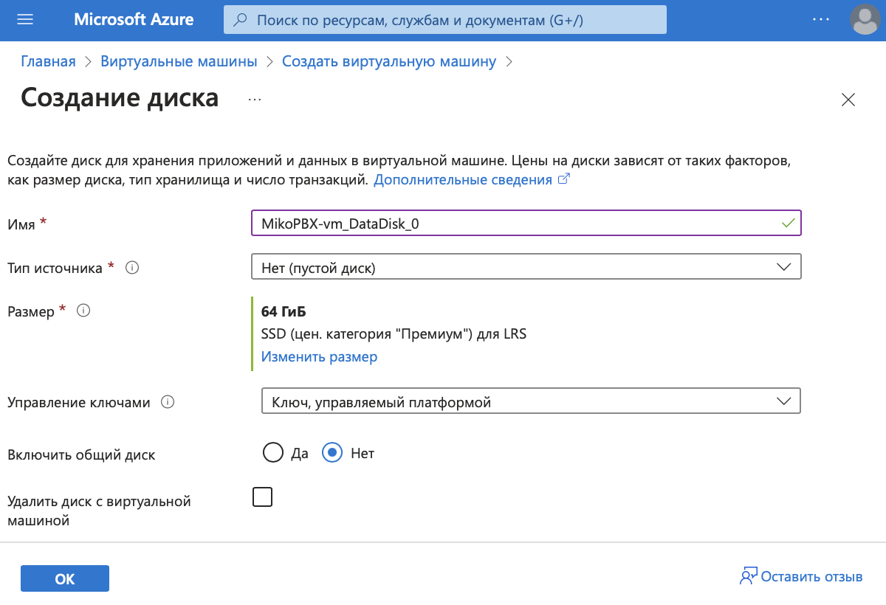<figcaption></figcaption></figure>

17. Завершив ввод значений, нажмите кнопку **Просмотр и создание**, затем кнопку **Создать**

### Настройка портов для входящих соединений

1. Откройте созданную виртуальную машину и перейдите в раздел **Сетевые подключения / Параметры сети / Правила**
2. На вкладке выберите **Создание правила для порта / Правило входящего порта**
3. Создайте правило для Web интерфейса
4. Укажите диапазоны портов назначения - **80**
5. Выберите протокол **TCP**

<figure>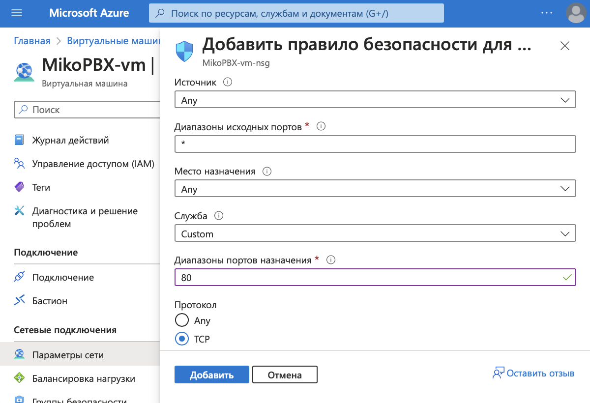<figcaption></figcaption></figure>

6. Укажите имя, например _HTTP\_80_
7. Для других полей используйте значения по умолчанию
8. Завершив ввод значений, нажмите кнопку **Добавить**

<figure><figcaption></figcaption></figure>

9. Аналогично создайте правило для SIP сигнализации TCP. Укажите диапазоны портов назначения - **5060,**протокол **TCP** и имя
10. Аналогично создайте правило для SIP сигнализации UDP. Укажите диапазоны портов назначения - **5060,**протокол **UDP** и имя
11. Аналогично создайте правило для передачи звука RTP. Укажите диапазоны портов назначения - **10000-10200,**протокол **UDP** и имя

<figure>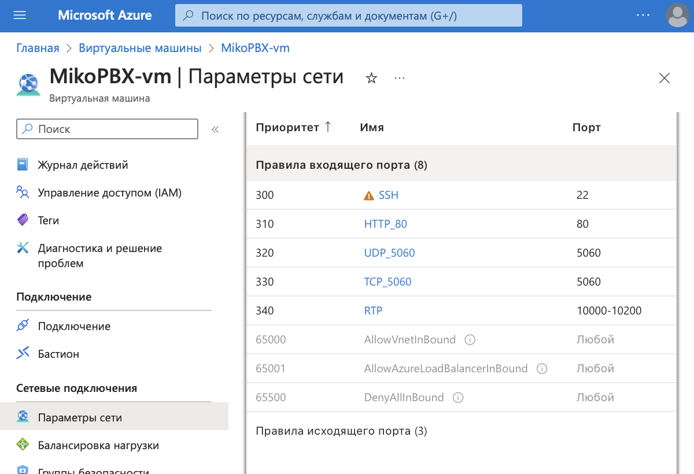<figcaption></figcaption></figure>

### Запуск АТС MikoPBX

1. Откройте созданную виртуальную машину и перейдите в раздел **Подключение**
2. Скопируйте **Общедоступный IP-адрес**

<figure>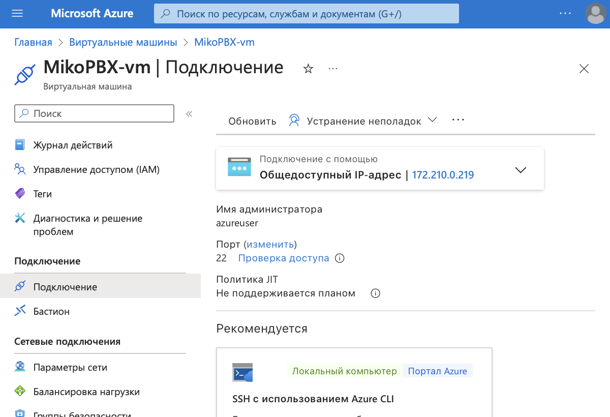<figcaption></figcaption></figure>

3. Введите в строке браузера общедоступный IP-адрес вашей виртуальной машины
4. Логин и пароль для входа по умолчанию - **admin**
5. В АТС на вкладке **Сеть и Firewall / Сетевые интерфейсы** в поле внешний IP адрес вашего маршрутизатора обязательно следует указать **общедоступный IP-адрес**

<figure><figcaption></figcaption></figure>

### Подключение диска для хранения данных

Подключитесь к MikoPBX, для этого вы можете использовать встроенную консоль

1. Откройте созданную виртуальную машину и перейдите в раздел **Подключение**
2. В выпадающем меню Дополнительные способы подключения выберите **Серийная консоль**
3. Выполните команду **/etc/rc/console\_menu**

<figure>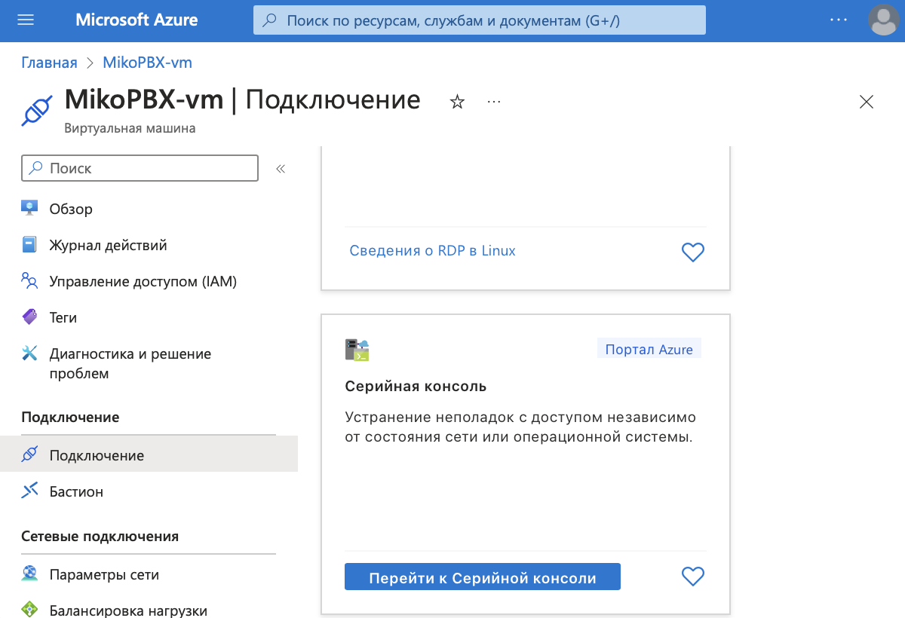<figcaption></figcaption></figure>

Или вы можете подключиться к АТС MikoPBX с помощью SSH-клиента по инструкции: [https://docs.mikopbx.com/mikopbx/faq/troubleshooting/connecting-to-a-pbx-using-an-ssh-client](https://docs.mikopbx.com/mikopbx/faq/troubleshooting/connecting-to-a-pbx-using-an-ssh-client)

После подключения к MikoPBX, приступайте к подключению диска для хранения данных

1. Переключите язык интерфейса на русский **Change Language / Русский**
2. В списке выберите **Хранилище данных / Подключить диск для хранения данных**
3. Выберите созданный ранее диск (размер диска не менее 50Гб) для хранения записей разговоров, в нашем случае _sda_
4. Перезагрузите виртуальную машину
