# VK Cloud Solutions

## Добавление локальной подсети

1. Авторизуйтесь на сайте [mcs.mail.ru](https://mcs.mail.ru/).&#x20;

<figure><figcaption></figcaption></figure>

2. Откройте меню **Виртуальных сетей**

<figure><figcaption></figcaption></figure>

3. Перейдите во вкладку "**Сети**"

<figure><figcaption></figcaption></figure>

4.  Для начала следует убедиться, что в разделе «**Виртуальные сети**» - «**Сети**» доступа локальная подсеть.

    MikoPBX будем устанавливать за NAT.

    Если сеть не создана: нажмите **"Создать"**

<figure><figcaption></figcaption></figure>

&#x20;       Введите **название** Сети и нажмите "**Добавить Сеть**"

<figure><figcaption></figcaption></figure>

## Добавление ssh-rsa ключа.

1. Перейдите к настройке ключевых пар:

&#x20;       Для этого нажмите на свой e-mail, далее на надпись "**Ключевые пары**"

<figure><figcaption></figcaption></figure>

2. Создайте или импортируйте ключ.

&#x20;       Он будет использоваться при доступе к АТС по ssh.

## Загрузка образа MikoPBX 

1. Перейдите во вкладку "**Облачные вычисления**"

<figure><figcaption></figcaption></figure>

2. Оттуда перейдите к вкладке "**Образы**":

<figure><figcaption></figcaption></figure>

3. Нажмите "**Создать образ**":

<figure><figcaption></figcaption></figure>

4. Скачайте образ диска формата raw.

<figure>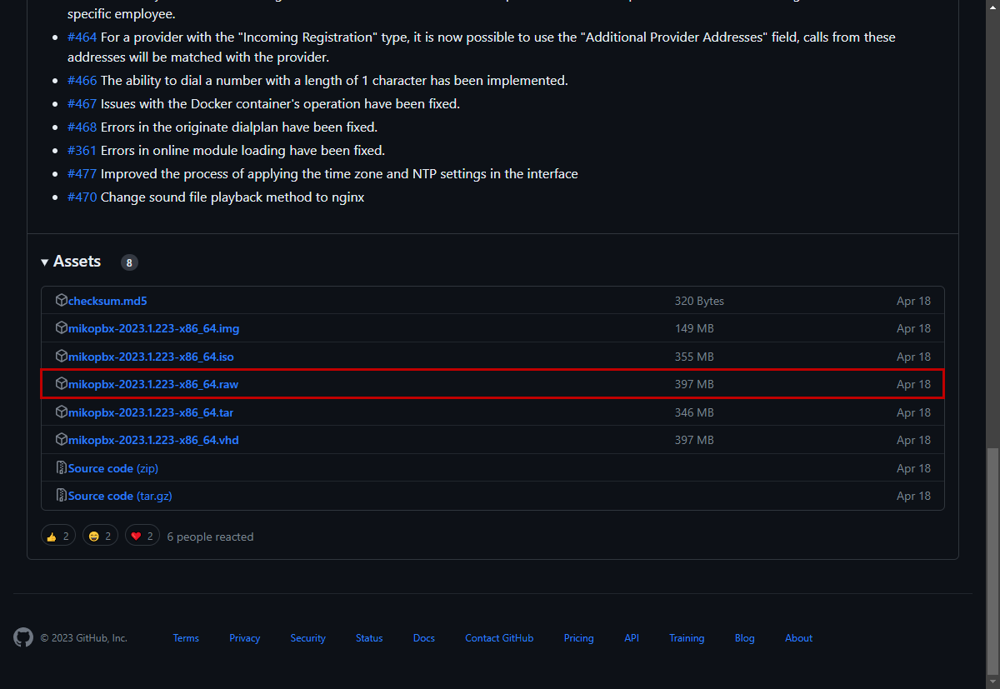<figcaption></figcaption></figure>

5. Выберите "**Диск**", выберите скачанный образ, задайте название образа.

&#x20;        Нажмите "**Создать образ**":

<figure>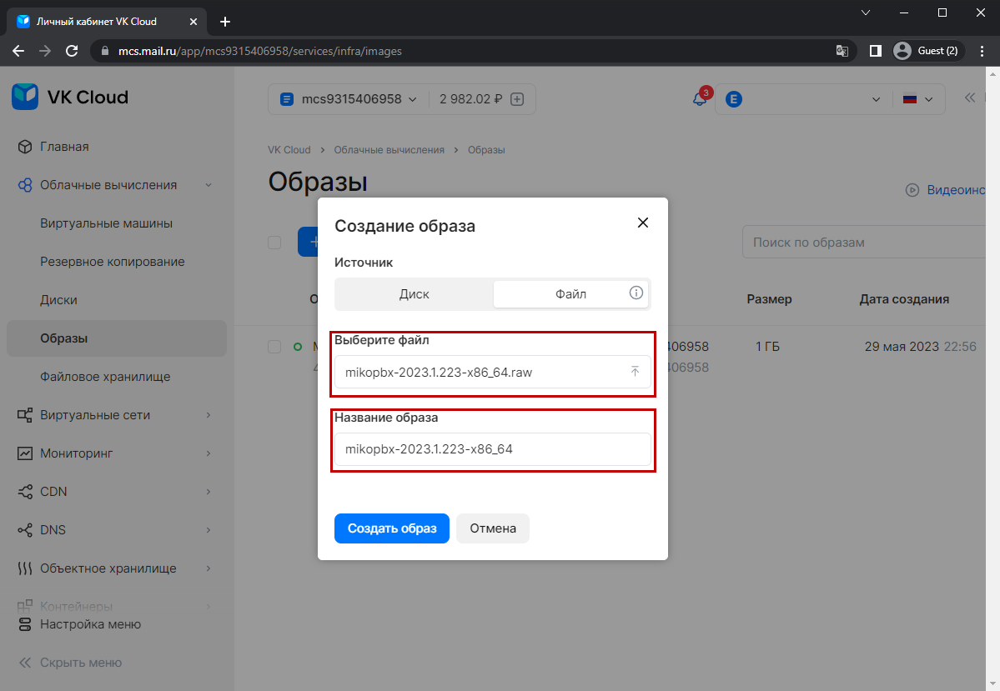<figcaption></figcaption></figure>

<figure>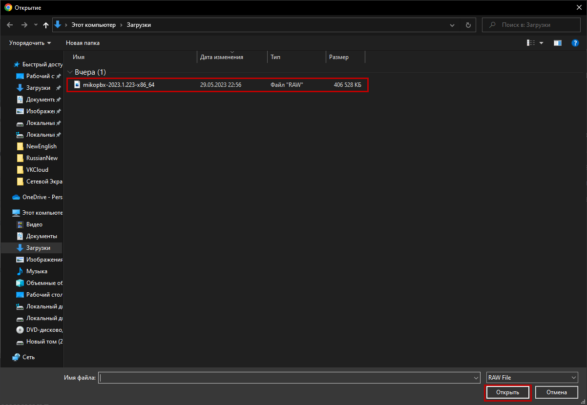<figcaption></figcaption></figure>

## Создадим инстанс 

1. Перейдите в раздел «**Облачные вычисления**» - «**Виртуальные машины**»

Нажмите "**Создать инстанс**":

<figure>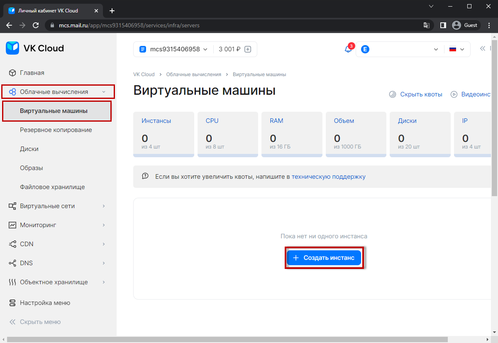<figcaption></figcaption></figure>

2. &#x20;Введите:

* _Имя виртуальной машины_
* _Тип виртуальной машины_
* _Зону доступности_
* _Количество машин в конфигурации_
* _Размер Диска_
* _Тип диска_

<mark style="color:red;">**Укажите MikoPBX в качестве операционной системы**</mark>

Нажмите **"Следующий шаг"**

<figure>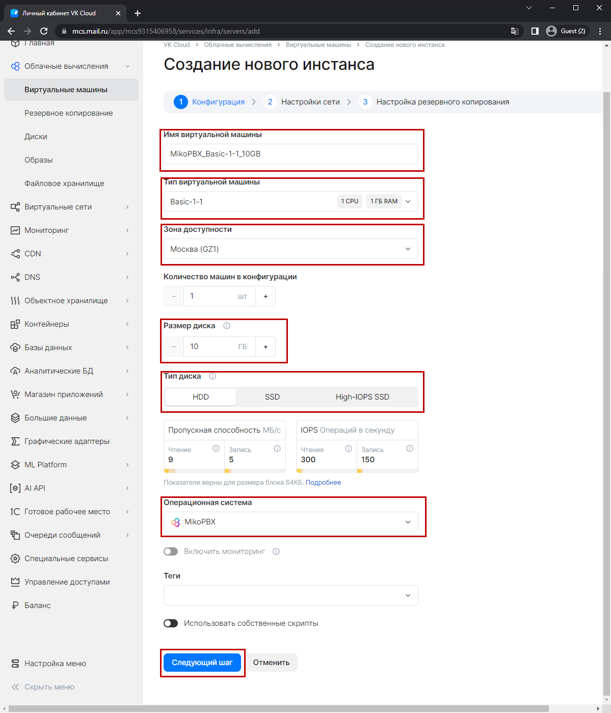<figcaption></figcaption></figure>

3. Выберите **сеть**, **ключ виртуальной машины** и нажмите "**Следующий шаг**"

<figure><figcaption></figcaption></figure>

4. Нажмите "**Создать инстанс**"

<figure><figcaption></figcaption></figure>

5. Как только инстанс будет создан, сразу остановите его запуск:

<figure><figcaption></figcaption></figure>

Инстанс создан.

## Диск для хранения данных 

1. Перейдите во вкладку **Диски**, нажмите "**Создать диск**"

<figure><figcaption></figcaption></figure>

2. Введите следующие параметры:

* Название диска
* Источник **(**_Пустой диск_**)**
* Тип диска
* Зону доступности**(**_Должна быть такая же, как и у инстанса_**)**
* Размер**(**_более 50 ГБ_**),**

Далее отметьте галочку "**подключить диск"** и укажите инстанс MikoPBX, который мы сейчас запускаем.

Нажмите "**Создать диск**"

<figure><figcaption></figcaption></figure>

<figure><figcaption></figcaption></figure>

3. Запустите инстанс:

<figure>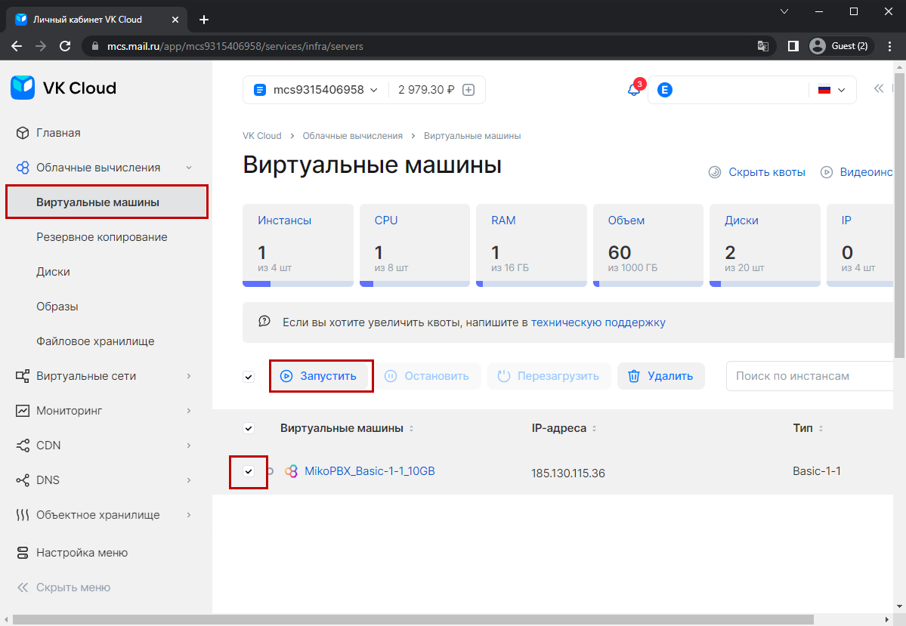<figcaption></figcaption></figure>

4. Перейдите в консоль АТС:

Зайдите во вкладку "**Виртуальные машины**", выберите свою виртуальную машину

<figure>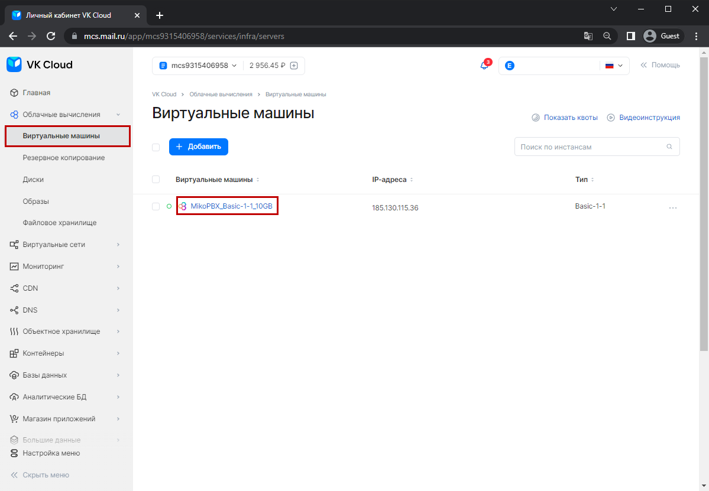<figcaption></figcaption></figure>

Перейдите во вкладку "**Консоль**"

<figure>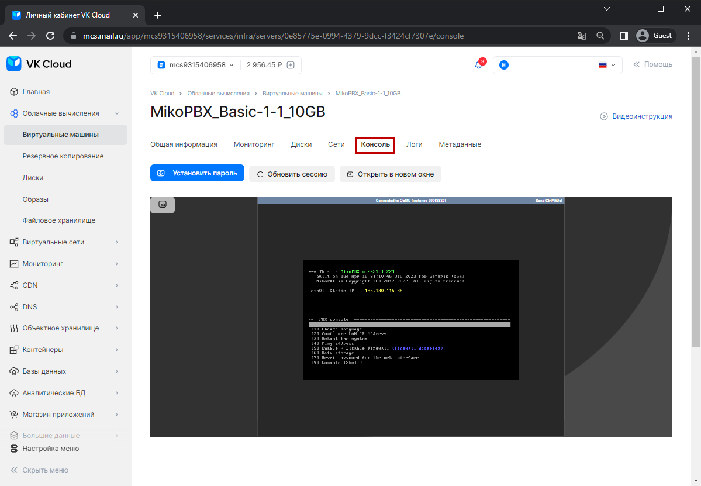<figcaption></figcaption></figure>

5. Выберите пункт «**\[6] Data storage**»

<figure><figcaption></figcaption></figure>

6. Далее выберите пункт «**\[1] Mount drive as data storage**»&#x20;

<figure><figcaption></figcaption></figure>

7. На следующем шаге нажмите **ENTER**

<figure><figcaption></figcaption></figure>

Система перезагрузится, надпись **"**<mark style="color:red;">**Storage disk not connected**</mark>**"** пропадет

<figure>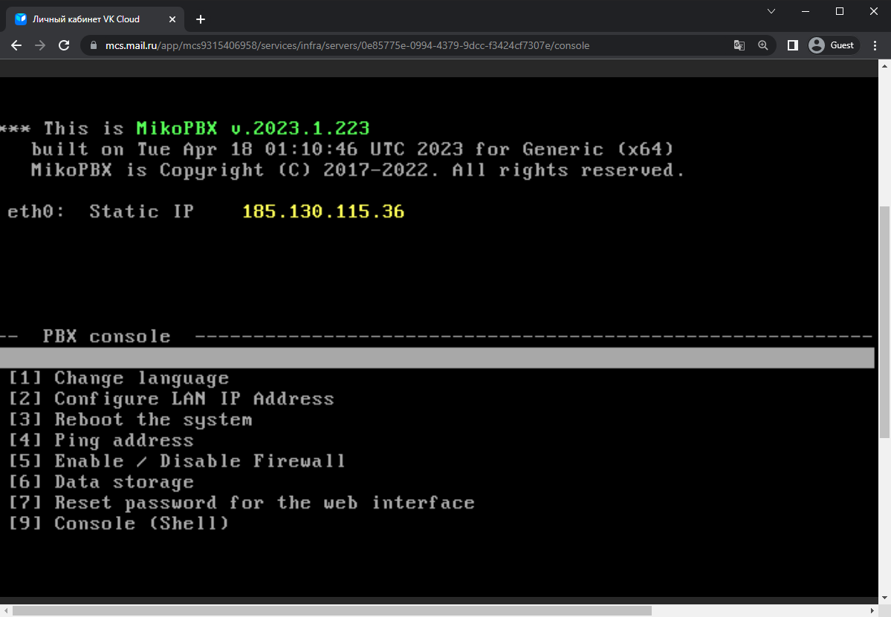<figcaption></figcaption></figure>

Диск для хранения данных успешно подключен.

## Подключение 

1. Определите шлюз, маску, внешний IP-адрес с помощью раздела **"Облачные вычисления" -> "Виртуальные машины" -> "Ваша виртуальная машина" -> "Сети"**

<figure><figcaption></figcaption></figure>

**Для данного примера:**

&#x20;  _IP-адрес: 185.130.115.36_

&#x20;  _Шлюз: 185.130.115.254_

&#x20;  _Маска: 22_

2. Перейдите в АТС:

Зайдите во вкладку "**Виртуальные машины**", выберите свою виртуальную машину

<figure><figcaption></figcaption></figure>

Перейдите во вкладку "**Консоль**"

<figure><figcaption></figcaption></figure>

3. Перейдите к разделу «**\[2] Configure LAN IP Address**»

<figure>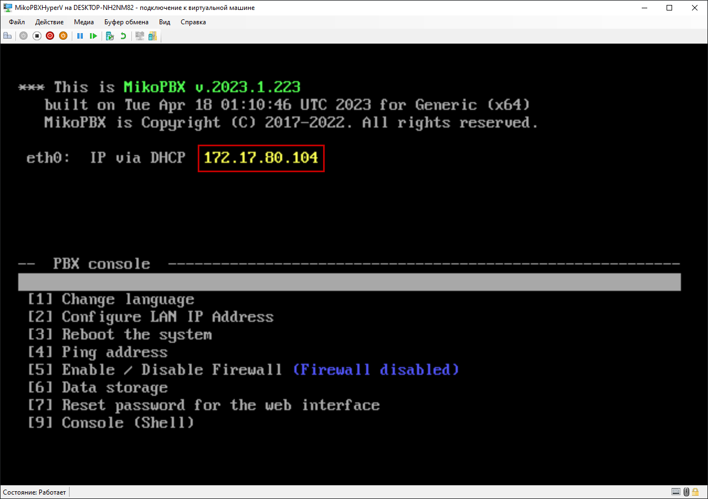<figcaption></figcaption></figure>

4. Выбираем «**\[2] Manual settings**»

<figure><figcaption></figcaption></figure>

5. Введите внешний IP-адрес.

Нажмите **Enter**

<figure>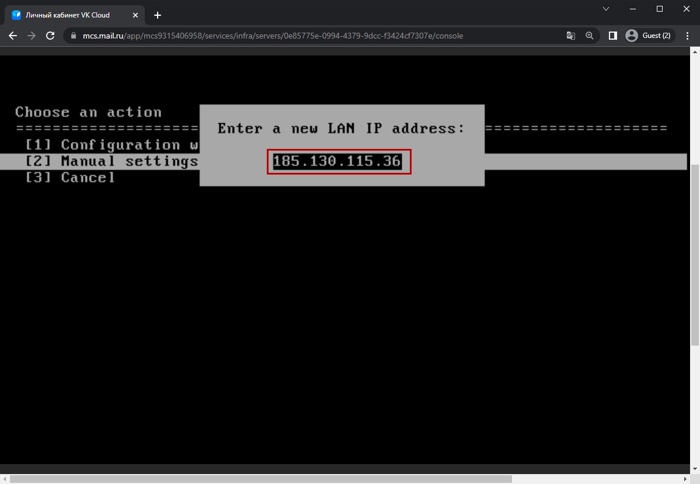<figcaption></figcaption></figure>

6. Введите значение маски подсети

Нажмите **Enter**

<figure>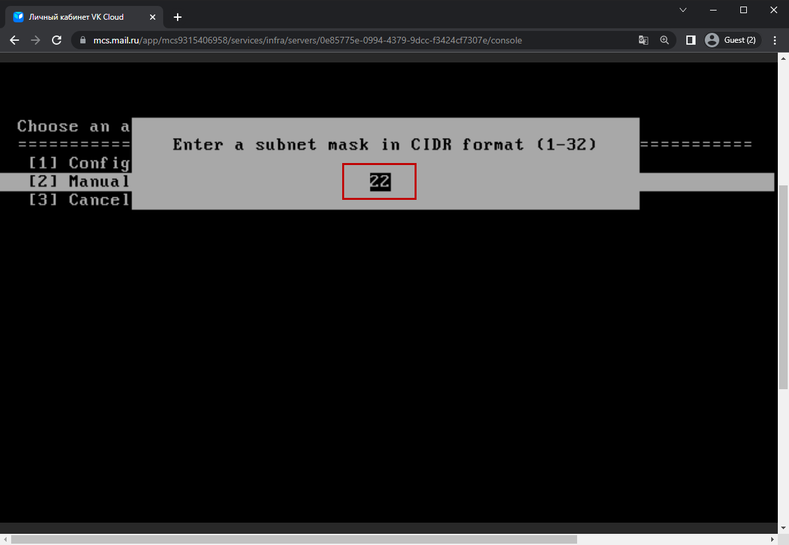<figcaption></figcaption></figure>

7. Введите значение шлюза

Нажмите **Enter:**

<figure>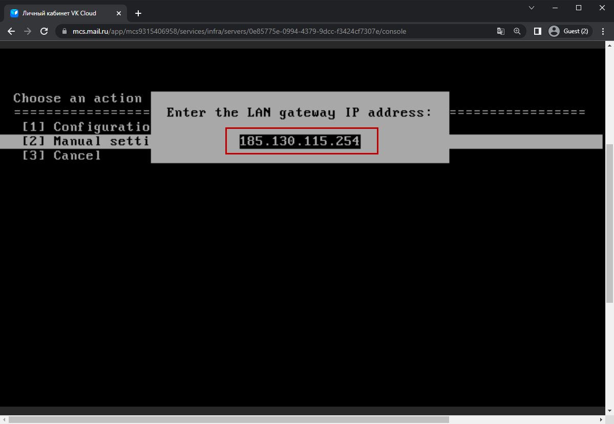<figcaption></figcaption></figure>

8. Введите значение DNS

Рекомендуется использовать стандартное - **8.8.8.8**

Нажмите **Enter**

<figure>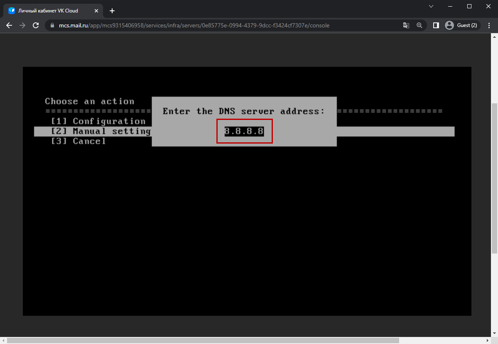<figcaption></figcaption></figure>

## Firewall

Для того, чтобы получить доступ к панели управления, нужно изменить стандартные настройки firewall в VKCloud

Для этого: Перейдите в "**Виртуальные сети**" -> "**Настройки firewall**" -> "**Добавить**"

<figure><figcaption></figcaption></figure>

Введите **Имя группы правил, Описание**

нажмите "**Создать группу**"

<figure>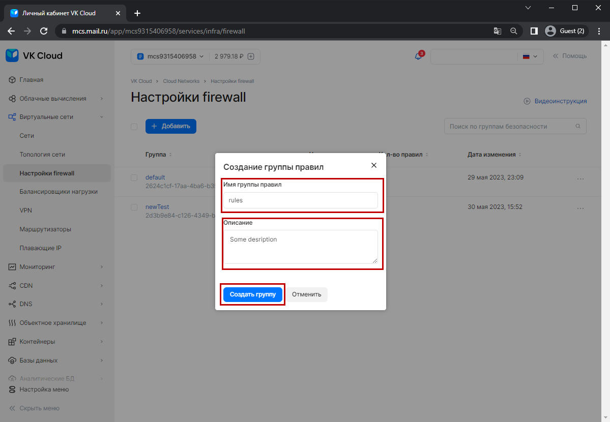<figcaption></figcaption></figure>

Нажмите "**Добавить правило**" в разделе "**Входящий трафик**"

<figure>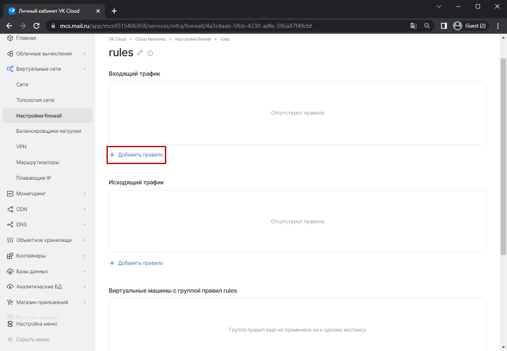<figcaption></figcaption></figure>

4. Выберите тип "**Все протоколы и все порты**", выберете Удаленный адрес "**Все IP-адреса**"

Нажмите "**Создать правило**"

<figure>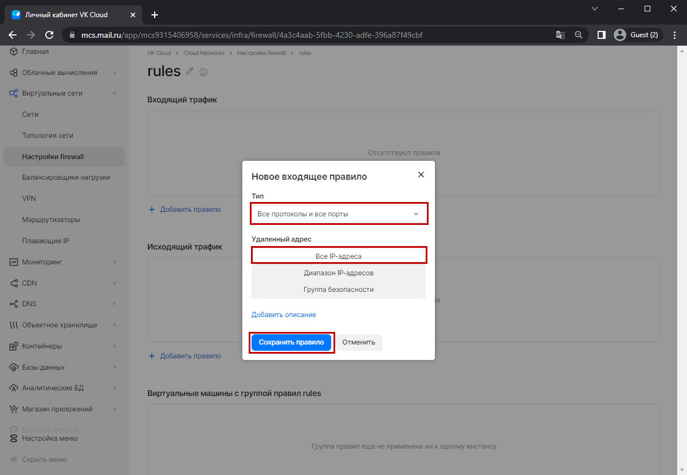<figcaption></figcaption></figure>

5. Нажмите "**Добавить виртуальную машину**"

<figure>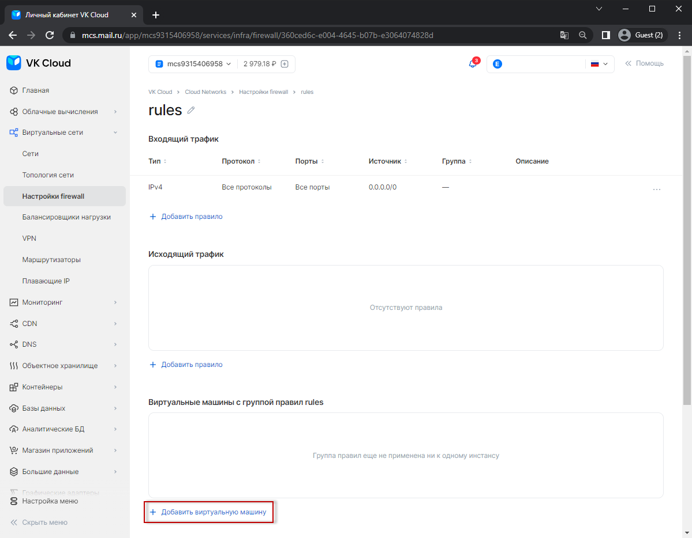<figcaption></figcaption></figure>

6. Выберете вашу виртуальную машину и нажмите "**Добавить группу правил**"

<figure>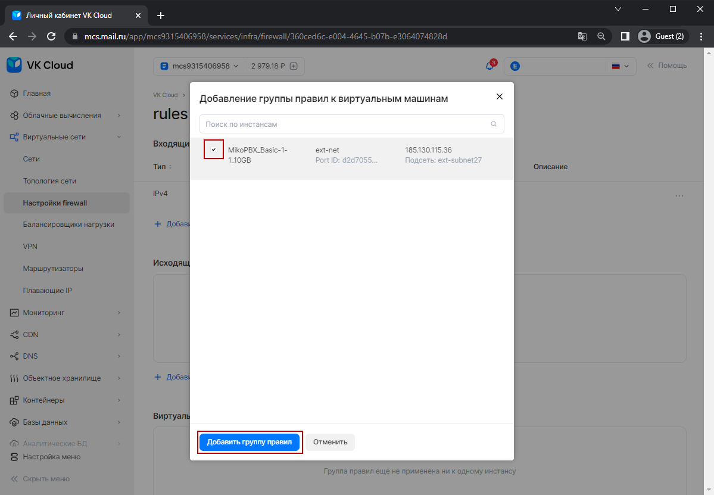<figcaption></figcaption></figure>

_<mark style="color:red;">**Не забудьте настроить firewall внутри MikoPBX**</mark>_. Инструкцию можно прочитать [здесь.](../../manual/connectivity/firewall.md)

## Первый вход в MikoPBX

Для того, чтобы открыть панель управления вам надо вбить в строку браузера IP-адрес вашей виртуальной машины.

<figure>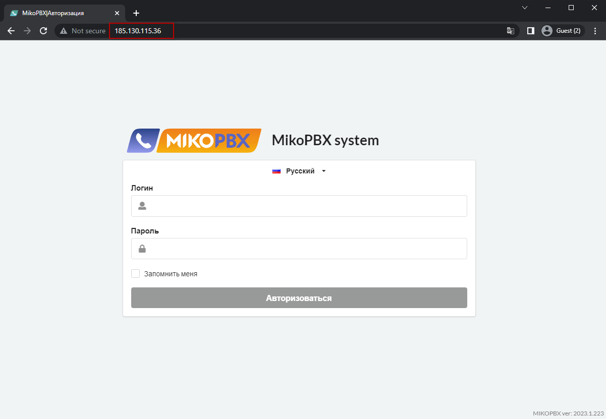<figcaption></figcaption></figure>

Логин и пароль по умолчанию - **Admin**

На этом установка MikoPBX на VKCloud завершена.
