# VK Cloud Solutions

Для начала авторизуйтесь на сайте [https://cloud.vk.com](https://cloud.vk.com/)

Приступим к настройке

### **Добавление локальной подсети**

1. Откройте Виртуальные сети / **Сети**
2. На вкладке Сети выберите **Создать**
3. Введите имя новой сети, например _pbx\_network_
4. Для других полей используйте значения по умолчанию
5. Завершив ввод значений, нажмите кнопку **Добавить сеть**

<figure>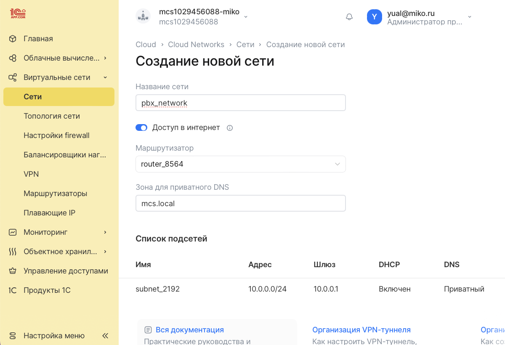<figcaption></figcaption></figure>

### **Добавление ssh-rsa ключа**

1. Перейдите к своему аккаунту
2. В выпадающем меню выберите **Ключевые пары**

Если у вас есть ключ SSH, выполните следующее

1. Выберите **Импортировать ключ**
2. Введите название ключа и укажите ключ в поле Публичный ключ
3. Нажмите кнопку **Импортировать ключ**

Если у вас есть нет ключа SSH, выполните следующее

1. Выберите **Создать ключ**
2. Введите название ключа, например _mikopbx\_ssh\_key_
3. Нажмите кнопку **Создать ключ**

<figure>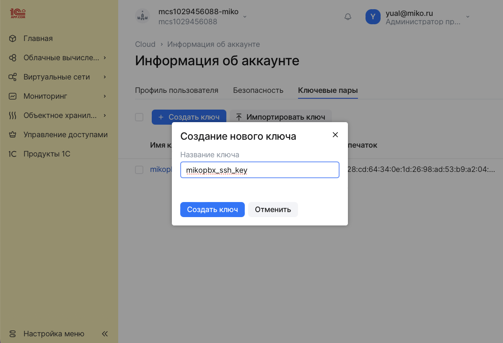<figcaption></figcaption></figure>

### **Загрузка образа MikoPBX**

1. Откройте Облачные вычисления / **Образы**
2. На вкладке Образы выберите **Создать**
3. Укажите источник - **Файл**
4. Выберите файл из дистрибутива MikoPBX с расширением **.raw**
5. Введите название образа, например _mikopbx\_image_
6. Завершив ввод значений, нажмите кнопку **Создать образ**

<figure>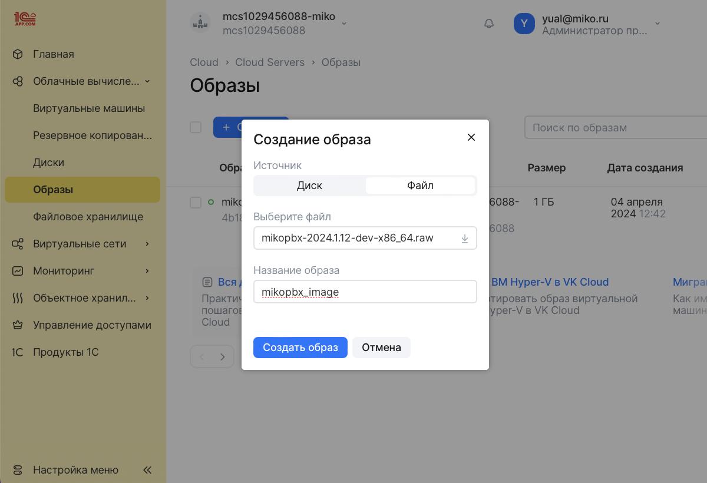<figcaption></figcaption></figure>

### **Создание инстанса**

1. Откройте Облачные вычисления / **Виртуальные машины**
2. На вкладке Виртуальные машины выберите **Добавить**
3. Введите имя виртуальной машины, например _mikopbx\_vm_
4. В поле Категория виртуальной машины выберите **Все актуальные типы виртуальных машин**
5. Укажите Тип виртуальной машины, исходя из ожидаемой нагрузки на АТС. Для тестовой машины можно указать STD2-1-1
6. Выберите Зону доступности

<figure>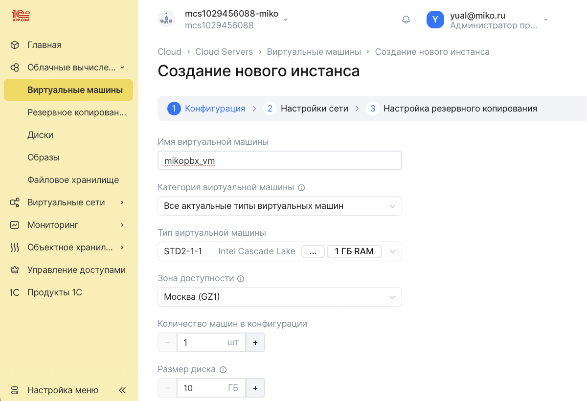<figcaption></figcaption></figure>

7. Укажите Тип диска - **HDD**
8. В качестве Операционной системы выберите _mikopbx\_image_

<figure>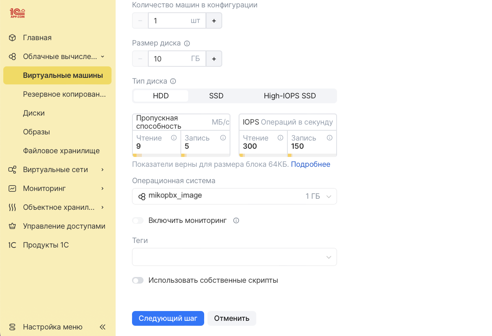<figcaption></figcaption></figure>

9. Перейдите к следующему шагу **Настройки сети**
10. Выберите созданную Сеть _pbx\_network_
11. Выберите созданный Ключ виртуальной машины _mikopbx\_ssh\_key_
12. Включите переключатель **Назначить внешний IP**

<figure>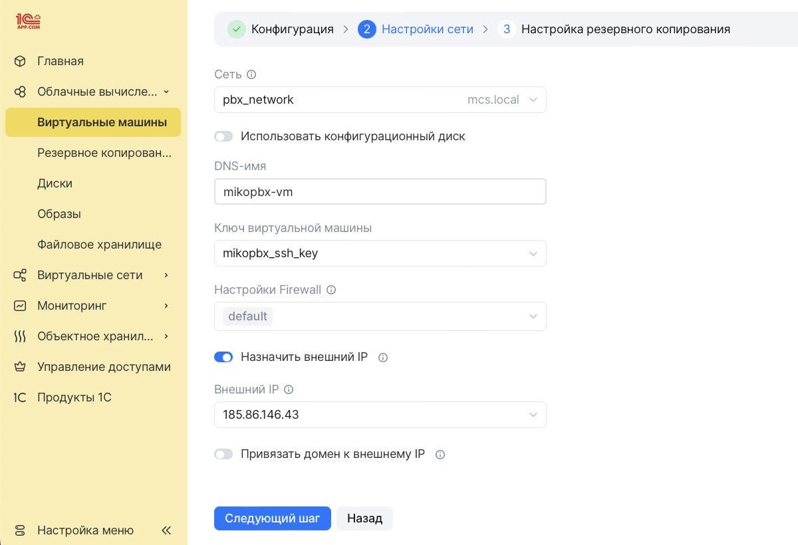<figcaption></figcaption></figure>

13. Для других полей используйте значения по умолчанию
14. Завершив ввод значений, нажмите кнопку **Создать инстанс**
15. Как только инстанс будет создан, сразу остановите его запуск

<figure>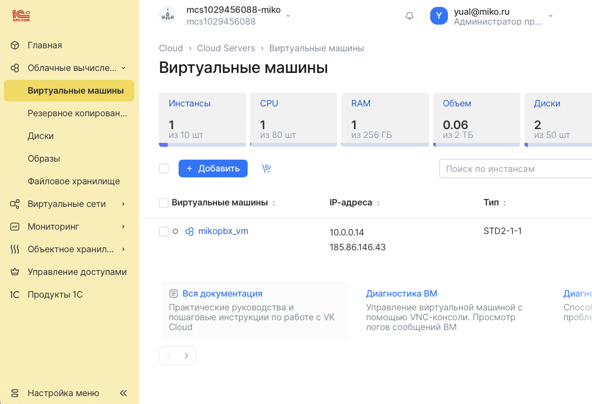<figcaption></figcaption></figure>

### **Диск для хранения данных**


Для развертывания АТС используйте **два** диска:

* диск объемом **1 Гб** для основной системы
* диск объемом **50+ Гб** для хранения записей разговоров


1. Откройте Облачные вычисления / **Диски**
2. На вкладке Диски выберите **Создать диск**
3. Введите название диска, например _mikopbx\_storage\_disk_
4. Укажите Источник - **Пустой диск**
5. Укажите Тип диска - **Сетевой HDD-диск (ceph-hdd)**
6. Выберите Зону доступности такую же, как и у инстанса
7. Укажите размер диска не менее 50Гб

<figure>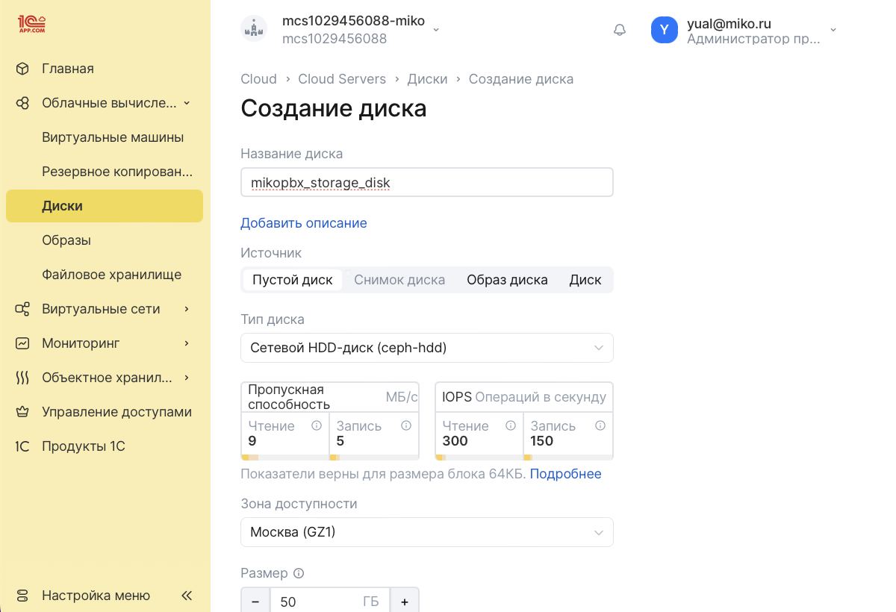<figcaption></figcaption></figure>

8. Включите переключатель **Подключить диск к инстансу**
9. Выберите созданный инстанс _mikopbx\_vm_

<figure>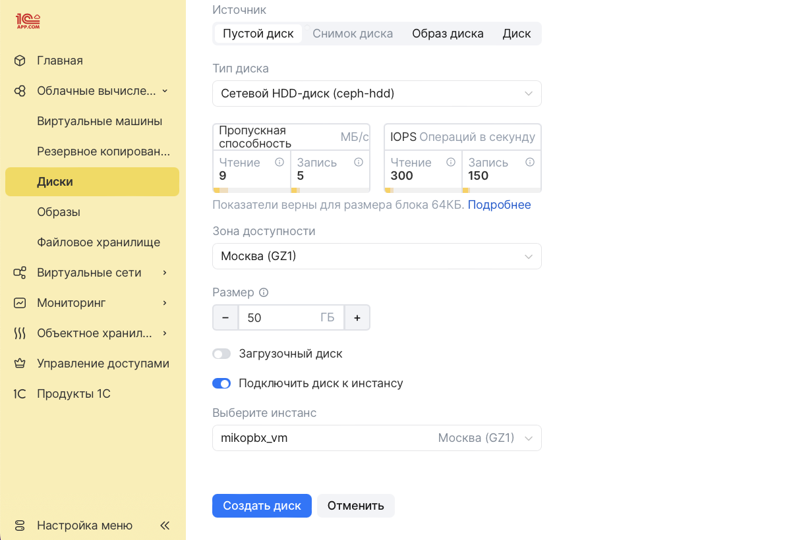<figcaption></figcaption></figure>

10. Для других полей используйте значения по умолчанию
11. Завершив ввод значений, нажмите кнопку **Создать диск**

<figure>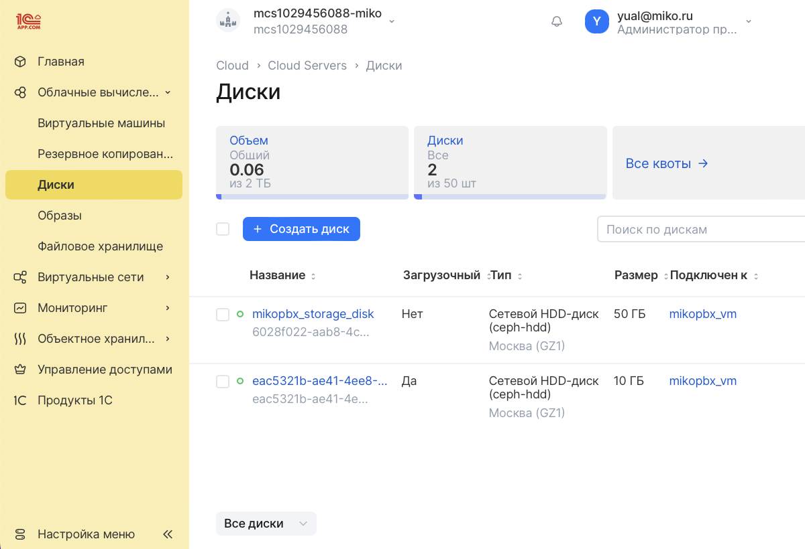<figcaption></figcaption></figure>

12. Откройте Облачные вычисления / **Виртуальные машины**
13. Запустите созданный инстанс _mikopbx\_vm_

### **Firewall**

1. Откройте Виртуальные сети / **Настройки firewall**
2. На вкладке Настройки firewall выберите **Добавить**
3. Введите имя группы правил, например _mikopbx\_rules_
4. Нажмите кнопку **Создать группу**

<figure>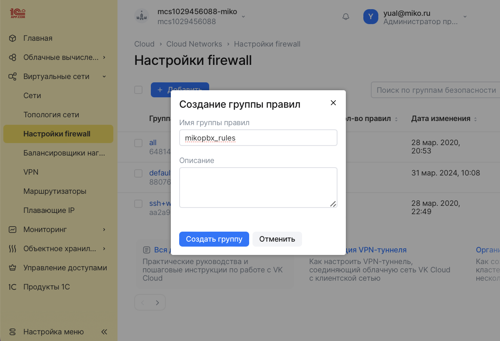<figcaption></figcaption></figure>

5. На открытой вкладке в разделе Входящий трафик выберите **Добавить правило**
6. Выберите Тип - **Все протоколы и все порты**
7. Укажите Удаленный адрес - **Все IP-адреса**
8. Нажмите кнопку **Создать правило**

<figure>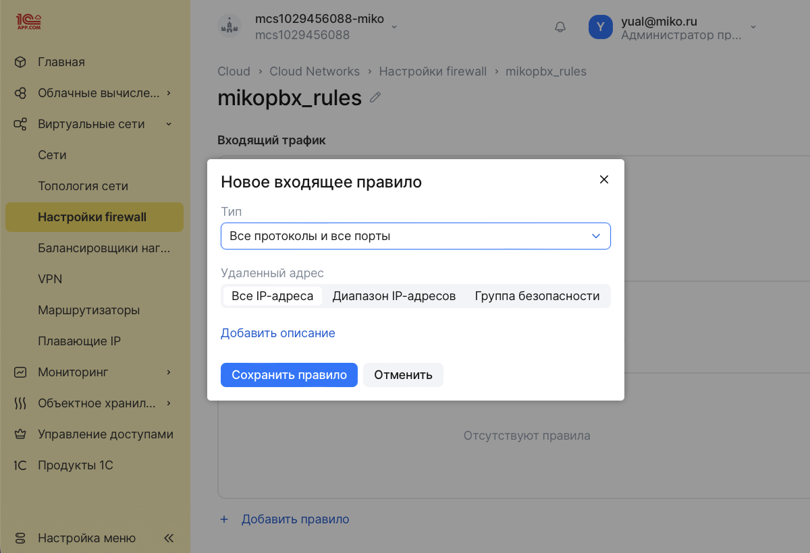<figcaption></figcaption></figure>

9. В разделе Виртуальные машины с группой правил mikopbx\_rules выберите **Добавить виртуальную машину**
10. Выберете созданную виртуальную машину _mikopbx\_vm_ и нажмите **Добавить группу правил**

<figure>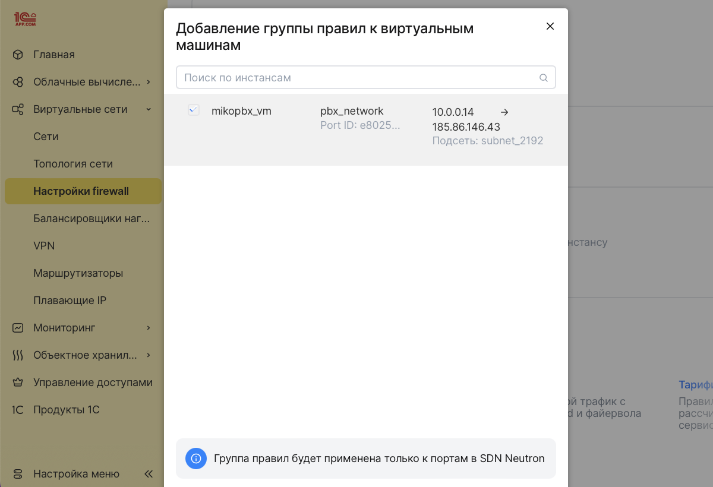<figcaption></figcaption></figure>

<figure>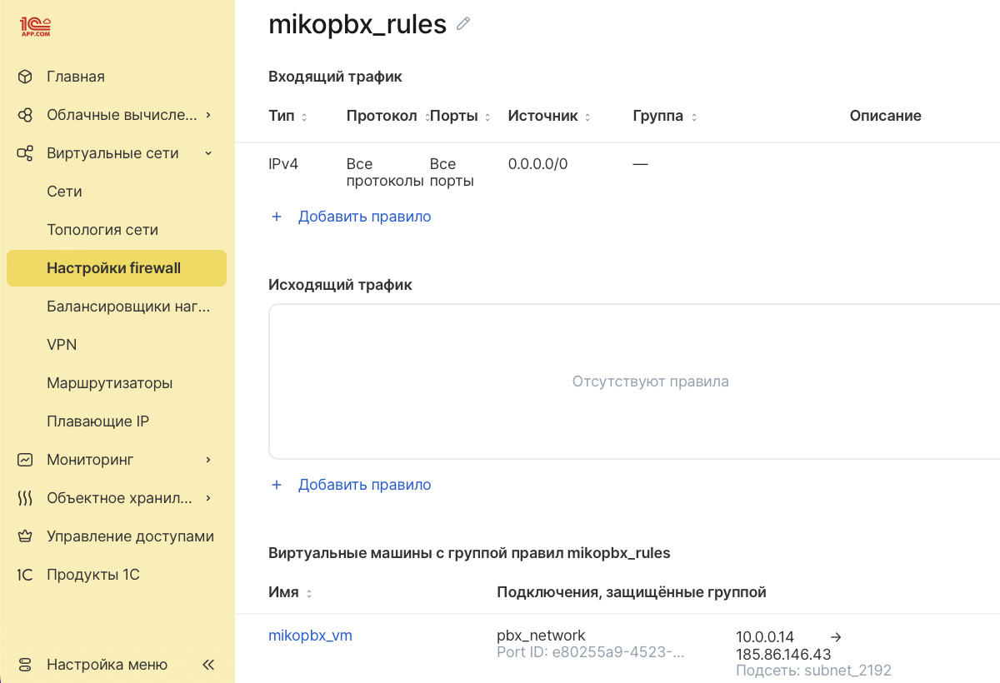<figcaption></figcaption></figure>


Обязательно выполните настройку Firewall на самой АТС MikoPBX


### **Запуск АТС MikoPBX**

1. Откройте Облачные вычисления / Виртуальные машины
2. Перейдите к созданной виртуальной машине _mikopbx-vm_
3. На открытой вкладке перейдите в раздел Логи

<figure>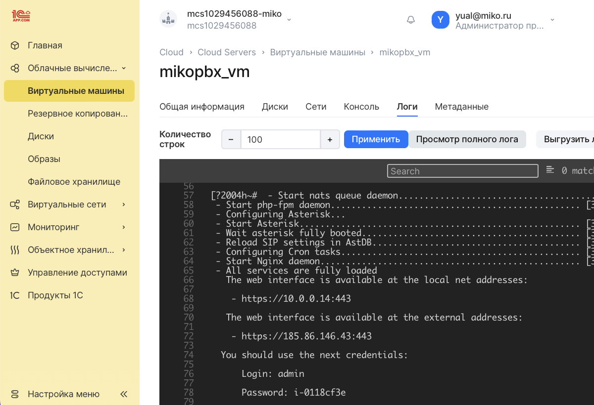<figcaption></figcaption></figure>

4. Скопируйте внешний адрес созданной виртуальной машины и введите его в строке браузера
5. Для входа используйте указанные во вкладке Серийная консоль логин и пароль

<figure><figcaption></figcaption></figure>
