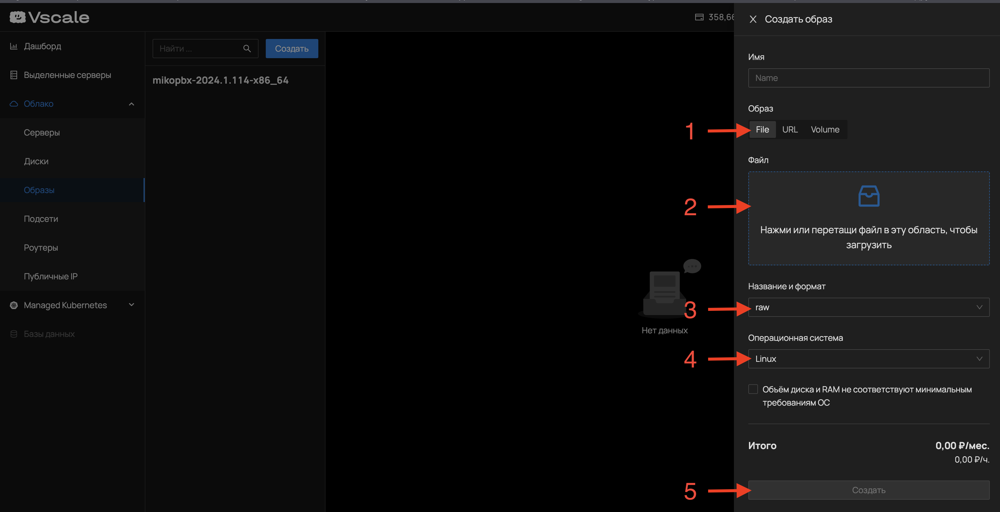
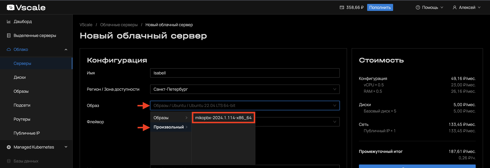
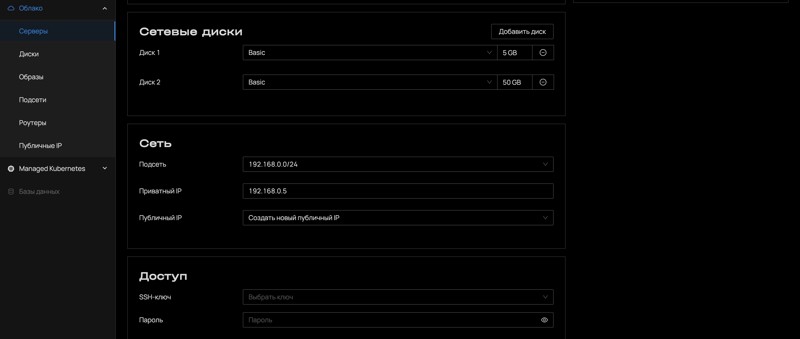
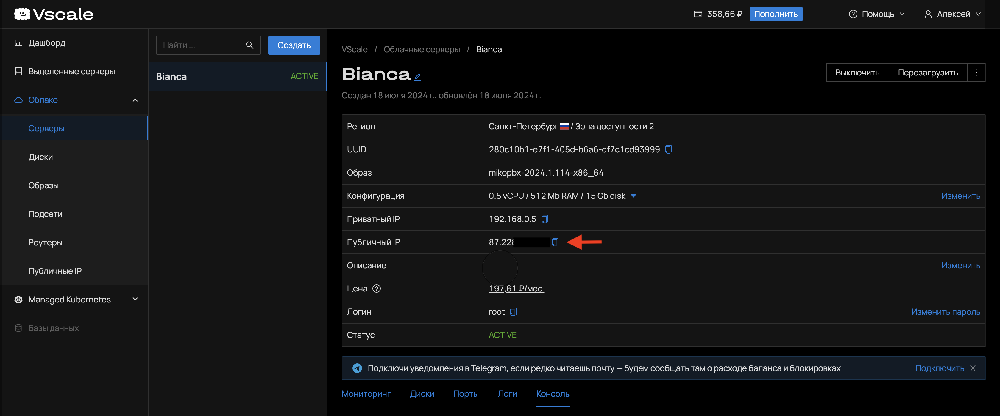

# Vscale

### Загрузка образа

1. Скачайте актуальный образ системы с расширением **.raw** на [сайте](https://github.com/mikopbx/Core/releases)&#x20;
2. Выполните аторизацию на портале [https://vscale.io](https://vscale.io)&#x20;
3.  Перейдите в раздел "**Облако**" - "**Образы**" - кликните по кнопке "**Создать**"&#x20;

    <figure><figcaption></figcaption></figure>


4. Выберите тип образа - "**File**" (п.1)
5. Формат образа - "**raw**" (п.3)
6. Операционная система - "**Linux**" (п.4)
7. Выберите файл для загрузки (п.2)
8. Кликните по кнопке "Создать" (п.5) и дождитесь завершения операции

### Создание сервера

1. Перейдите в раздел "**Облако**" - "**Серверы**" - кликните по кнопке "**Создать**"&#x20;
2. Введите имя сервера
3. В поле "**Флейвор**" выберите конфигурацию сервера
4.  Выберите загруженный ранее образ MikoPBX&#x20;

    <figure><figcaption></figcaption></figure>


5. Настройте два диска, первый на 5Гб, второй на 50Гб
6. В разделе "**Сеть**" - "**Публичный IP**" - выберите "**Создать новый публичный IP**"
7.  В разделе "**Доступ**" задайте сложный пароль&#x20;

    <figure><figcaption></figcaption></figure>


8. Кликните по кнопке "**Создать сервер**" и дождитесь завершения операции

### Вход в web интерфейс

После создания сервера можно перейти к его статусу в разделе "**Облако**" - "**Серверы**"

<figure><figcaption></figcaption></figure>

> Пароль для входа в вэб интерфейс по умолчанию устанавливается в значение, равному "instance-id", на текущий момент нет возможности получить этот идентификатор из web интерфейса Vscale.

Для получения пароля от web интерфейса в консоли выполните команду:

```
sqlite3 /cf/conf/mikopbx.db "select * from m_PbxSettings where key='WebAdminPassword'"
```

Получите вывод:

```
+------------------+------------+
|       key        |   value    |
+------------------+------------+
| WebAdminPassword | i-001537fd |
+------------------+------------+

```

В данном примере паролем будет значение **i-001537fd**

Теперь можно перейти по публичному адресу и начать настройку АТС. &#x20;
