# Vultr (In dev stage)


Инструкция актуальна для версии 2024.2.138 и новее!


В данной инструкции мы пошагово произведем установку MikoPBX с помощью облачной платформы Vultr.

Перед началом Вам необходимо скачать актуальный образ MikoPBX с расширением **.iso**. Сделать это можно на [github MikoPBX](https://github.com/mikopbx/core/releases).

## Загрузка образа в Vultr

### Загрузка файла в хранилище

Для начала необходимо загрузить образ в облачную платформу.

1. Перейдите в раздел "**Cloud Storage**" -> "**Object Storage**":

<figure><figcaption>
Раздел "Object Storage"
</figcaption></figure>

2. Необходимо создать новое хранилище. Для этого нажмите "**Add Object Storage**":

<figure><figcaption>
Элемент "Add Object Storage"
</figcaption></figure>

3. Выберите тип хранилища (рекомендуется использовать самый базовый, так как он нужен только для хранения файла образа диска). Так же укажите название.
4. Перейдите в созданное хранилище, нажав на его название:

<figure><figcaption>
Название хранилища
</figcaption></figure>

5. Перейдите во вкладку "**Buckets**" и создайте новый Bucket с произвольным названием.

<figure><figcaption>
Новый Bucket
</figcaption></figure>

6. В информации о хранилище, будут указаны данные для S3 подключения.

<figure><figcaption>
Данные для S3-подключения
</figcaption></figure>

7. Далее необходимо подключиться к хранилищу через WinSCP. Для этого, перейдем в его интерфейс. Выберите "**New Site**":

<figure><figcaption>
"New Site"
</figcaption></figure>

8. Укажите следующие параметры:

* "**File protocol**" - Amazon S3.
* "**Encryption**" - TLS/SSL Implict encryption.
* "**Port number**" - 443.
* "**Host Name**", "**Access key ID**", "**Secret access key**" - параметры из информации о хранилище.

Нажмите "**Login**".

<figure><figcaption>
Параметры авторизации
</figcaption></figure>

9. Загрузите файл образа диска в хранилище.

<figure><figcaption>
Загрузка файла в хранилище
</figcaption></figure>

10. Вернитесь в интерфейс Vultr, перейдите в директорию Вашего Bucket'а.&#x20;

<figure><figcaption>
Директория Bucket'а
</figcaption></figure>

11. Нажмите на три точки справа от названия файла. Перейдите в раздел "**Change Access**". Разрешите доступ, переключив тумблер.

<figure><figcaption>
Разрешение доступа
</figcaption></figure>

### Импорт образа

1. Нажмите на три точки справа от названия файла. Скопируйте URL.

<figure>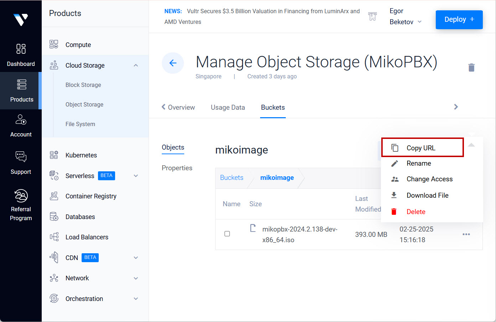<figcaption>
Элемент "Copy URL"
</figcaption></figure>

2. Перейдите в раздел "**Orchestration**" -> "**ISOs**":

<figure><figcaption>
Раздел "ISOs"
</figcaption></figure>

3. Нажмите "**Add ISO**":

<figure>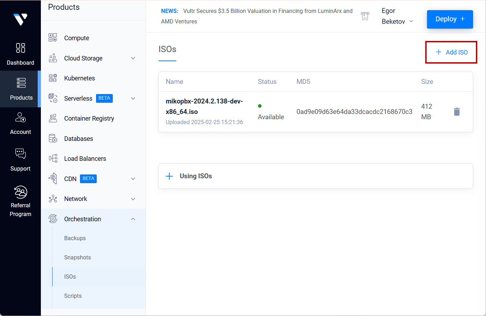<figcaption>
Элемент "Add ISO"
</figcaption></figure>

4. Вставьте ссылку на ранее загруженный файл, нажмите "**Upload**".

## Добавление связки SSH-ключей

1. Перейдите в раздел "**Account**" -> "**SSH Keys**". Нажмите "**Add SSH Key**"

<figure>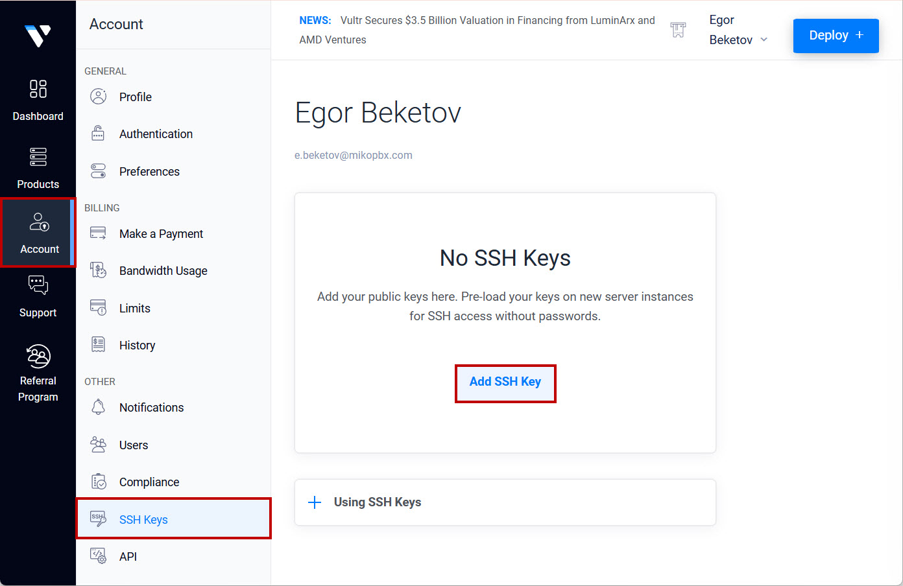<figcaption>
Элемент "Add SSH Key"
</figcaption></figure>

2. Сгенерируйте пару SSH ключей [по инструкции](../../faq/troubleshooting/connecting-to-a-pbx-using-ssh/).
3. В интерфейсе добавления пары SSH-ключей введите произвольное название, а так же вставьте сгенерированный ключ.

Нажмите "**Add SSH Key**".

<figure>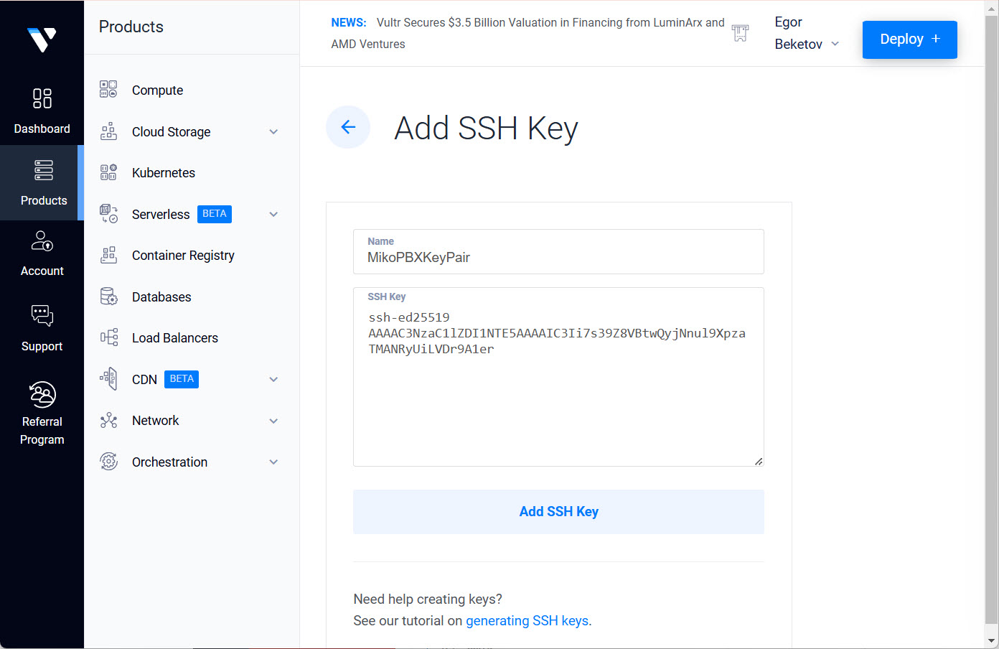<figcaption>
Добавление связки
</figcaption></figure>

## Создание виртуальной машины

1. Перейдите в раздел "**Products**" -> "**Compute**":

<figure>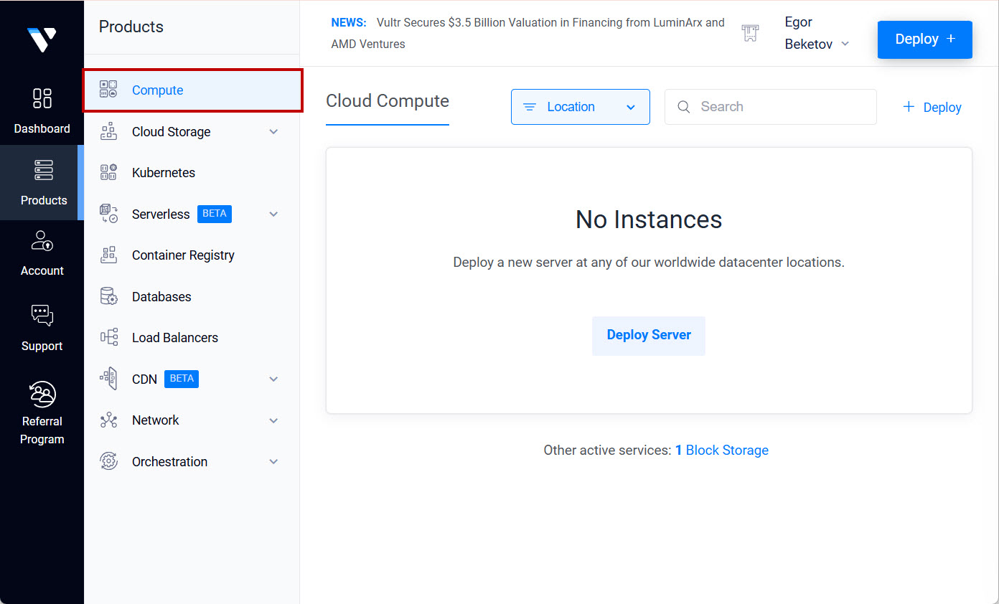<figcaption>
Раздел "Compute"
</figcaption></figure>

2. Нажмите "**Deploy Server**":

<figure>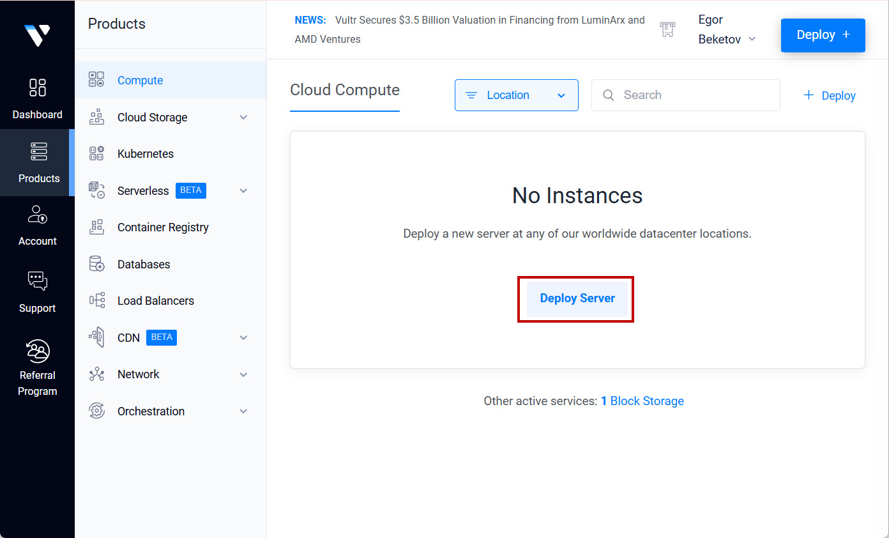<figcaption>
Элемент "Deploy Server"
</figcaption></figure>

3. В открывшемся разделе выберите регион и конфигурацию вашей виртуальной машины.

<figure><figcaption>
Параметры ВМ №1
</figcaption></figure>

4. Перейдите далее.

* Выберите "**ISO/iPXE**" -> Ранее загрузочный образ.
* Так же выберите ранее созданную пару SSH-ключей.

Нажмите "**Deploy**".

<figure><figcaption>
Параметры ВМ №2
</figcaption></figure>

## Создание второго диска

После создания сервера, остановите его запуск.&#x20;

1. Перейдите в раздел "**Cloud Storage**" -> "**Block Storage**":

<figure>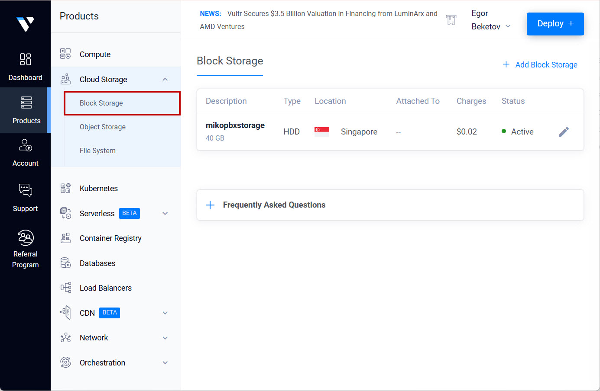<figcaption>
Раздел "Block Storage"
</figcaption></figure>

2. Нажмите "**Add Block Storage**":

<figure>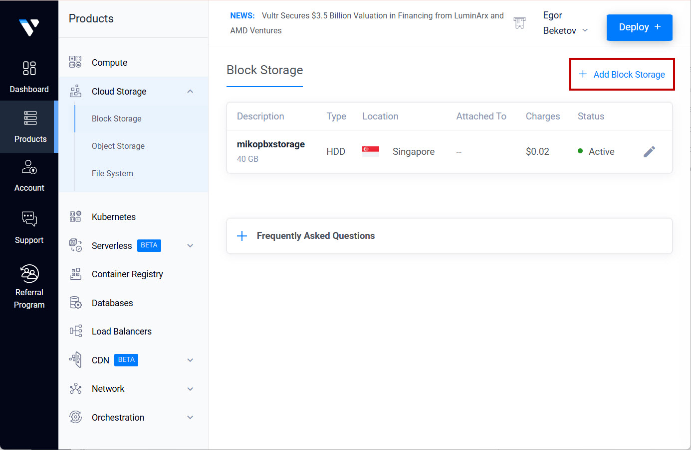<figcaption>
Элемент "Add Block Storage"
</figcaption></figure>

3. Выберите тип диска, регион (такой же как у ранее созданной виртуальной машины), размер, а так же укажите произвольное название.


Рекомендуемый размер диска для хранения записей разговоров - не менее 50Гб.


4. Перейдите в раздел управления созданным диском. Прикрепите диск к созданной виртуальной машине используя пункт "**Attach to:**"

<figure>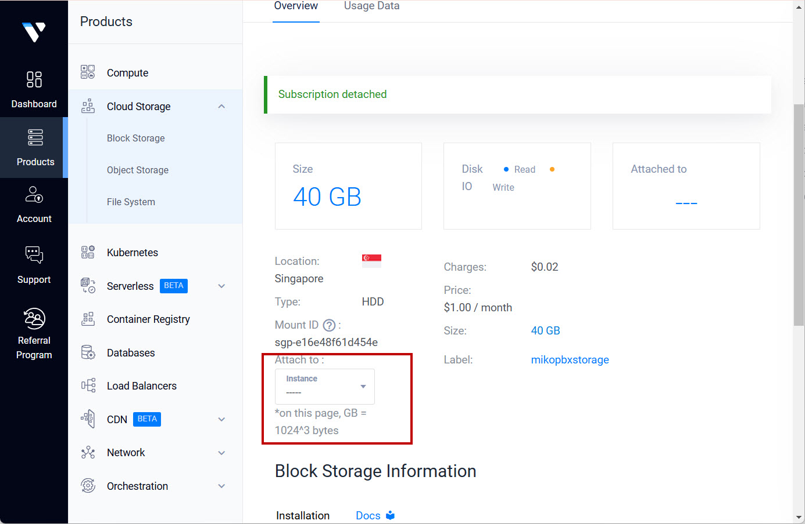<figcaption>
Элемент "Attach to"
</figcaption></figure>

## Установка системы

1. Перейдите в меню управления виртуальной машиной.

<figure>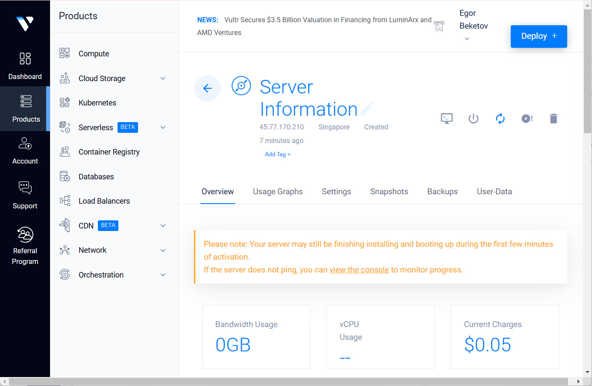<figcaption>
Меню управления виртуальной машиной
</figcaption></figure>

2. Перейдите в консоль, нажав на соответствующий элемент.

<figure>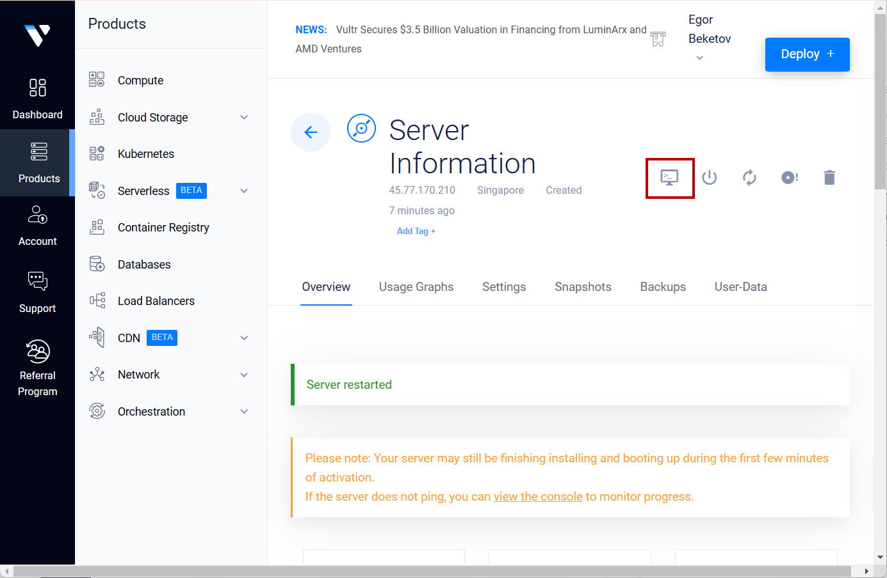<figcaption>
Элемент для открытия консоли
</figcaption></figure>

3. Вы попадете во встроенную консоль.

<figure>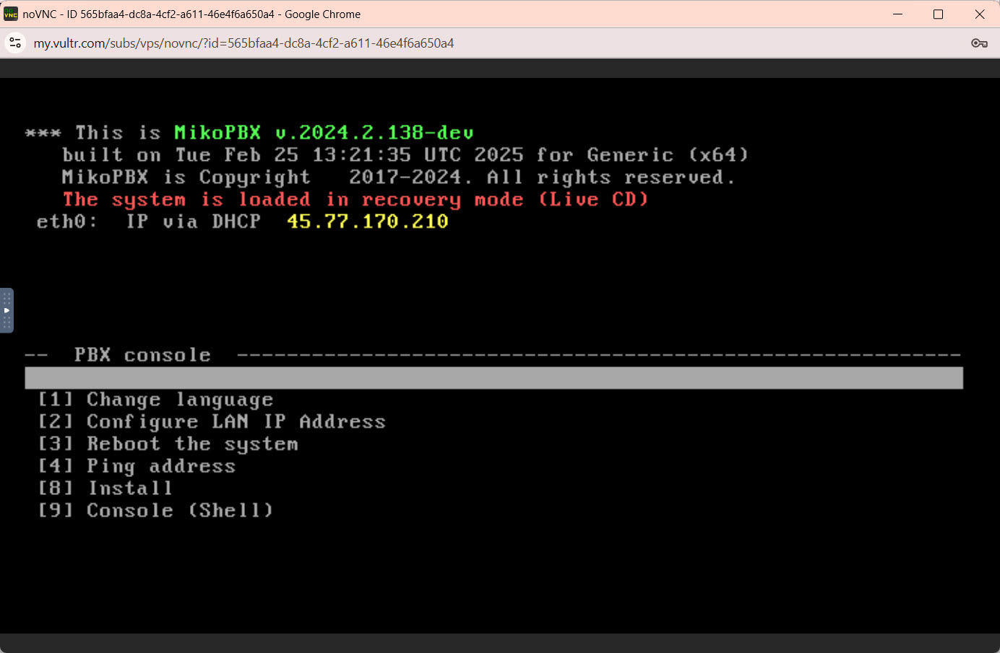<figcaption>
Встроенная консоль
</figcaption></figure>

4. Перейдите в "**\[8] Install**".
5. Выберите диск, который будет использован в качестве системного. Подтвердите действия - введите "**y**" и нажмите "**Enter**":

<figure>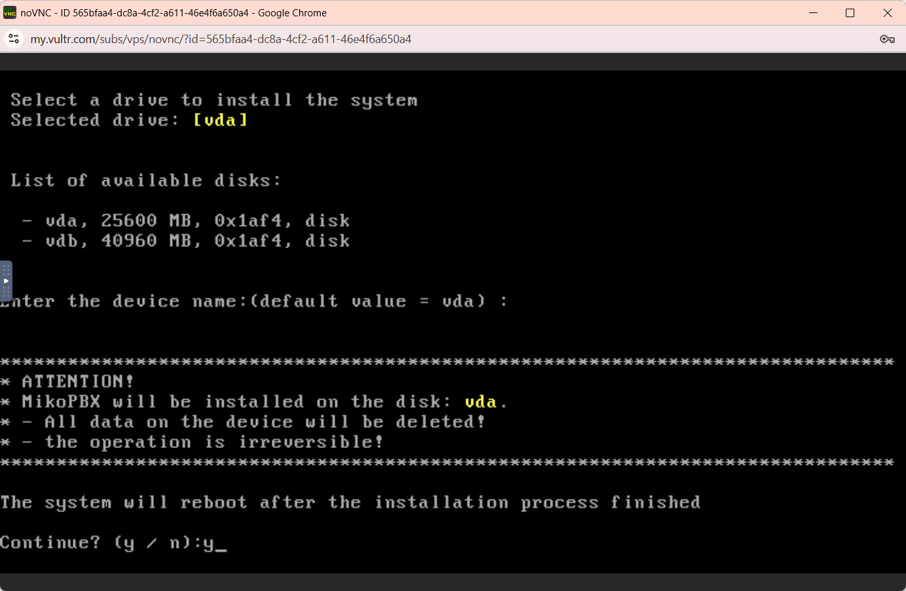<figcaption>
Выбор системного диска
</figcaption></figure>

6. Выберите диск для хранения записей разговоров. Система перезагрузится.
7. Перейдите в настройки виртуальной машины "**Settings**", далее в "**Custom ISO**". Нажмите "**Remove ISO**".

<figure>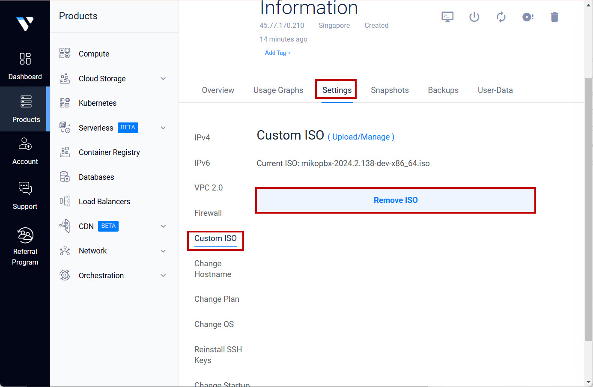<figcaption>
Элемент "Remove ISO"
</figcaption></figure>

На данном этапе система установлена и готова к работе!

## Подключение к WEB-интерфейсу

1. В адресную строку введите IP-адрес Вашей виртуальной машины. Найти его Вы можете в консоли MikoPBX.

<figure>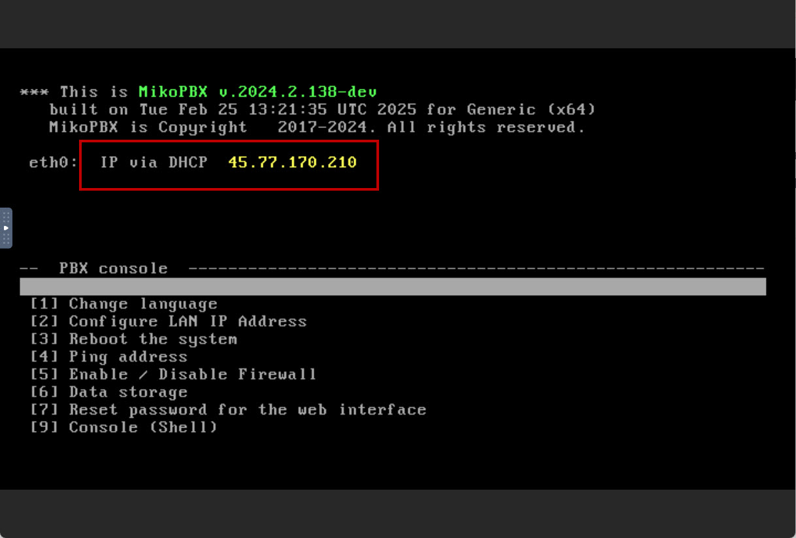<figcaption>
IP-адрес станции
</figcaption></figure>

2.
