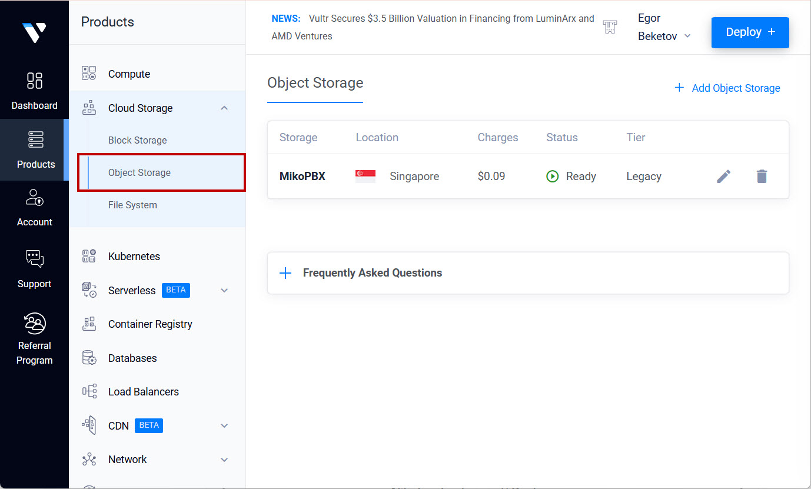
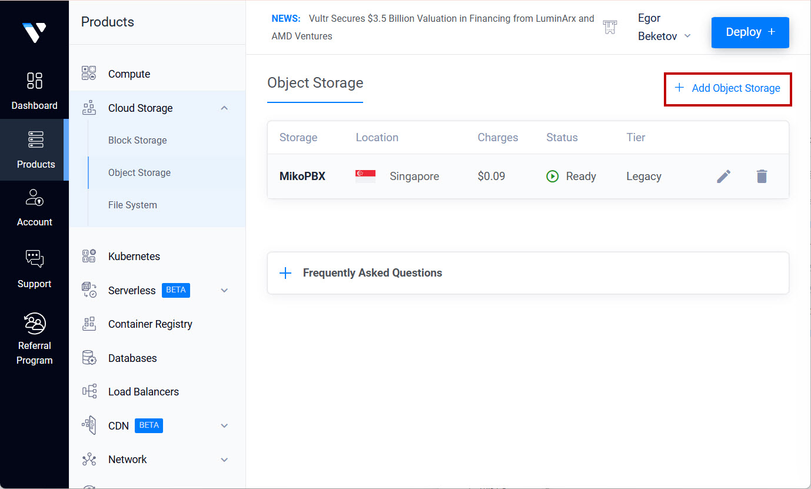
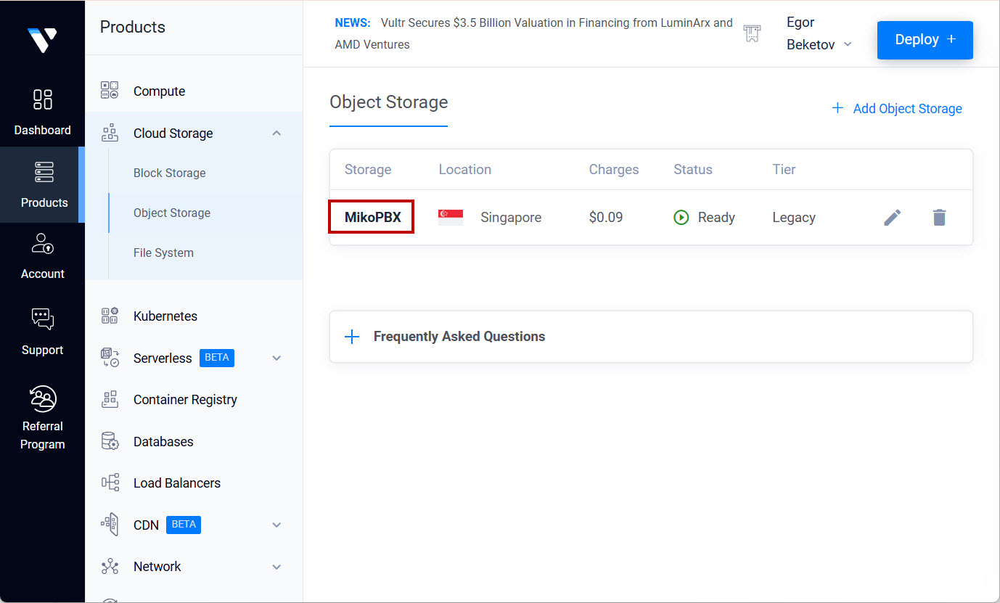
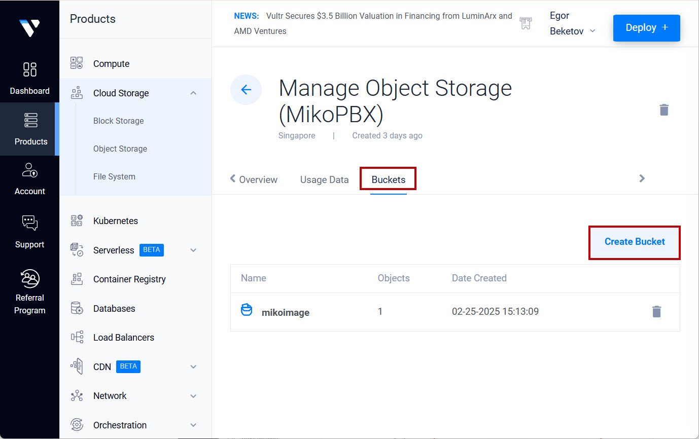
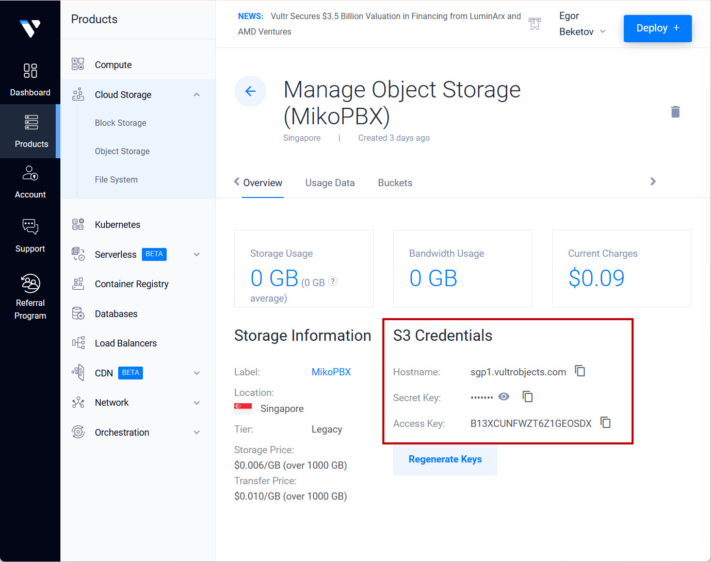
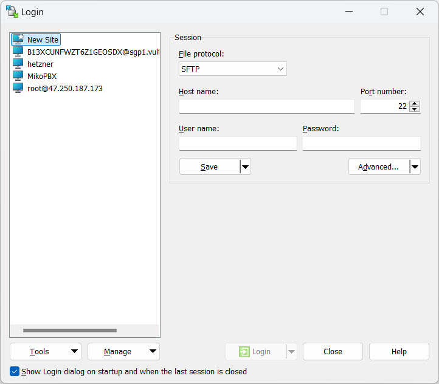
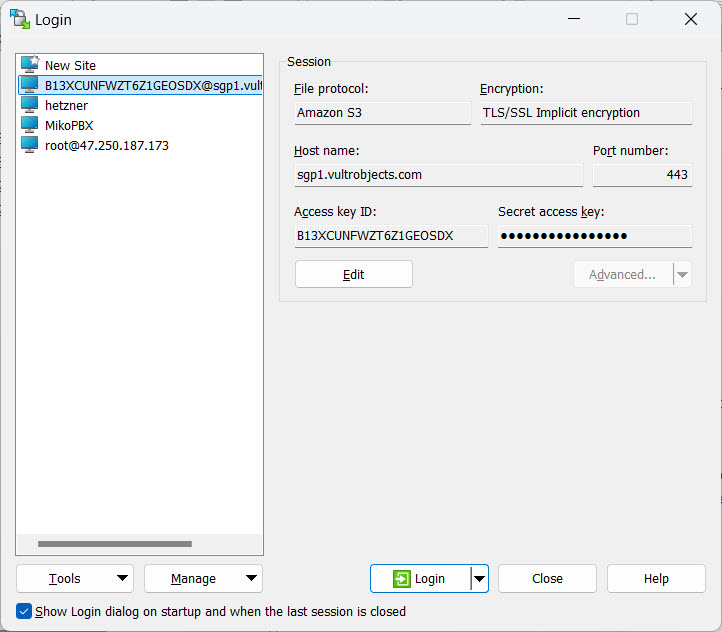
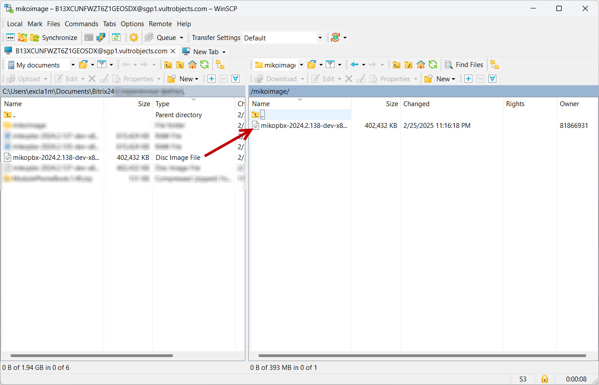
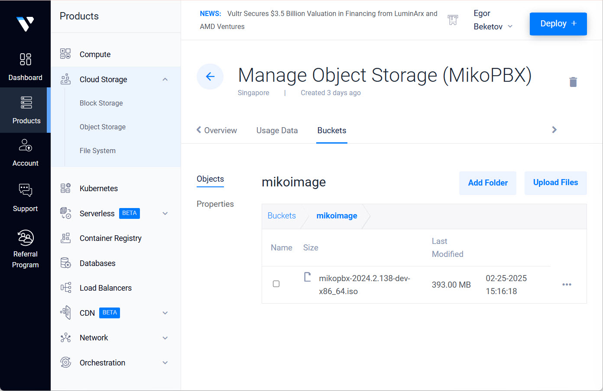
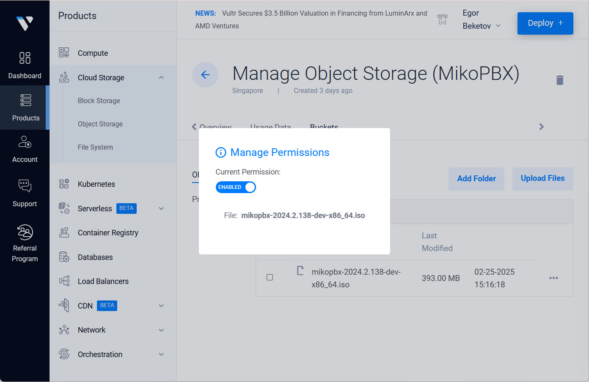

# Vultr (In dev)

## Vultr


This guide applies to **MikoPBX version 2024.2.138** and later!


This guide provides a step-by-step process for installing MikoPBX on the Vultr cloud platform.

Before starting, you must download the latest **.iso** MikoPBX image file from [MikoPBX’s GitHub releases](https://github.com/mikopbx/core/releases).

## Uploading the Image to Vultr

### Uploading the File to Storage

First, you need to upload the image to the cloud platform.

1. Navigate to **"Cloud Storage"** → **"Object Storage"**:

<figure><figcaption>
"Object Storage" section
</figcaption></figure>

2. Create a new storage resource by clicking **"Add Object Storage"**:

<figure><figcaption>
"Add Object Storage" button
</figcaption></figure>

3. Select the type of storage (it’s recommended to use the basic option, as you only need it to store the disk image). Also provide a name.
4. Click on your newly created storage resource:

<figure><figcaption>
Name of the Object Storage
</figcaption></figure>

5. Go to the **"Buckets"** tab and create a new bucket with a custom name.

<figure><figcaption>
Creating a new bucket
</figcaption></figure>

6. The storage information will display S3 connection details.

<figure><figcaption></figcaption></figure>

7. Next, connect to your storage via WinSCP. Open WinSCP and select **"New Site"**:

<figure><figcaption>
"New Site"
</figcaption></figure>

8. Enter the following parameters:

* **File protocol** – Amazon S3
* **Encryption** – TLS/SSL Implicit encryption
* **Port number** – 443
* **Host Name**, **Access key ID**, and **Secret access key** – from the storage information

Click **"Login"**.

<figure><figcaption>
S3 Connection parameters
</figcaption></figure>

9. Upload the **.iso** disk image file to the storage.

<figure><figcaption>
Uploading the .iso disk image file
</figcaption></figure>

10. Return to the Vultr interface and go to your bucket’s directory.

<figure><figcaption></figcaption></figure>

11. Click the three dots to the right of the file name, then **"Change Access"**. Grant access by toggling the switch.

<figure><figcaption>
"Change Access"
</figcaption></figure>

#### Importing the ISO

1. Click the three dots to the right of the file name and select **"Copy URL"**.
2. Navigate to **"Orchestration"** → **"ISOs"**:
3. Click **"Add ISO"**:
4. Paste the link to your previously uploaded file and click **"Upload"**.

### Adding an SSH Key Pair

1. Go to **"Account"** → **"SSH Keys"**. Click **"Add SSH Key"**:
2. Generate an SSH key pair [following this guide](https://chatgpt.com/faq/troubleshooting/connecting-to-a-pbx-using-ssh/).
3.  In the interface for adding the key pair, provide a custom name and paste your **public** SSH key.

    Click **"Add SSH Key"**.

### Creating a Virtual Machine

1. Go to **"Products"** → **"Compute"**:
2. Click **"Deploy Server"**:
3. In the next section, select the region and configuration for your virtual machine.
4.  Continue configuring the server:

    * Under **ISO/iPXE**, select the previously uploaded ISO.
    * Select the SSH key pair you created.

    Click **"Deploy"**.

### Creating a Second Disk

After the server is created, power it off.

1. Go to **"Cloud Storage"** → **"Block Storage"**:
2. Click **"Add Block Storage"**:
3.  Select the disk type, region (same as the VM), size, and a custom name.

    \{% hint style="success" %\} We recommend at least **50GB** for storing call recordings. This guide uses 30GB as an example. \{% endhint %\}
4. Go to the management page for the newly created block storage. Attach the volume to your virtual machine using the **"Attach to:"** option.

### Installing the System

1. Go to your virtual machine management page.
2. Open the console by clicking the relevant button:
3. You will enter the built-in console.
4. Navigate to **"\[8] Install"**.
5. Select the disk to be used as the system disk. Confirm by typing **"y"** and pressing **"Enter"**:
6. Select the disk for storing call recordings. The system will reboot.
7. Go to **"Settings"** for your virtual machine and then **"Custom ISO"**. Click **"Remove ISO"**.

At this point, MikoPBX is installed and ready to use.

### Connecting to the Web Interface

1. In your browser, enter the IP address of your virtual machine. You can find it in the MikoPBX console.
2. Log in using the following credentials:
   * **Username**: admin
   * **Password**: The VM ID, which looks like "150dd137-a0e2-45f6-baf9-ddc15a600d60" and can be found in the address bar (screenshot below).
