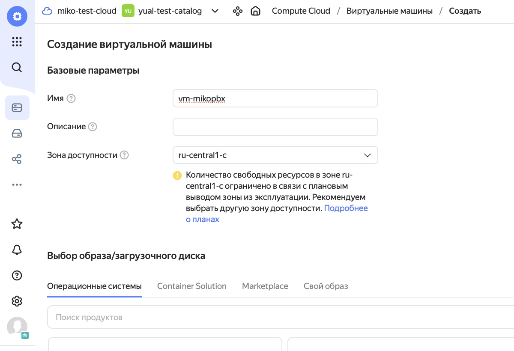
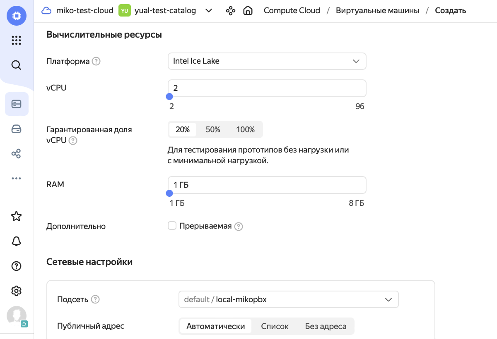
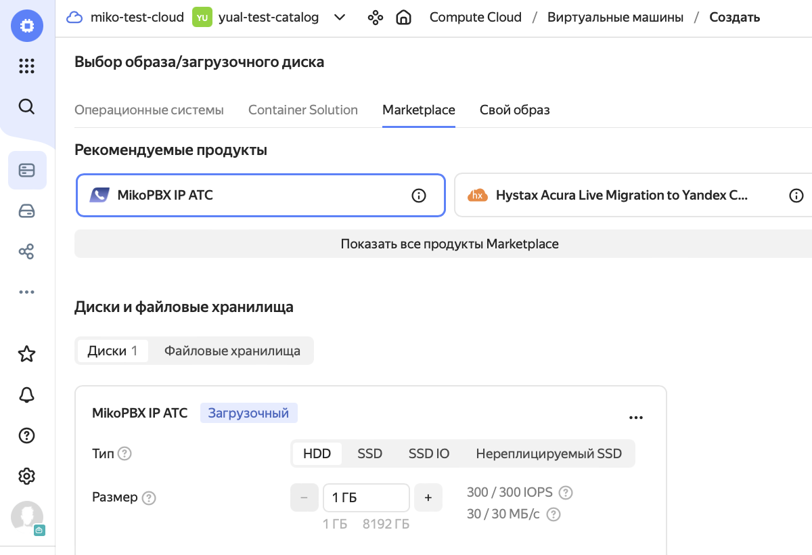
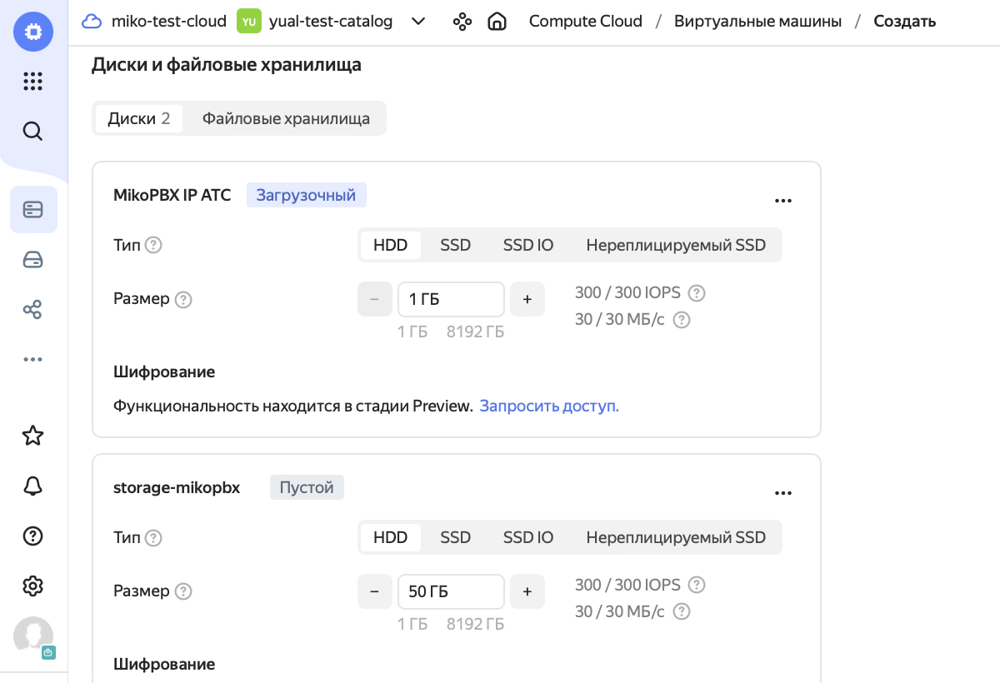
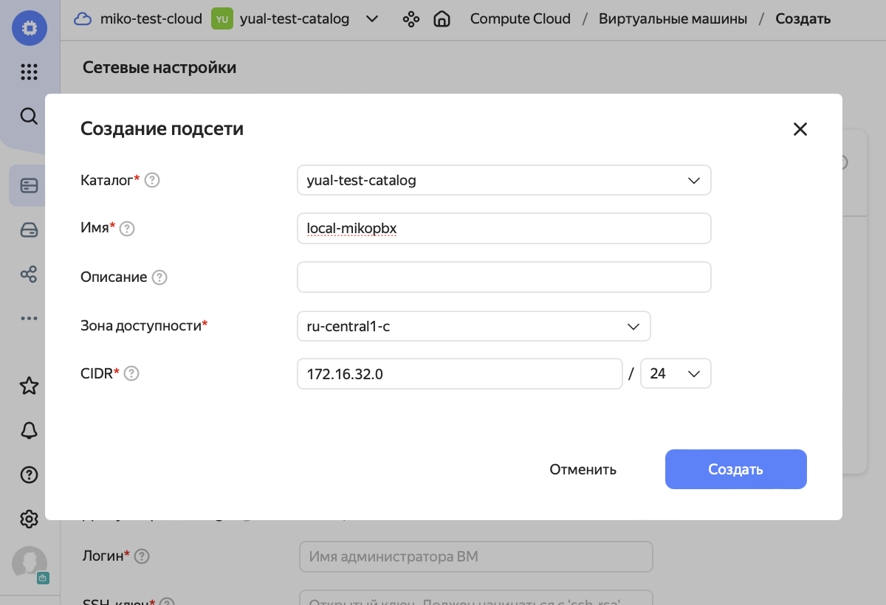
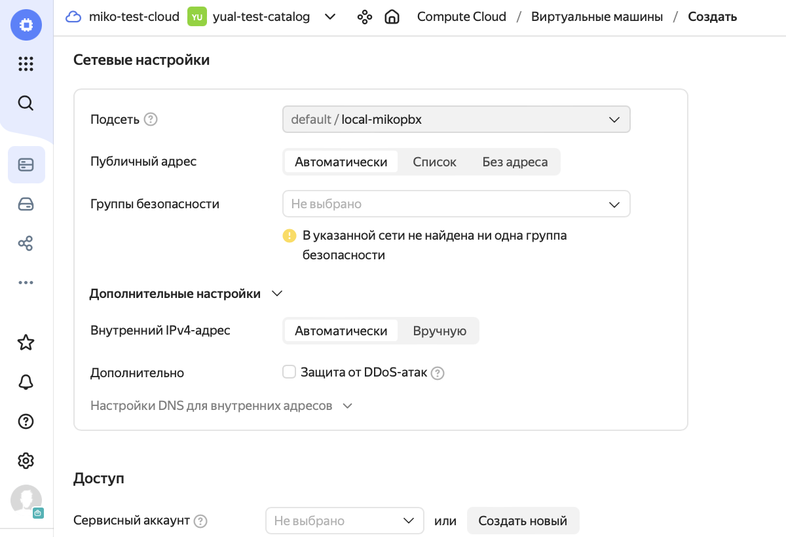
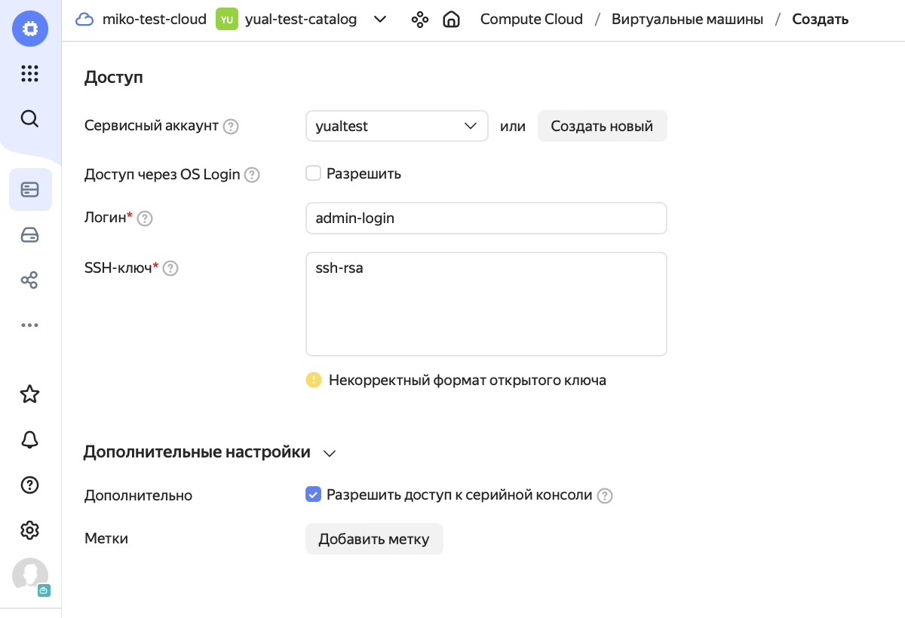
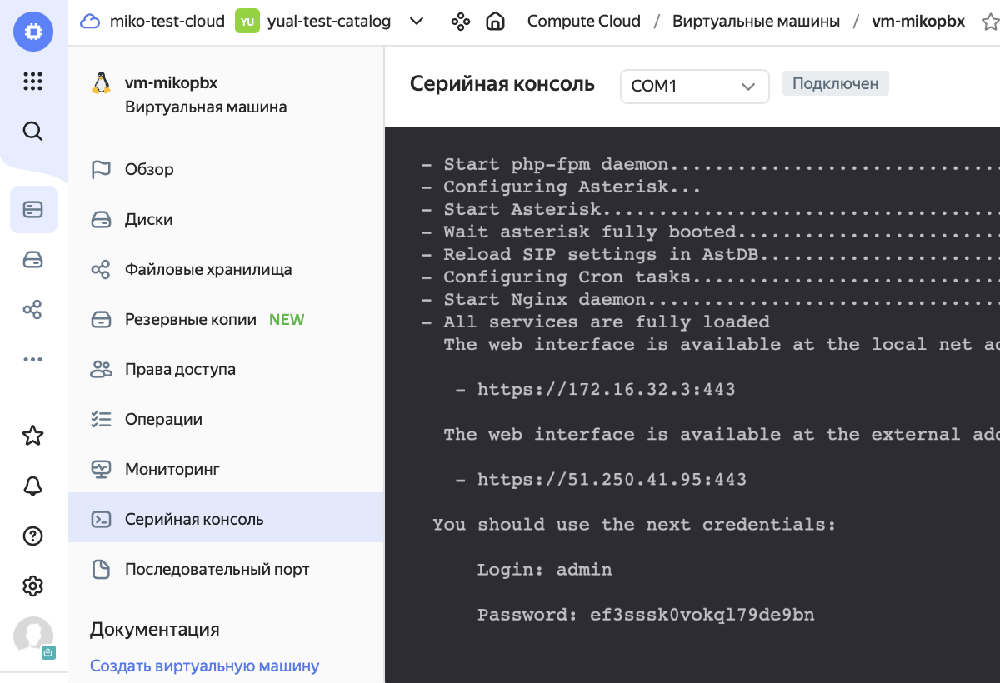

# Магазин приложений

Для начала зарегистрируйтесь в сервисе [Yandex Cloud](https://console.cloud.yandex.ru/?referralCode=dn22bvnhhe64i62i71ua).

Приступим к настройке

### Создание виртуальной машины

1. Откройте Все сервисы / Инфраструктура и сеть / **Compute Cloud**
2. Перейдите в раздел Виртуальные машины
3. На вкладке выберите **Создать ВМ**
4. Введите имя виртуальной машины, например _vm-mikopbx_
5. Укажите зону доступности

<figure><figcaption></figcaption></figure>

6. Укажите параметры вычислительных ресурсов виртуальной машины, исходя из ожидаемой нагрузки на АТС и вашего бюджета. Для тестовой машины можно указать Гарантированная доля vCPU - 20%, RAM - 1 Гб

<figure><figcaption></figcaption></figure>

### Загрузка АТС MikoPBX из образа в маркетплейсе

1. В разделе Выбор образа/загрузочного диска выберите Marketplace / Показать все продукты Marketplace / VoIP / **MikoPBX IP АТС**
2. В разделе Диски и файловые хранилища скорректируйте размер загрузочного диска до **1 Гб**

<figure><figcaption></figcaption></figure>

### Настройка дисков


Для развертывания АТС используйте **два** диска:

* диск объемом **1 Гб** для основной системы
* диск объемом **50+ Гб** для хранения записей разговоров


1. В разделе Диски и файловые хранилища выберите **Добавить диск**
2. На открытой вкладке введите имя диска для хранения данных, например _storage-mikopbx_
3. Укажите тип диска **HDD**
4. Укажите размер диска не менее 50 Гб
5. Наполнение - **Пустой**
6. Для других полей на вкладке используйте значения по умолчанию
7. Нажмите кнопку **Добавить**

<figure><figcaption></figcaption></figure>

<figure><figcaption></figcaption></figure>

### Настройка сети

1. В разделе Сетевые настройки выберите существующую или создайте новую облачную сеть
2. В поле Подсеть в выпадающем меню выберите **Добавить подсеть**
3. На открытой вкладке введите имя подсети, например _local-mikopbx_
4. В поле CIDR укажите диапазон адресов, например _172.16.32.0/24_
5. Для других полей на вкладке используйте значения по умолчанию
6. Нажмите кнопку **Создать**

<figure><figcaption></figcaption></figure>

7. Публичный адрес и Внутренний IPv4-адрес оставьте в положении **Автоматически**

<figure><figcaption></figcaption></figure>

### Настройка параметров SSH

1. В разделе Доступ укажите Сервисный аккаунт
2. Введите Логин и SSH-ключ, предварительно сгенерированный по [инструкции](https://yandex.cloud/ru/docs/compute/operations/vm-connect/ssh?utm\_source=console\&utm\_medium=side-bar-left\&utm\_campaign=compute)&#x20;
3. В разделе Дополнительные настройки установите флажок **Разрешить доступ к серийной консоли**

<figure><figcaption></figcaption></figure>

4. Завершив ввод значений, нажмите кнопку **Создать ВМ**

### **Запуск АТС MikoPBX**

1. Дождитесь запуска созданной виртуальной машины, обычно первый запуск занимает 6-8 минут. Статус **Running**, еще не означает что система полностью развернулась
2. Откройте созданную виртуальную машину и перейдите в раздел Серийная консоль

<figure><figcaption></figcaption></figure>

3. Скопируйте внешний адрес созданной виртуальной машины и введите его в строке браузера
4. Для входа используйте указанные во вкладке Серийная консоль логин и пароль

<figure><figcaption></figcaption></figure>


[Первые шаги](https://app.gitbook.com/o/-MI-h3\_aaVcY5WIyVzY2/snippet/15162)

