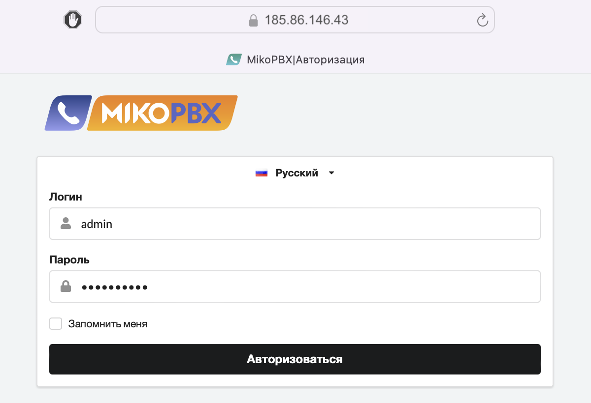

# In a Docker container

## Docker

### Installing Docker and Docker Compose on Ubuntu 22.04


The "**Host system**" must run on Linux 5+. Tested on Debian 11, Ubuntu 21.04, and Ubuntu Server 22.04 LTS.


Before working with Docker, you need to install Docker and Docker Compose themselves. Here's how to do it:


```bash
# Update package list and install required dependencies
sudo apt update
sudo apt install apt-transport-https ca-certificates curl software-properties-common

# Add the GPG key for Docker's official repository
curl -fsSL https://download.docker.com/linux/ubuntu/gpg | sudo apt-key add -

# Add Docker's repository to the APT sources list
sudo add-apt-repository "deb [arch=amd64] https://download.docker.com/linux/ubuntu $(lsb_release -cs) stable"

# Install Docker CE
sudo apt update
sudo apt install docker-ce

# Install Docker Compose
sudo curl -L "https://github.com/docker/compose/releases/download/1.29.2/docker-compose-$(uname -s)-$(uname -m)" -o /usr/local/bin/docker-compose
sudo chmod +x /usr/local/bin/docker-compose

# Verify Docker Compose version
docker-compose --version
```


### Creating a User and Directories on the Host System

Before creating the container on the host machine, it's necessary to create a user and group with limited permissions, as well as a folder for storing configuration settings and call recordings.


```bash
# Creating a new user (e.g., www-user) without superuser rights
sudo adduser --disabled-password --gecos "" www-user

# Creating directories for data storage
sudo mkdir -p /var/spool/mikopbx/cf
sudo mkdir -p /var/spool/mikopbx/storage

# Granting the created user ownership of the directories
sudo chown -R www-user:www-user /var/spool/mikopbx/
```


### Launching the Docker Container
To launch the container with your application, use the following commands:

```
# Pulling the container image
docker pull ghcr.io/mikopbx/mikopbx-x86-64

# Running the container in unprivileged mode
docker run --cap-add=NET_ADMIN --net=host --name mikopbx --hostname mikopbx \
           -v /var/spool/mikopbx/cf:/cf \
           -v /var/spool/mikopbx/storage:/storage \
           -e SSH_PORT=23 \
           -e ID_WWW_USER="$(id -u www-user)" \
           -e ID_WWW_GROUP="$(id -g www-user)" \
           -it -d --restart always ghcr.io/mikopbx/mikopbx-x86-64
```

### Testing the Functionality

To ensure that your MikoPBX application is posted and working in the Docker container, you can follow these steps after launching it. These steps will help you verify the container's status and view its logs.

#### Step 1: Check Container Status

First, ensure that the container is successfully launched and running. To do this, use the command `docker ps`, which will show a list of running containers and their statuses.

```bash
docker ps
```
This command will display information about all active containers. Make sure that the `mikopbx` container is present in the list and its status indicates that it is running (e.g., status **up**).

#### Step 2: View Container Logs
After confirming that the container is running, the next step is to view the logs to ensure that the application has loaded without errors and is functioning properly. The docker logs command will allow you to see the output generated by your application.

```bash
docker logs mikopbx
```

Check the command output for a message similar to the one below. This message indicates that MikoPBX is successfully loaded and ready for use:

```
++++++++++++++++++++++++++++++++++++++++++++++++++++++++++++++++++++++
|               All services are fully loaded welcome                |
|                       MikoPBX 2024.1.60.                           |
++++++++++++++++++++++++++++++++++++++++++++++++++++++++++++++++++++++
|                        Web Interface Access                        |
|                                                                    |
| Local Network Address:                                             |
| https://10.0.0.4                                                   |
|                                                                    |
| Web credentials:                                                   |
|    Login: admin                                                    |
|    Password: admin                                                 |
++++++++++++++++++++++++++++++++++++++++++++++++++++++++++++++++++++++
| SSH access disabled!                                               |
++++++++++++++++++++++++++++++++++++++++++++++++++++++++++++++++++++++
```

If you see the MikoPBX startup process, wait a moment and re-run the command docker logs mikopbx.

#### Step 3: Check Access to the Web Interface
When the container starts, it lacks information about the host system's address, so you need to open the external address of the host system, in this case, Ubuntu, in a web browser.
https://<IP address of the host system>

Log into the web interface using the admin login and the admin password to make sure that the web interface is accessible and functioning correctly.

<figure><figcaption></figcaption></figure>

## Features of Containerized MikoPBX

* The **NET_ADMIN** flag is required for the proactive protection system **fail2ban** and the firewall **iptables** to function inside the container. When an access block is triggered, for example, by entering an incorrect password, access from the IP address of the attacker will be blocked.
* If you need to use the "[Backup Module](../manual/maintenance/backup.md)", the container should be run with the **–privileged** flag. When MikoPBX is run in a container, backups can also be performed by manually archiving the **cf** and **storage** directories. In this case, the privileged mode is not necessary, but the container must be stopped during copying.
* The **–net=host** flag indicates that NAT between the host and container will not be used. MikoPBX will be directly connected to the host machine's network. All ports that the container needs to occupy will also be occupied on the host machine. If any port on the host machine is unavailable, errors will occur when loading MikoPBX. More details in the [Docker documentation...](https://docs.docker.com/network/host/)&#x20;
* If necessary, you can adjust the standard set of ports used by MikoPBX. This can be done by declaring environment variables when launching the container.

## Environment Variables for Configuring MikoPBX

Below are some of the environment variables that will allow you to adjust the MikoPBX ports and settings used.

* **SSH_PORT** - port for SSH (**22**)
* **WEB_PORT** - port for the web interface via HTTP protocol (**80**)
* **WEB_HTTPS_PORT** - port for the web interface via HTTPS protocol (**443**)
* **SIP_PORT** - port for connecting a SIP client (**5060**)
* **TLS_PORT** - port for connecting a SIP client with encryption (**5061**)
* **RTP_PORT_FROM** - beginning of the RTP port range, voice transmission (**10000**)
* **RTP_PORT_TO** - end of the RTP port range, voice transmission (**10800**)
* **IAX_PORT** - port for connecting IAX clients (**4569**)
* **AMI_PORT** - AMI port (**5038**)
* **AJAM_PORT** - AJAM port used for connecting the telephony panel for 1C (**8088**)
* **AJAM_PORT_TLS** - AJAM port used for connecting the telephony panel for 1C (**8089**)
* **BEANSTALK_PORT** - port for the Beanstalkd queue server (**4229**)
* **REDIS_PORT** - port for the Redis server (**6379**)
* **GNATS_PORT** - port for the gnatsd server (**4223**)
* **ID_WWW_USER** - identifier for www-user (can be set with the expression \
  `$(id -u www-user)`, where **www-user** is **NOT a root** user)
* **ID_WWW_GROUP** - group identifier for www-user (can be set with the expression \
  `$(id -g www-user)`, where **www-user** is **NOT a root** group)
* **WEB_ADMIN_LOGIN** - login for Web interface access
* **WEB_ADMIN_PASSWORD** - password for Web interface access

A full list of all possible setting parameters is available in the source code [here](https://github.com/mikopbx/Core/blob/develop/src/Common/Models/PbxSettingsConstants.php).

## Docker Compose Launch Option

Here is an example of a `docker-compose.yml` file that can be used to manage your MikoPBX container via Docker Compose:


```yaml
services:
  mikopbx:
    container_name: "mikopbx"
    image: "ghcr.io/mikopbx/mikopbx-x86-64"
    network_mode: "host"
    cap_add:
      - NET_ADMIN
    entrypoint: "/sbin/docker-entrypoint"
    hostname:  "mikopbx-in-a-docker"
    volumes:
      - /var/spool/mikopbx/cf:/cf
      - /var/spool/mikopbx/storage:/storage
    tty: true
    environment:
      - ID_WWW_USER=${ID_WWW_USER}
      - ID_WWW_GROUP=${ID_WWW_GROUP}
      # Change the station name through environment variables
      - PBX_NAME=MikoPBX-in-Docker
      # Change the default SSH port to 23
      - SSH_PORT=23
      # Change the default WEB port to 8080
      - WEB_PORT=8080
      # Change the default WEB HTTPS port to 8443
      - WEB_HTTPS_PORT=8443

```


Save the contents into a file named `docker-compose.yml`, make the necessary adjustments, and launch MikoPBX using the command:

```bash
export ID_WWW_USER=$(id -u www-user)
export ID_WWW_GROUP=$(id -g www-user)
docker compose -f docker-compose.yml up
```

### Running Multiple MikoPBX Instances on One Host

####Mode Without Network Isolation Between Host and Containers (–net=host)

It is also possible to organize the launch of multiple MikoPBX containers on a single host. However, you need to consider Docker's port handling features. If the –net=host mode is not used, it will lead to a high load on the host system's CPU because Docker creates a separate rule in Iptables for each allocated port.

With the –net=host mode enabled, you need to manually monitor the distribution of available ports between the running containers and built-in applications. For instance, to run two MikoPBX containers on one host, you can use the following configuration file:


```yaml
services:
  mikopbx-first:
    container_name: "mikopbx-first"
    image: "ghcr.io/mikopbx/mikopbx-x86-64"
    network_mode: "host"
    entrypoint: "/sbin/docker-entrypoint"
    hostname:  "mikopbx-in-docker-first"
    volumes:
      - /var/spool/mikopbx/first/cf:/cf
      - /var/spool/mikopbx/first/storage:/storage
    tty: true
    environment:
      - ID_WWW_USER=${ID_WWW_USER}
      - ID_WWW_GROUP=${ID_WWW_GROUP}
      - PBX_NAME=MikoPBXFirst
      - PBX_FIREWALL_ENABLED=0
      - PBX_FAIL2BAN_ENABLED=0
      - SSH_PORT=123
      - WEB_PORT=8080
      - WEB_HTTPS_PORT=8443
      - SIP_PORT=5060
      - TLS_PORT=5061
      - RTP_PORT_FROM=10000
      - RTP_PORT_TO=10800
      - IAX_PORT=4569
      - AMI_PORT=5038
      - AJAM_PORT=8088
      - AJAM_PORT_TLS=8089
      - BEANSTALK_PORT=4229
      - REDIS_PORT=6379
      - GNATS_PORT=4223
mikopbx-second:
    container_name: "mikopbx-second"
    image: "ghcr.io/mikopbx/mikopbx-x86-64"
    network_mode: "host"
    tty: true
    entrypoint: "/sbin/docker-entrypoint"
    hostname:  "mikopbx-in-docker-second"
    volumes:
      - /var/spool/mikopbx/second/cf:/cf
      - /var/spool/mikopbx/second/storage:/storage
    environment:
      - ID_WWW_USER=${ID_WWW_USER}
      - ID_WWW_GROUP=${ID_WWW_GROUP}
      - PBX_NAME=MikoPBXSecond
      - PBX_FIREWALL_ENABLED=0
      - PBX_FAIL2BAN_ENABLED=0
      - SSH_PORT=2223
      - WEB_PORT=8081
      - WEB_HTTPS_PORT=9443
      - SIP_PORT=6060
      - TLS_PORT=6061
      - RTP_PORT_FROM=20000
      - RTP_PORT_TO=20800
      - IAX_PORT=5569
      - AMI_PORT=6038
      - AJAM_PORT=9088
      - AJAM_PORT_TLS=9089
      - BEANSTALK_PORT=5229
      - REDIS_PORT=7379
      - GNATS_PORT=5223      
```


#### Network Bridge Mode (**–net=bridge**)

There is an option to launch MikoPBX containers in the **–net=bridge** mode. However, as mentioned above, to use this mode you either need to significantly limit the range of RTP ports or open them on the host machine without using Docker's capabilities.

For this, you will need to write a small script to determine the name of the current bridge interface and the IP address of each container. After running Docker Compose, you will then need to add the necessary iptables rules for the RTP port range as follows:



```bash
#!/bin/bash

COMPOSE_FILE="$1"

if [ -z "$COMPOSE_FILE" ]; then
    echo "Usage: $0 path/to/docker-compose.yaml"
    exit 1
fi

# Retrieve user identifier for running the container
export ID_WWW_USER=$(id -u www-user)
export ID_WWW_GROUP=$(id -g www-user)

# Stop current containers if they are running
docker compose -f "$COMPOSE_FILE" down

# Remove them
docker compose -f "$COMPOSE_FILE" rm

# Start containers in the background
docker compose -f "$COMPOSE_FILE" up -d
sleep 60

# Create a label for IPTABLES rules
IPTABLES_COMMENT="mikopbx-custom-rule"

# Determine the project identifier, used when creating a network bridge
project_prefix=$(cat "$COMPOSE_FILE" | yq e '.x-project-name' -)

# If the prefix is not set, use a default value
if [ -z "$project_prefix" ]; then
    project_prefix="default_prefix"
fi

# Function to get container IP address
function get_container_ip() {
    docker inspect -f '{{range .NetworkSettings.Networks}}{{.IPAddress}}{{end}}' "$1"
}

# Function to get the name of the bridge interface
function get_bridge_name() {
    local network_name="$1"
    local prefix="$2"
    local network_id=$(docker network inspect "${prefix}_${network_name}" -f '{{.Id}}')

    if [ -z "$network_id" ]; then
        echo "Error: Network ${prefix}_${network_name} not found."
        return 1
    fi

    local bridge_name=$(ip link show type bridge | grep -o "br-${network_id:0:12}\b")
    echo $bridge_name
}

echo "Delete tagged iptables rules"
# Delete all iptables rules tagged with our comment
iptables -S | grep "$IPTABLES_COMMENT" | sed 's/-A /-D /' | while read rule; do
        echo "Delete rule $rule"
        iptables $rule
done

# Delete all NAT iptables rules tagged with our comment
iptables -S -t nat | grep "$IPTABLES_COMMENT" | sed 's/-A /-D /' | while read rule; do
     echo "Delete rule $rule"
     iptables -t nat $rule
done

# Parse the docker-compose file and obtain all necessary parameters.
echo "Parsing docker-compose file and configuring iptables rules"
cat "$COMPOSE_FILE" | yq e '.services[] | select(.environment[] | test("RTP_PORT_FROM")) | {"container_name": .container_name, "environment": .environment, "network": .networks[0]}' -o=json | jq -c '.' | while read -r service; do
    container_name=$(echo $service | jq -r '.container_name')
    network_name=$(echo $service | jq -r '.network')
    bridge_name=$(get_bridge_name "$network_name" "$project_prefix")
    container_ip=$(get_container_ip "$container_name")

    RTP_PORT_FROM=$(echo $service | jq -r '.environment[] | select(contains("RTP_PORT_FROM")) | split("=")[1]')
    RTP_PORT_TO=$(echo $service | jq -r '.environment[] | select(contains("RTP_PORT_TO")) | split("=")[1]')

    echo "Configuring iptables for $container_name ($container_ip) on $bridge_name from port $RTP_PORT_FROM to $RTP_PORT_TO"

    iptables -A DOCKER -t nat ! -i "$bridge_name" -p udp -m udp --dport $RTP_PORT_FROM:$RTP_PORT_TO -j DNAT --to-destination $container_ip:$RTP_PORT_FROM-$RTP_PORT_TO -m comment --comment "$IPTABLES_COMMENT"
    iptables -A DOCKER -d $container_ip/32 ! -i "$bridge_name" -o "$bridge_name" -p udp -m udp --dport $RTP_PORT_FROM:$RTP_PORT_TO -j ACCEPT -m comment --comment "$IPTABLES_COMMENT"
    iptables -A POSTROUTING -t nat -s $container_ip/32 -d $container_ip/32 -p udp -m udp --dport $RTP_PORT_FROM:$RTP_PORT_TO -j MASQUERADE -m comment --comment "$IPTABLES_COMMENT"

    echo "Don't forget to open UDP ports $RTP_PORT_FROM to $RTP_PORT_TO on external firewall if it exists"
done

echo "iptables configuration completed successfully."

```


Let's describe several containers in the docker-compose.yaml file, specify different ports for the web interface, SIP ports, and ranges of RTP ports to ensure they do not overlap.


```yaml
services:
  mikopbx-first:
    container_name: "mikopbx-first"
    image: "ghcr.io/mikopbx/mikopbx-x86-64"
    entrypoint: "/sbin/docker-entrypoint"
    hostname:  "mikopbx-in-docker-first"
    volumes:
      - /var/spool/mikopbx/first/cf:/cf
      - /var/spool/mikopbx/first/storage:/storage
    tty: true
    cap_add:
      - net_admin
    networks:
      - network-bridge1
    environment:
      - ID_WWW_USER=${ID_WWW_USER}
      - ID_WWW_GROUP=${ID_WWW_GROUP}
      - PBX_NAME=MikoPBXFirst
      - RTP_PORT_FROM=10000 # UDP range 10000-10800 on host will be directed to the container
      - RTP_PORT_TO=10800
      - WEB_ADMIN_PASSWORD=mikopbx-first-password
      - ENABLE_USE_NAT=1
      - PBX_FIREWALL_ENABLED=1
      - PBX_FAIL2BAN_ENABLED=1
    ports:
      - "8443:443"  # TCP port 8443 on the host is directed to port 443 in the container
      - "5060:5060/udp"  # UDP port 5060 on the host is directed to port 5060 in the container
  mikopbx-second:
    container_name: "mikopbx-second"
    image: "ghcr.io/mikopbx/mikopbx-x86-64"
    tty: true
    cap_add:
      - net_admin
    networks:
      - network-bridge2
    entrypoint: "/sbin/docker-entrypoint"
    hostname:  "mikopbx-in-docker-second"
    volumes:
      - /var/spool/mikopbx/second/cf:/cf
      - /var/spool/mikopbx/second/storage:/storage
    environment:
      - ID_WWW_USER=${ID_WWW_USER}
      - ID_WWW_GROUP=${ID_WWW_GROUP}
      - PBX_NAME=MikoPBXSecond
      - RTP_PORT_FROM=20000 # UDP range 20000-20800 on host will be directed to the container
      - RTP_PORT_TO=20800
      - EXTERNAL_SIP_PORT=6060 # Inform MikoPBX about its external SIP port
      - WEB_ADMIN_PASSWORD=mikopbx-second-password
      - ENABLE_USE_NAT=1
      - PBX_FIREWALL_ENABLED=1
      - PBX_FAIL2BAN_ENABLED=1
    ports:
      - "9443:443"  # TCP port 9443 on the host is directed to port 443 in the container
      - "6060:5060/udp"  # UDP port 6060 on the host is directed to port 5060 in the container
x-project-name: mikopbx # This parameter must be present
networks:
  network-bridge1:
    driver: bridge
  network-bridge2:
    driver: bridge
```


Creating a directory for scripts

```bash
mkdir -p /usr/src/mikopbx
```

Save the **start-multiple-mikopbx.sh** and **docker-compose.yaml** files into this folder.

Install the necessary dependencies for the script.

```bash
sudo apt-get update
sudo apt-get install jq
sudo snap install yq
```

Navigate to our folder, add execution rights and launch our script.

```bash
cd /usr/src/mikopbx
chmod +x start-multiple-mikopbx.sh
./start-multiple-mikopbx.sh docker-compose.yaml
```

While waiting for the containers to start, check the firewall settings on the host, and if necessary, open the ports specified in our **docker-compose.yaml** file, specifically:

* TCP/UDP ports **5060** and **6060** for SIP
* UDP ranges **10000**-**10800** and **20000**-**20800** for RTP voice transmission
* TCP ports **8443** and **9443** for HTTPS protocol, for web interface operation.

Access each station in turn at the addresses:

* https://<host machine IP>:8443
* https://<host machine IP>:9443

Each machine should have NAT mode enabled, indicating that the container is behind a router in the network interface settings. If the stations will be used within a local network, then in the external IP field, enter the local IP address of the host machine, otherwise its public IP address.


Important note!\
One of our containers uses port forwarding from SIP port changing its value from 5060 to 6060. \
In this case, for the system to function correctly, you need to add the external value of the SIP port in the NAT settings in the network interfaces section of MikoPBX. \
This setting can also be made by setting the corresponding value of the environment variable EXTERNAL\_SIP\_PORT=6060 in the docker-compose file.


With that, the setup is complete, and you can configure accounts and make calls.

## Creating a container from a tar archive

In addition to using our official registry, you might need to create a container from an image, for example, for a beta version. Our published releases and pre-releases include a tar archive, which we use to create a container.

Here is an example code for its use:

```bash
// Create a container from a tar archive
docker import \
  --change 'ENTRYPOINT ["/bin/sh", "/sbin/docker-entrypoint"]' \
  mikopbx-2024.1.92-x86_64.tar \
  "mikopbx:2024.1.92"

// Launch the created container
docker run --cap-add=NET_ADMIN --net=host --name mikopbx --hostname mikopbx \
	 -v mikopbx_cf:/cf \
	 -v mikopbx_storage:/storage \
	 -e SSH_PORT=23 \
	 -e ID_WWW_USER="$(id -u www-user)" \
	 -e ID_WWW_GROUP="$(id -g www-user)" \
	 -it mikopbx:2024.1.92
```

## Useful commands

Command to connect to the PBX console:

```bash
docker exec -it mikopbx sh
```

Command to connect to the PBX console menu:

```bash
docker exec -it mikopbx /etc/rc/console_menu
```

Connecting to sngrep for SIP analysis

```bash
docker exec -it mikopbx sngrep
```
