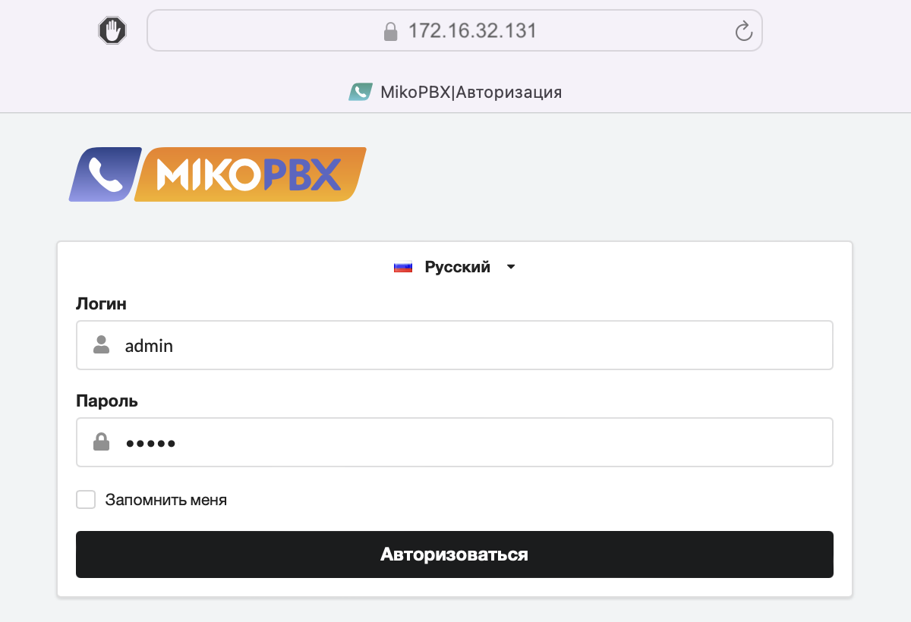

# Запуск MikoPBX в контейнере

Для работы с MikoPBX в контейнере необходимо установить docker и docker compose, а также создать пользователя и папки для хранения настроек конфигурации и записей разговоров по инструкции


[docker-installation.md](docker-installation.md)




### Запуск контейнера Docker

Для запуска контейнера с вашим приложением воспользуйтесь следующими командами:

```bash
# Получение образа контейнера
sudo docker pull ghcr.io/mikopbx/mikopbx:latest

## Альтернативно — можно загрузить образ с Docker Hub
# sudo docker pull mikopbx/mikopbx:latest

# Запуск контейнера в не привилегированном режиме
sudo docker run --cap-add=NET_ADMIN --net=host --name mikopbx --hostname mikopbx \
           -v /var/spool/mikopbx/cf:/cf \
           -v /var/spool/mikopbx/storage:/storage \
           -e SSH_PORT=23 \
           -e ID_WWW_USER="$(id -u www-user)" \
           -e ID_WWW_GROUP="$(id -g www-user)" \
           -it -d --restart always ghcr.io/mikopbx/mikopbx:latest
```


Docker автоматически загрузит образ под архитектуру вашей системы (x86-64 или arm64).

Образ также доступен на Docker Hub: `mikopbx/mikopbx:latest`


### Проверка работы

Чтобы убедиться, что ваше приложение MikoPBX запостилось и работает в Docker-контейнере, можно выполнить следующие шаги после его запуска. Эти шаги помогут проверить состояние контейнера и просмотреть его логи.

#### Шаг 1: Проверка статуса контейнера

Сначала нужно удостовериться, что контейнер успешно запущен и работает. Для этого используем команду `docker ps`, которая покажет список запущенных контейнеров и их статус.

```bash
sudo docker ps
```

Эта команда выведет информацию о всех активных контейнерах. Убедитесь, что контейнер `mikopbx` присутствует в списке и его статус указывает на то, что он запущен и работает (например, статус **up**).

#### Шаг 2: Просмотр логов контейнера

После подтверждения того, что контейнер запущен, следующим шагом будет просмотр логов для проверки, что приложение загрузилось без ошибок и функционирует нормально. Команда `docker logs` позволит вам увидеть вывод, который генерирует ваше приложение.

```bash
sudo docker logs mikopbx
```

Просмотрите вывод команды на наличие сообщения, подобного указанному ниже. Это сообщение свидетельствует о том, что MikoPBX успешно загружена и готова к использованию:

```
++++++++++++++++++++++++++++++++++++++++++++++++++++++++++++++++++++++
|               All services are fully loaded welcome                |
|                         MikoPBX 2026.1.223                         |
|       built on Tue Apr 7 03:39:14 UTC 2026 (arm64) in Docker       |
++++++++++++++++++++++++++++++++++++++++++++++++++++++++++++++++++++++
|                        Web Interface Access                        |
|                                                                    |
| Local Network Address:                                             |
| https://192.168.65.3                                               |                                             |
|                                                                    |
| Web credentials:                                                   |
|    Login: admin                                                    |
|    Password: admin                                                 |
++++++++++++++++++++++++++++++++++++++++++++++++++++++++++++++++++++++
| SSH access disabled!                                               |
|                                                                    |
++++++++++++++++++++++++++++++++++++++++++++++++++++++++++++++++++++++
```

Если отображается процесс запуска MikoPBX, то необходимо подождать и повторить команду `sudo docker logs mikopbx`

#### Шаг 3: Проверка доступа к веб-интерфейсу

При старте контенер не имеет информации об адресе хостовой системы, потому необходимо открыть внешний адрес хостовой системы, в данном случае **Ubuntu** в браузере.\
https://\<IP адрес хост системы>

Войдите в веб-интерфейс, используя логин `admin` и пароль `admin`, чтобы убедиться, что веб-интерфейс доступен и функционирует корректно.

<figure><figcaption></figcaption></figure>

### Особенности работы контейнизированной MikoPBX

* Флаг **NET\_ADMIN** необходим для возможности работы системы проактивной защиты **fail2ban** и фаервола **iptables** внутри контейнера. При срабатывании блокировки доступа, например при вводе неверного пароля, доступ с IP адреса злоумышленника будет заблокирован.
* Если необходимо использовать «[Модуль резервного копирования](/broken/pages/6CXS3sHS7G3loDJ8vM9C)», то контейнер следует запускать с флагом **--privileged**. Когда MikoPBX запускается в контейнере, резервное копирование можно также выполнять архивированием каталогов **cf** и **storage** вручную . В этом случае привелегированный режим можно не использовать, но в момент копирования контейнер должен быть остановлен.
* Флаг **--net=host** указывает на то, что NAT между хостом и контейнером не будет использоваться. MikoPBX будет подключена напрямую к сети хостовой машины. Все порты, которые должен занять контейнер будут заняты и на хост машине. Если на хост машине, какой-то из портов недоступн, то при загрузке MikoPBX возникнут ошибки. Подробнее в [документации к Docker...](https://docs.docker.com/network/host/)
* При необходимости можно скорректировать стандартный набор портов, которые использует MikoPBX. Это можно сделать, объявляя переменные окружения при запуске контейнера.

### Создание контейнера из tar архива

Помимо использования нашего официального реестра, вам может понадобиться вариант создания контейнера из образа, например для бета-версии. В составе опубликованных релизов и предрелизов поставляется tar-архив, который мы используем для создания контейнера.

Пример кода для его использования:

```bash
# Загружаем образ из tar архива (Необходимо заранее его загрузить!)
sudo docker load -i mikopbx-2026.1.223-x86_64-docker.tar

# Запускаем созданный контейнер
sudo docker run --cap-add=NET_ADMIN --net=host --name mikopbx --hostname mikopbx \
     -v mikopbx_cf:/cf \
     -v mikopbx_storage:/storage \
     -e SSH_PORT=23 \
     -e ID_WWW_USER="$(id -u www-user)" \
     -e ID_WWW_GROUP="$(id -g www-user)" \
     -it mikopbx:2026.1.223
```

### Переменные окружения для конфигурирования MikoPBX

Ниже перечислены некоторые переменные окружения, которые позволят скорректировать используемые MikoPBX порты и настройки.

* **SSH\_PORT** - порт для SSH (**22**)
* **WEB\_PORT** - порт для работы web интерфейса по протоколу HTTP (**80**)
* **WEB\_HTTPS\_PORT** - порт для работы web интерфейса по протоколу HTTPS (**443**)
* **SIP\_PORT** - порт для подключения SIP клиента (**5060**)
* **TLS\_PORT** - порт для подключения SIP клиента с шифрованием (**5061**)
* **RTP\_PORT\_FROM** - начало диапазона RTP портов, передача голоса (**10000**)
* **RTP\_PORT\_TO** - конец диапазона RTP портов, передача голоса (**10800**)
* **IAX\_PORT** - порт для подключения IAX клиентов (**4569**)
* **AMI\_PORT** - порт AMI (**5038**)
* **AJAM\_PORT** - порт AJAM используется для подключения панели телефонии для 1С (**8088**)
* **AJAM\_PORT\_TLS** - порт AJAM используется для подключения панели телефонии для 1С (**8089**)
* **BEANSTALK\_PORT** - порт для сервера очередей **Beanstalkd** (**4229**)
* **REDIS\_PORT** - порт для сервера **Redis** (**6379**)
* **GNATS\_PORT** - порт для сервера **gnatsd** (**4223**)
* **ID\_WWW\_USER** - идентификатор пользователя www-user (можно задать выражением `$(id -u www-user)`, где **www-user** имя **НЕ root** пользователя)
* **ID\_WWW\_GROUP** - идентификатор группы www-user (можно задать выражением `$(id -g www-user)`, где **www-user** имя **НЕ root** группы)
* **WEB\_ADMIN\_LOGIN** - логин для доступа в Web интерфейс
* **WEB\_ADMIN\_PASSWORD** - пароль для доступа в Web интерфейс

Полный список всех возможных параметров настроек доступен в исходном коде [по ссылке](https://github.com/mikopbx/Core/blob/develop/src/Common/Models/PbxSettingsConstants.php).
