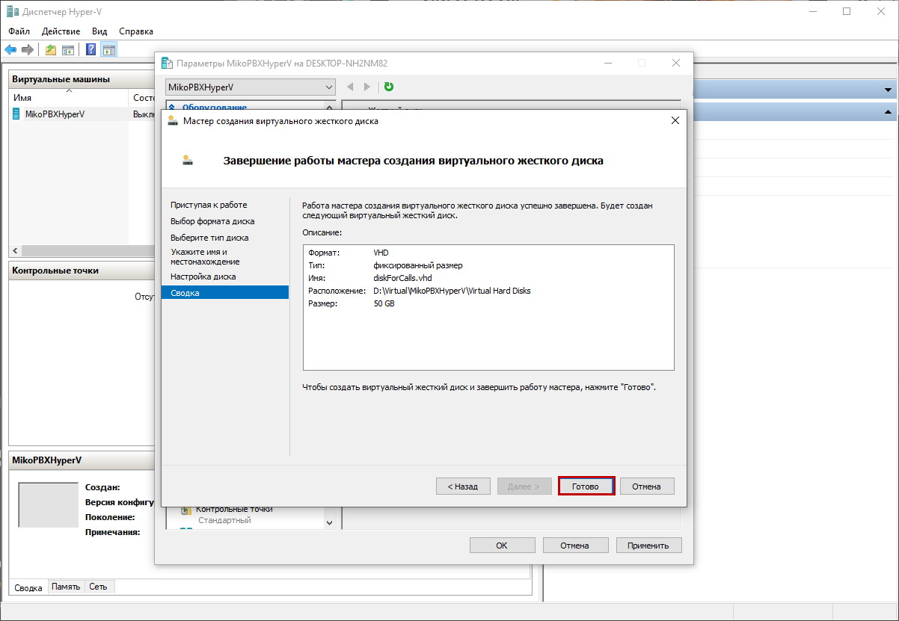
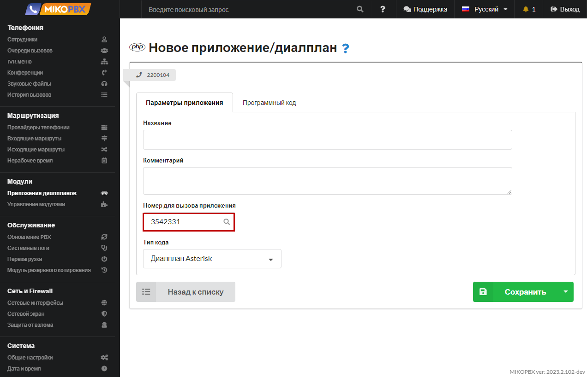
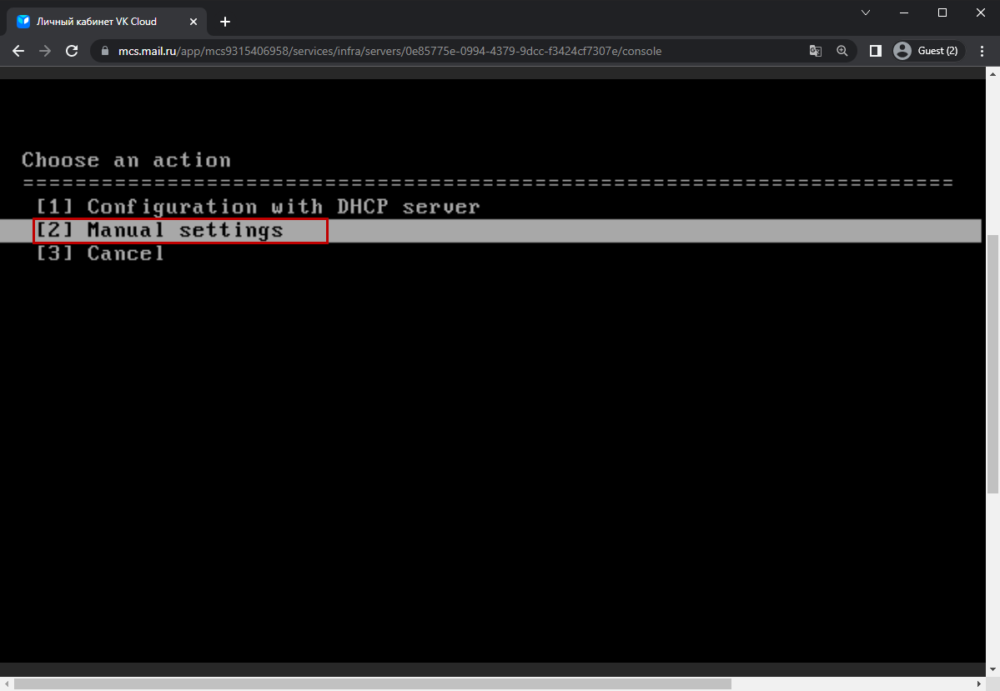

# Hyper-V

## Создание виртуальной машины

1. В оснастке Hyper-V Manager выполните действие **«Действие» - «Создать» - «Виртуальная машина...«**. Будет открыт помощник создания виртуальной машины

<figure><figcaption></figcaption></figure>

2. На первом шаге введите имя виртуальной машины

<figure><figcaption></figcaption></figure>

3. Выберите вариант «**Поколение 1**»

<figure><figcaption></figcaption></figure>

4. Выделите необходимый размер оперативной памяти. Мы рекомендуем **не менее 2 Гб**

Уберите галочку с пункта **"Использовать для этой виртуальной машины динамическую память"**

<figure><figcaption></figcaption></figure>

5. Выберите подключение к сети

<figure><figcaption></figcaption></figure>

6. Для операционной системы выделите диск размером 1Гб

<figure><figcaption></figcaption></figure>

7. Выберите заранее скачанный файл образа диска с расширением **.iso**

<figure><figcaption></figcaption></figure>

8. &#x20;Нажмите **"Готово"**

<figure><figcaption></figcaption></figure>

## Создание диска для записи разговоров

1. Перейдите в параметры виртуальной машины

<figure><figcaption></figcaption></figure>

2. Перейдите во вкладку "**Контроллер 0 IDE**" и нажмите "**Добавить**"

<figure><figcaption></figcaption></figure>

3. Нажмите "**Создать**"

<figure><figcaption></figcaption></figure>

4. Выберите формат "**VHD"**

<figure><figcaption></figcaption></figure>

5. Выберите тип диска фиксированного размера

<figure><figcaption></figcaption></figure>

6. Укажите **Имя** и **Расположение** диска

<figure><figcaption></figcaption></figure>

7. Укажите **Размер** диска (Мы рекомендуем размер диска **не менее 50 Гб**)

<figure><figcaption></figcaption></figure>


**1 час** записи разговоров занимает примерно **14мб** на диске.


8. Нажмите "**Готово**"

<figure><figcaption></figcaption></figure>

9. Удалите DVD-дисковод

<figure><figcaption></figcaption></figure>

## Установка MikoPBX

1. Перейдите в "**Действие**" -> "**Пуск**"

<figure><figcaption></figcaption></figure>

2. Нажмите "**Подключить**"

<figure><figcaption></figcaption></figure>

3. Выберите "**\[8] Install**"

<figure><figcaption></figcaption></figure>

4. Введите имя диск, на который будет установлена система, в нашем случае - **sdb**

<figure><figcaption></figcaption></figure>

5. Подтвердите ваш выбор: введите **y**

<figure><figcaption></figcaption></figure>

6. Выберите диск для записи разговоров - в нашем случае **sdc**

<figure><figcaption></figcaption></figure>

7. Система перезагрузится и надпись "Recovery mode" исчезнет. MikoPBX готова к работе.

<figure><figcaption></figcaption></figure>

## Первое подключение к MikoPBX

1. IP адрес вашей станции вы можете найти в интерфейсе АТС

<figure><figcaption></figcaption></figure>

2. Введите его в строку браузера и у вас откроется Веб-интерфейс MikoPBX

Пароль и логин по умолчанию - **admin**

<figure><figcaption></figcaption></figure>
