# Proxmox

### **Loading the MikoPBX image**

1. Open the local / **ISO images** tab and select **Download from URL**
2. In the URL field, paste the link to the MikoPBX distribution file with the **.iso** extension
3. Click the **Download** button and wait for the file to finish downloading

<figure>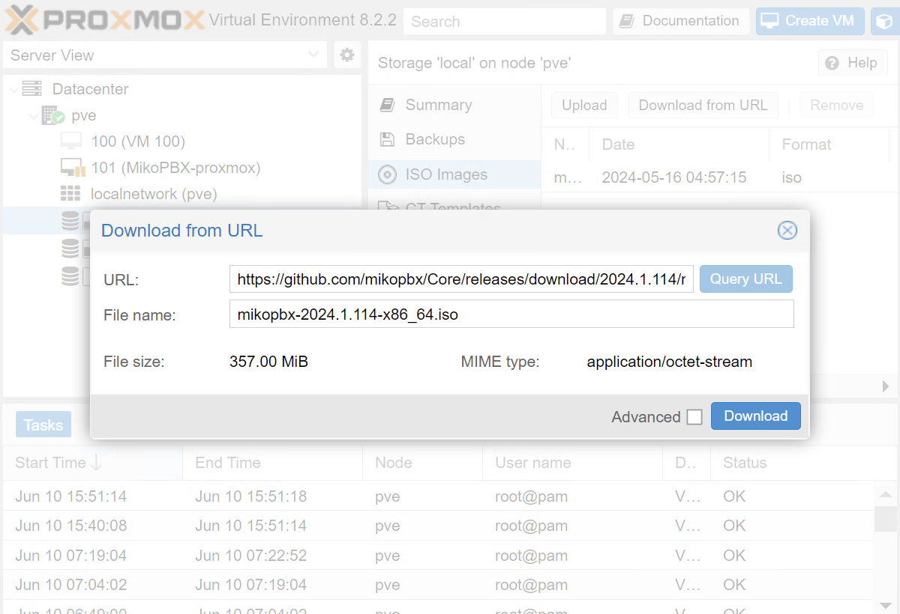<figcaption></figcaption></figure>

### **Creating a virtual machine**

1. Select **Create VM**
2. On the General tab, enter the name of the virtual machine, for example _mikopbx-vm_

<figure><figcaption></figcaption></figure>

3. Go to the OS tab, and in the ISO image field, select the previously downloaded image
4. Set the OS type to **Linux**

<figure><figcaption></figcaption></figure>

5. On the System tab, uncheck the Qemu Agent box, and use the default values for other fields

<figure><figcaption></figcaption></figure>


To deploy the PBX use **two** disks:

* A **1 Gb** disk for the main system
* A **50+ Gb** disk for storing call recordings


6. Go to the Disks tab
7. Adjust the size of the system disk to **1 GB**

<figure>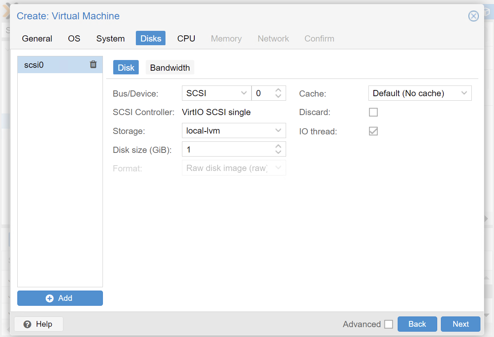<figcaption></figcaption></figure>

8. Click the **Add** button and add an additional disk for data storage
9. Specify a disk size of at least 50 GB

<figure>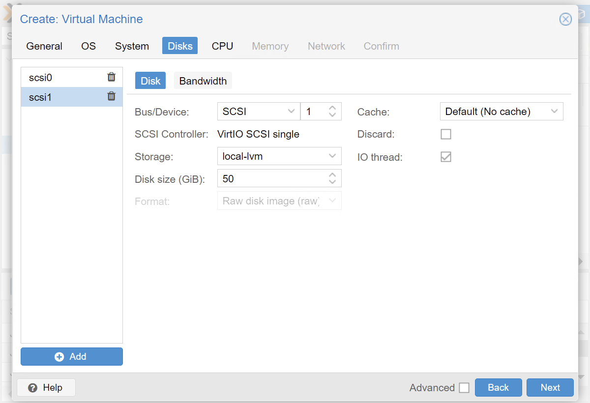<figcaption></figcaption></figure>

10. On the CPU and Memory tabs, specify the computing resources for the virtual machine based on the expected load on the PBX. For a test machine, you can set Cores (CPU tab) to 2 and Memory (Memory tab) to 2 GB

<figure>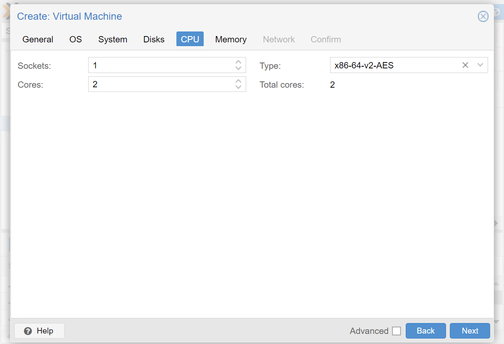<figcaption></figcaption></figure>

<figure>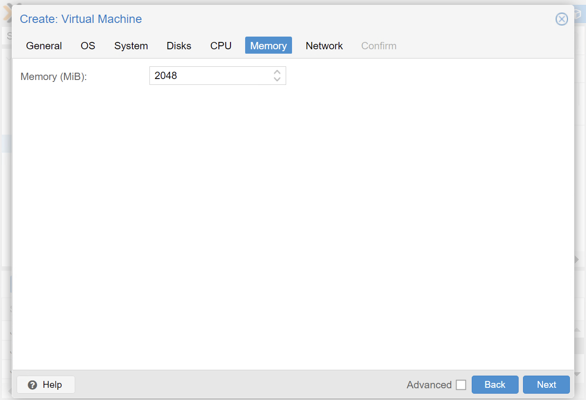<figcaption></figcaption></figure>

11. On the Network tab, uncheck the Firewall box

<figure>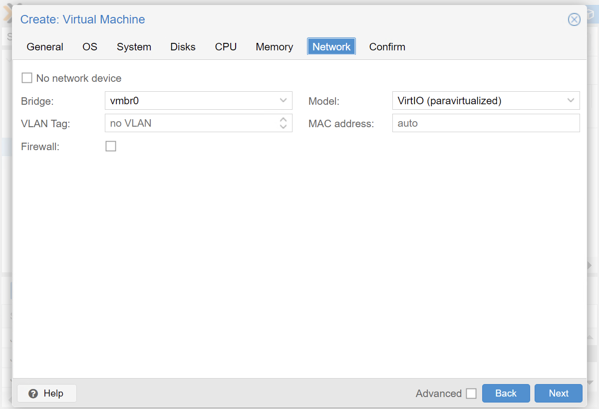<figcaption></figcaption></figure>

12. Go to the last tab, Confirm, and check the **Start after created** box
13. After entering the values, click the **Finish** button

<figure>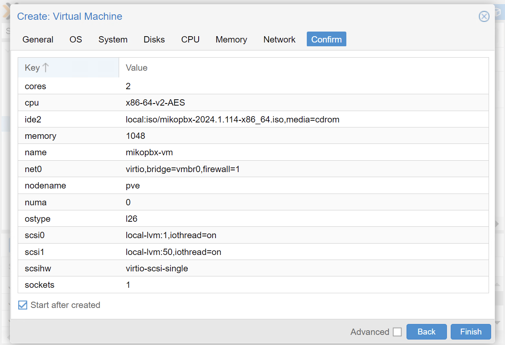<figcaption></figcaption></figure>

### **Installing MikoPBX**

1. Go to the created virtual machine _mikopbx-vm_
2. On the open tab, go to the Console section
3. If the boot is successful, a console menu will appear. Enter **8** from the keyboard to start the installation

<figure>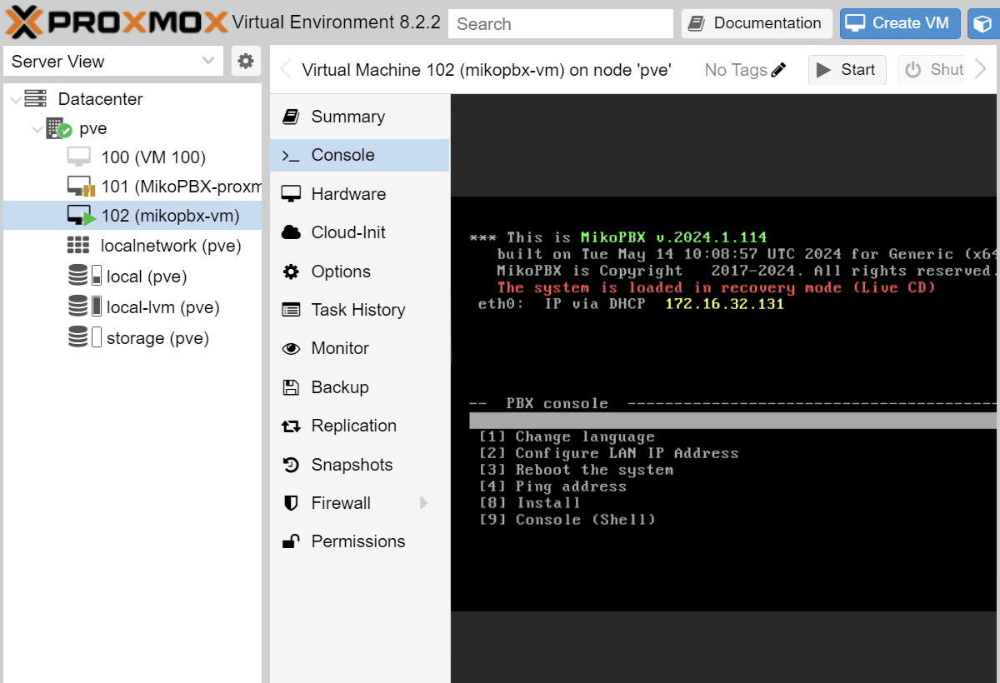<figcaption></figcaption></figure>

4. Select the disk for the system and enter the disk name from the keyboard, for example _**sda**_. Confirm the selection by entering _**y**_ from the keyboard

<figure>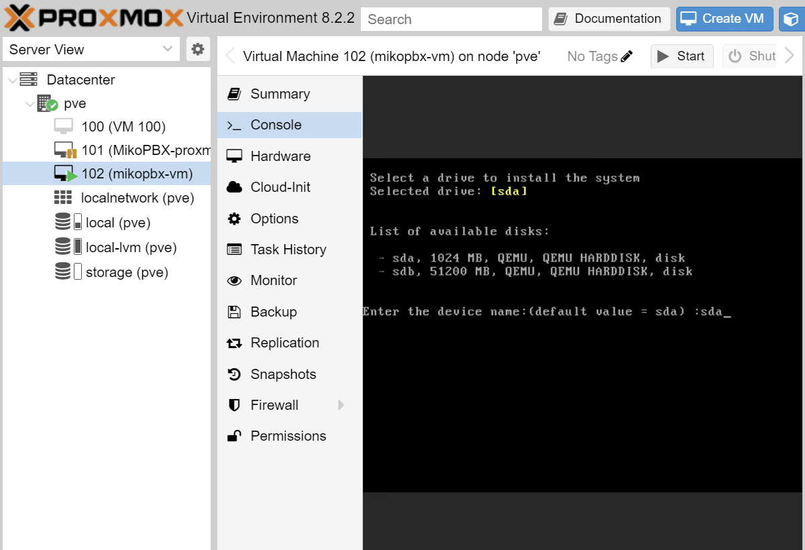<figcaption></figcaption></figure>

<figure>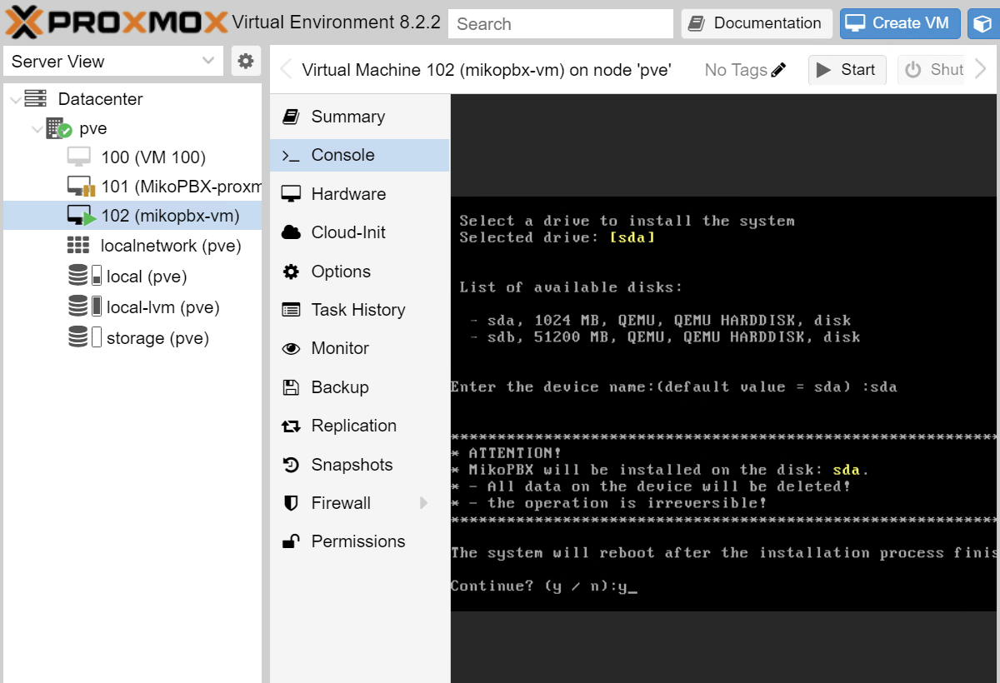<figcaption></figcaption></figure>

5. Connect the disk for storing call recordings, enter the disk name for connection from the keyboard, for example _**sdb**_

<figure>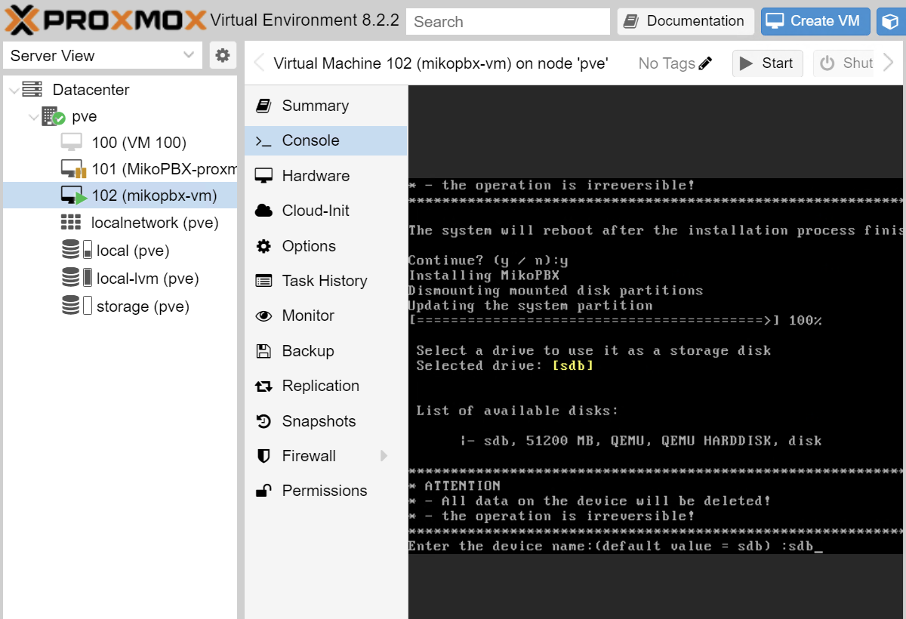<figcaption></figcaption></figure>


When the message "**Press any key within 30 seconds to boot from LiveCD...**" appears, do not press any buttons. In this case, the system will boot from the hard drive.


### **Starting MikoPBX**

1. On the open tab in the Console section, copy the external address of the created virtual machine and enter it in the browser address bar

<figure>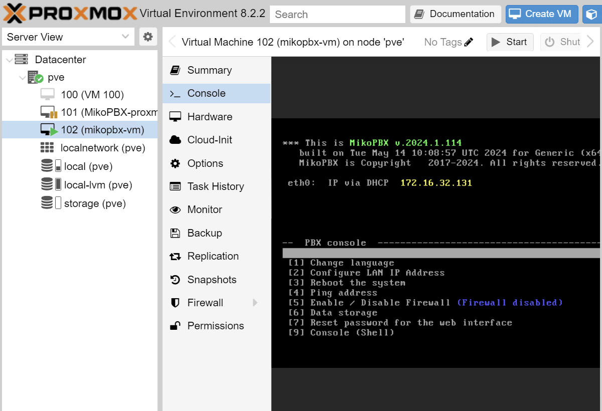<figcaption></figcaption></figure>

2. To log in, use the username - admin and password - admin

<figure>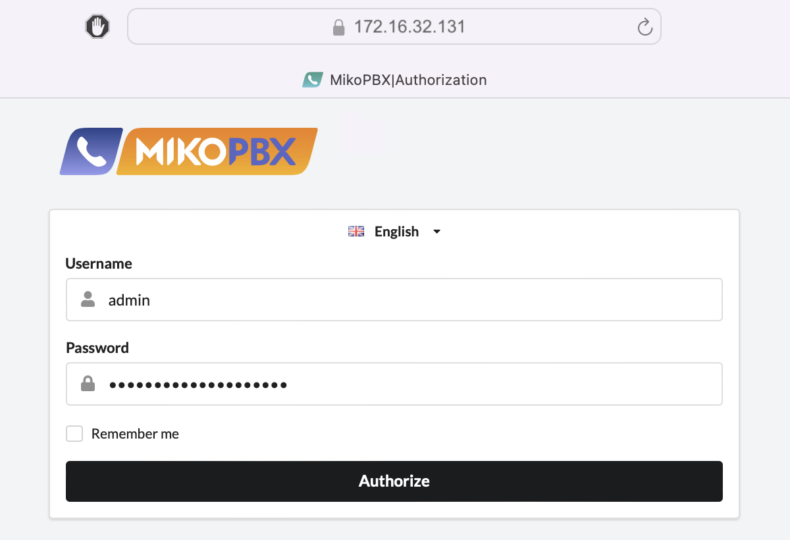<figcaption></figcaption></figure>
