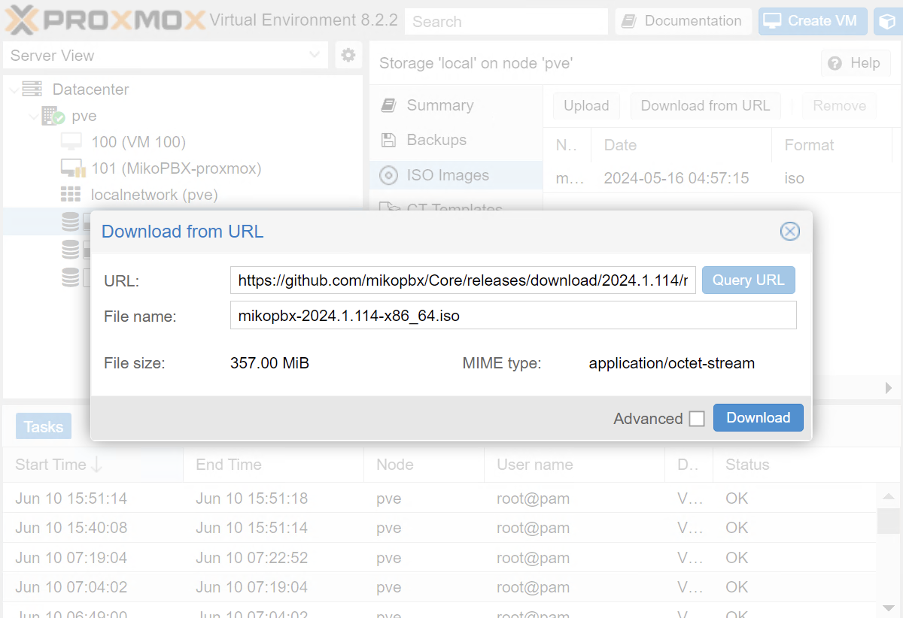
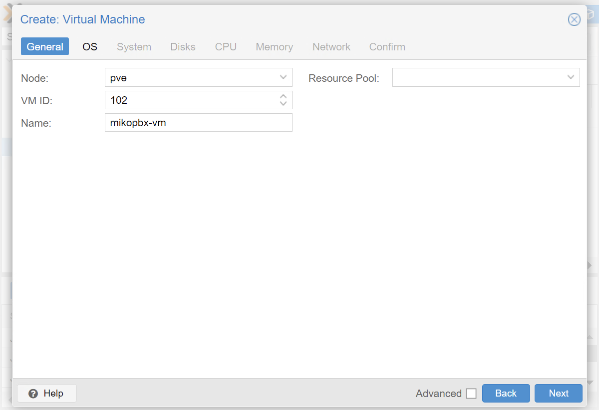
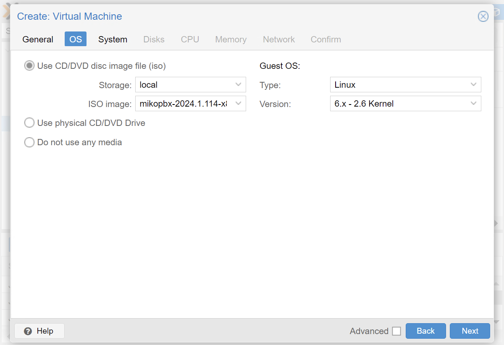
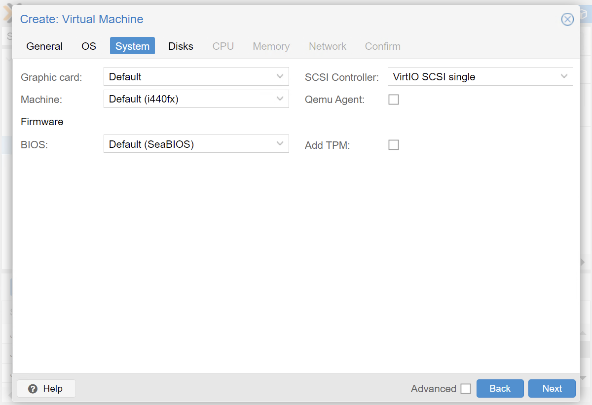
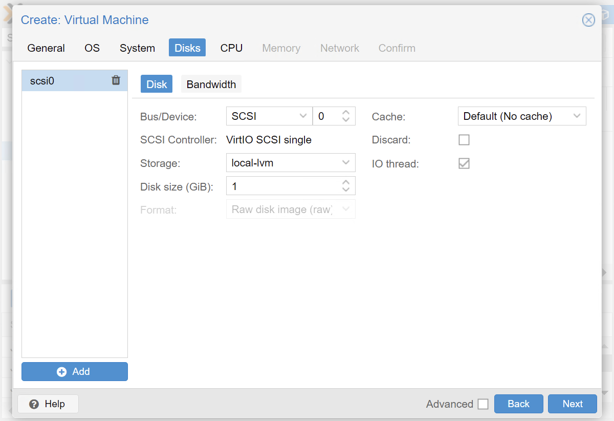
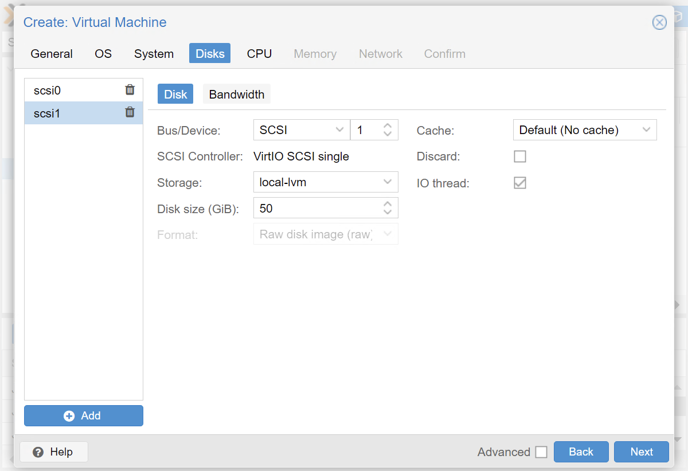
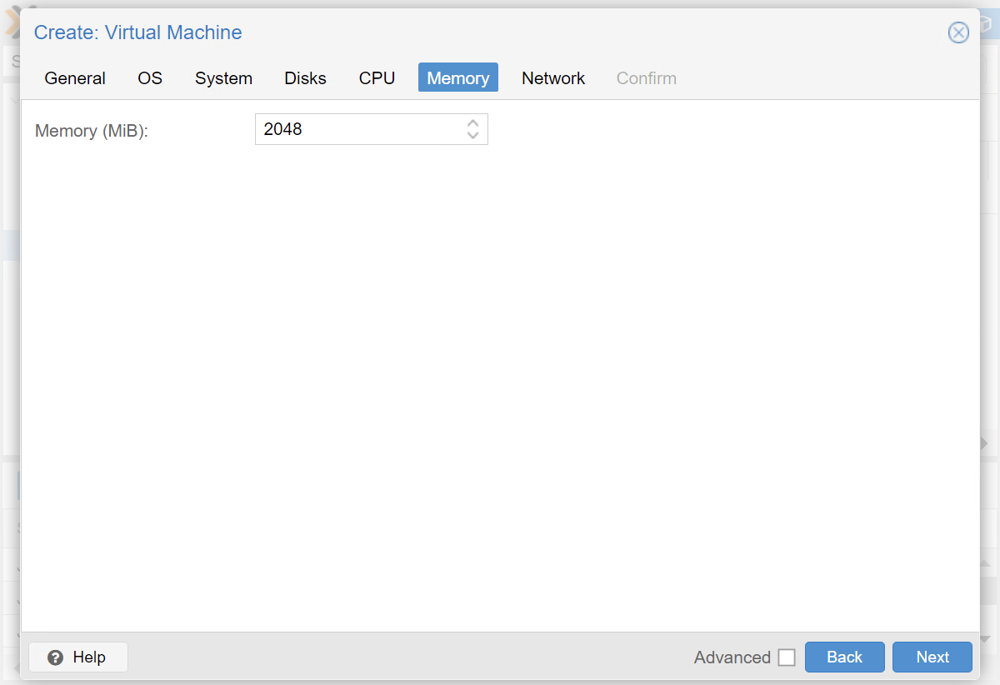
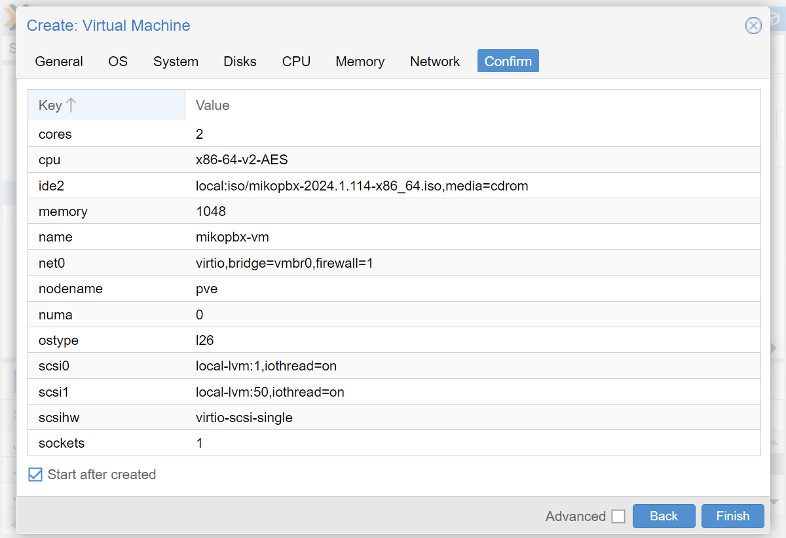
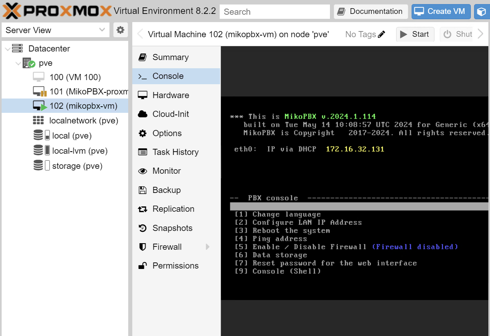
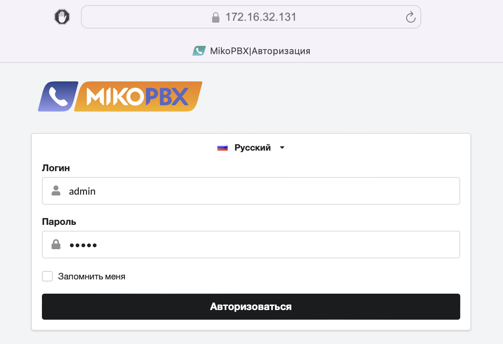

# Proxmox

### **Загрузка образа MikoPBX**

1. Откройте вкладку local / **ISO images** и выберите **Download from URL**
2. В поле URL вставьте ссылку на файл из дистрибутива MikoPBX с расширением **.iso**
3. Нажмите кнопку **Download**, дождитесь окончания загрузки файла

<figure><figcaption></figcaption></figure>

### **Создание виртуальной машины**

1. Выберите **Create VM**
2. На вкладке General введите имя (Name) виртуальной машины, например _mikopbx-vm_

<figure><figcaption></figcaption></figure>

3. Перейдите к следующей вкладке OS, в поле ISO image выберите загруженный ранее образ
4. Укажите тип OS (Type) - **Linux**

<figure><figcaption></figcaption></figure>

5. На вкладке System уберите флажок Qemu Agent, для других полей используйте значения по умолчанию

<figure><figcaption></figcaption></figure>

6. Перейдите к вкладке Disks
7. Скорректируйте размер диска под систему до **1 Гб**

<figure><figcaption></figcaption></figure>

8. Нажмите кнопку **Add** и добавьте дополнительный диск для хранения данных
9. Укажите размер диска не менее 50 Гб

<figure><figcaption></figcaption></figure>

10. На вкладках CPU и Memory укажите параметры вычислительных ресурсов виртуальной машины, исходя из ожидаемой нагрузки на АТС. Для тестовой машины можно указать в поле Cores (вкладка CPU) - 2, в поле Memory (вкладка Memory) - 2 Гб

<figure><figcaption></figcaption></figure>

<figure><figcaption></figcaption></figure>

11. На вкладке Network уберите флажок Firewall

<figure><figcaption></figcaption></figure>

12. Перейдите к последней вкладке Confirm и установите флажок **Start after created**
13. Завершив ввод значений, нажмите кнопку **Finish**

<figure><figcaption></figcaption></figure>

### **Установка АТС MikoPBX**

1. Перейдите к созданной виртуальной машине _mikopbx-vm_
2. На открытой вкладке перейдите в раздел Console
3. Если загрузка прошла успешно, появится консольное меню. Введите с клавиатуры **8** для начала установки

<figure><figcaption></figcaption></figure>

4. Выберите диск под систему и введите с клавиатуры имя диска, например _**sda**_. Подтвердите выбор, введите с клавиатуры _**y**_

<figure><figcaption></figcaption></figure>

<figure><figcaption></figcaption></figure>

5. Подключите диск для хранения записей разговоров, ведите с клавиатуры наименование диска для подключения, например _**sdb**_

<figure><figcaption></figcaption></figure>

<figure><figcaption></figcaption></figure>

### **Запуск АТС MikoPBX**

1. На открытой вкладке в раздел Console скопируйте внешний адрес созданной виртуальной машины и введите его в строке браузера
2. Для входа используйте логин - admin и пароль - admin

<figure><figcaption></figcaption></figure>
