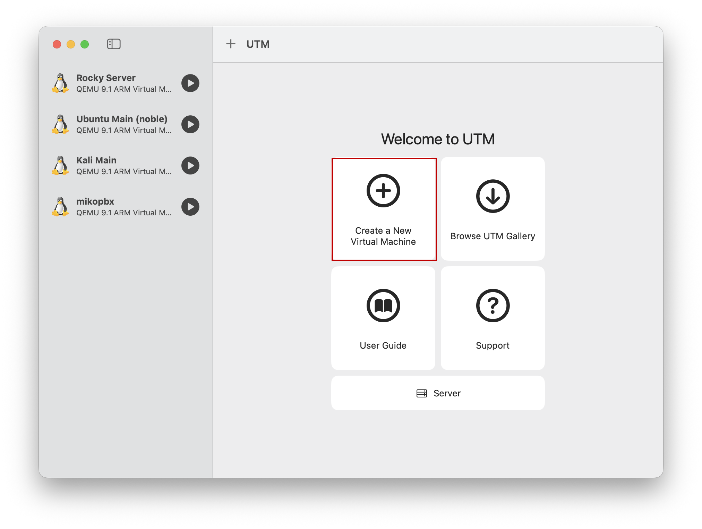
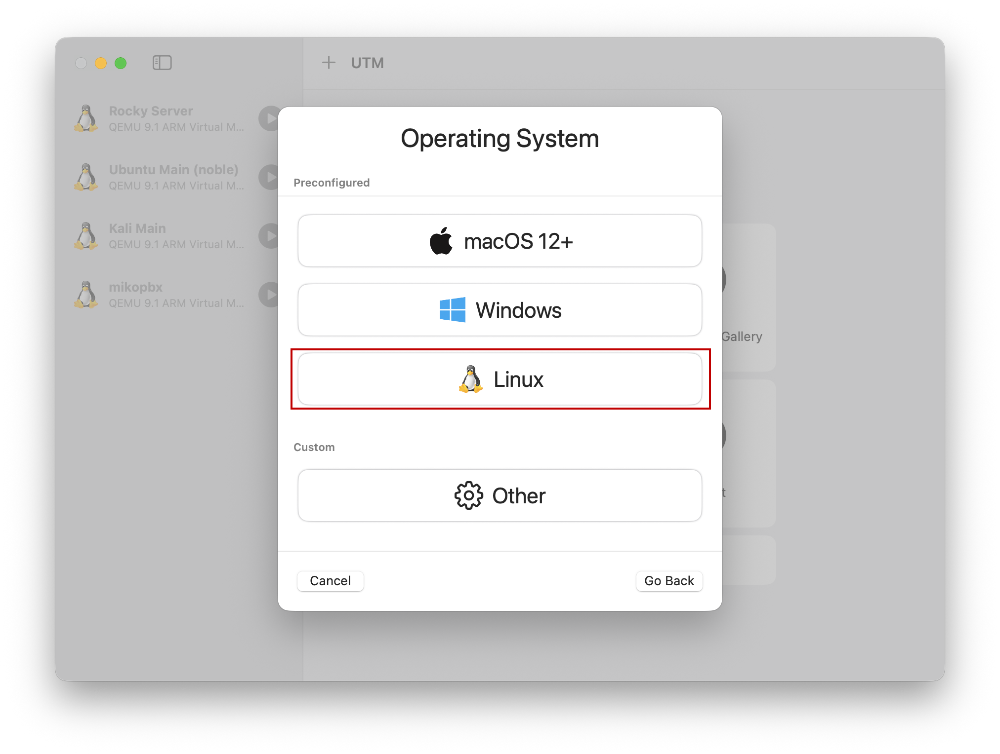
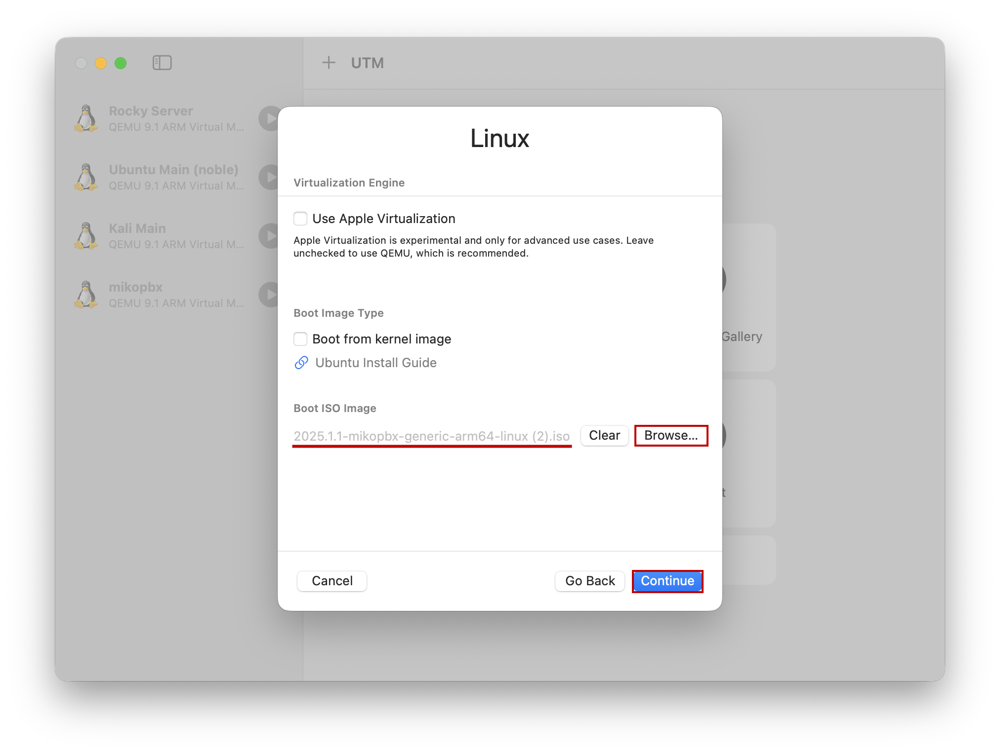
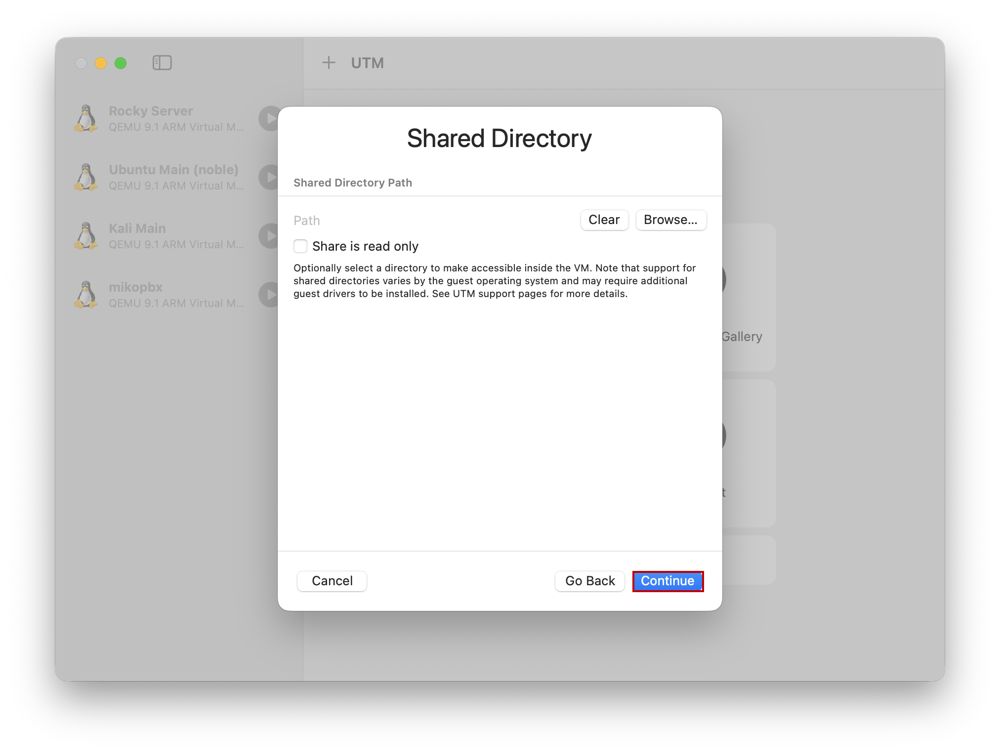
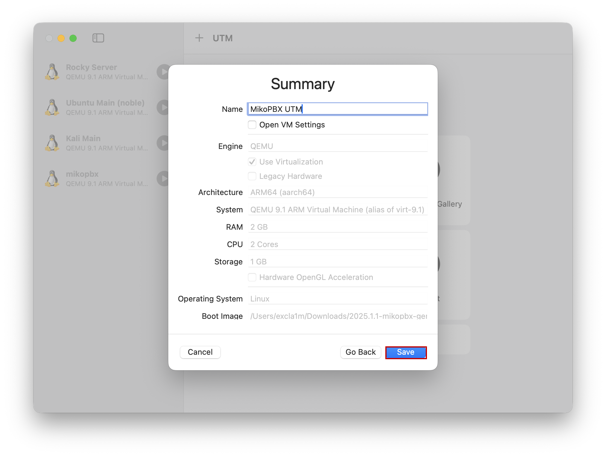
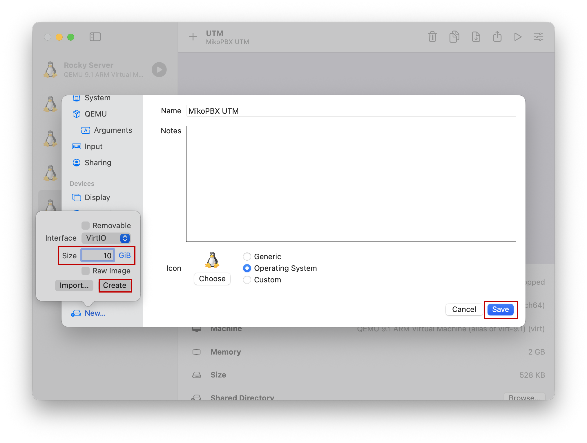
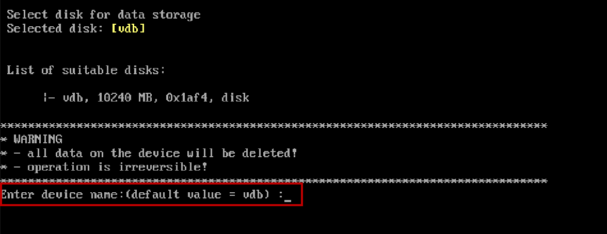

# UTM

In this manual, the installation will be performed on UTM. Before it starts, download the disk image file with the ".iso" extension. You can do this by [following this link](https://github.com/mikopbx/core/releases).&#x20;


This instruction has been relevant since the first release, published in 2026. Tested on Apple Silicon processors.


## Creating a virtual machine

1. Go to UTM. Click "Create a New Virtual Machine" to create a new virtual machine.

<figure><figcaption>
The main page of UTM. Creating a new VM.
</figcaption></figure>

2. Select "Virtualize" as the VM type.

<figure><figcaption>
Selecting the type of virtual machine
</figcaption></figure>

3. Select "Preconfigured" - "Linux" as the operating system type.

<figure><figcaption>
Choosing the type of operating system
</figcaption></figure>

4. Select the previously downloaded disk image file in the "Boot ISO Image" section. To do this, click on "Browse...".

<figure><figcaption>
Selecting a disk image file for a VM
</figcaption></figure>

5. Next, specify the characteristics of your virtual machine. In our case, 2 GB of RAM and 2 processor cores will be used.

<figure><figcaption>
VM Configuration
</figcaption></figure>

6. Next, specify the size for the system disk. In our case, 1 GB.


MikoPBX uses two disks:

1. The system disk. The system is installed on it, the recommended size is 1 GB.
2. A disk for storing recordings of conversations. The recommended size is from 50 GB.


<figure><figcaption>
Specifying the size of the system disk
</figcaption></figure>

7. Click Continue.

<figure><figcaption>
The "Shared Directory" section
</figcaption></figure>

8. The final configuration of the VM will be displayed. Give it the desired name (the "Name" field). And click "Save".

<figure><figcaption>
The final configuration
</figcaption></figure>

## Connecting a disk for data storage

1. Go to the VM settings. To do this, right-click on its name, then "Edit".

<figure><figcaption>
VM Settings
</figcaption></figure>

2. Go to "Drives". Click "New..."

<figure><figcaption>
"Drives" section
</figcaption></figure>

3. Create a new disk with the following parameters:

* **Interface** - VirtlO
* **Size** - at least 50 GB (in this documentation, 10 GB will be used for the test machine)

Click "Create".

<figure><figcaption>
Creating a second disk
</figcaption></figure>

## System installation

1. Start the VM.

<figure><figcaption>
Launching a VM
</figcaption></figure>

2. After loading, you will see the message <mark style="color:red;">PBX is running in Live or Recovery mode</mark>. This means that the system is loaded from the disk image in Live mode. It is necessary to install the system. To do this, go to the "\[8] Install on Hard Drive" section.

<figure><figcaption>
MikoPBX in LiveCD mode
</figcaption></figure>

3. Select the disk to install the system. In our case, vda and vdb disks are available, and we select the vda disk for installation.

<figure><figcaption>
Selecting a disk to install the system on
</figcaption></figure>

4. Confirm the selection: enter "**y**" from the keyboard and press Enter.

<figure><figcaption>
Confirming the disk selection
</figcaption></figure>

5. Next, select a disk for storing conversation recordings. In our case, the only remaining one is 10 GB size disk.

<figure><figcaption>
Selecting a disk for storing conversation recordings
</figcaption></figure>

After that, the system will reboot and be available in normal mode (the label "<mark style="color:red;">PBX is running in Live or Recovery mode</mark>" will disappear).

<figure><figcaption>
MikoPBX IP-address
</figcaption></figure>

Enter this IP address in the browser bar to access the Web interface.

<figure><figcaption>
MikoPBX Web-interface
</figcaption></figure>


Standard login information:

* Login: admin
* Password: admin

