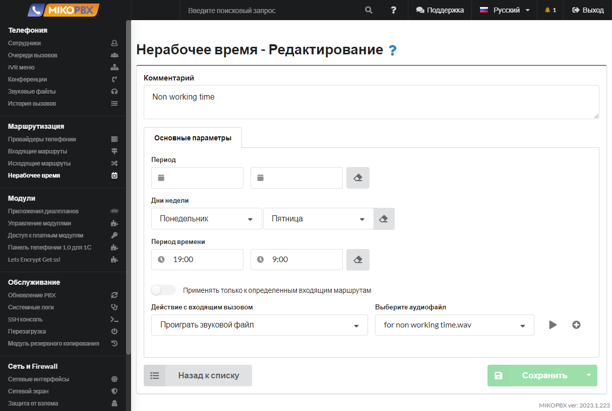
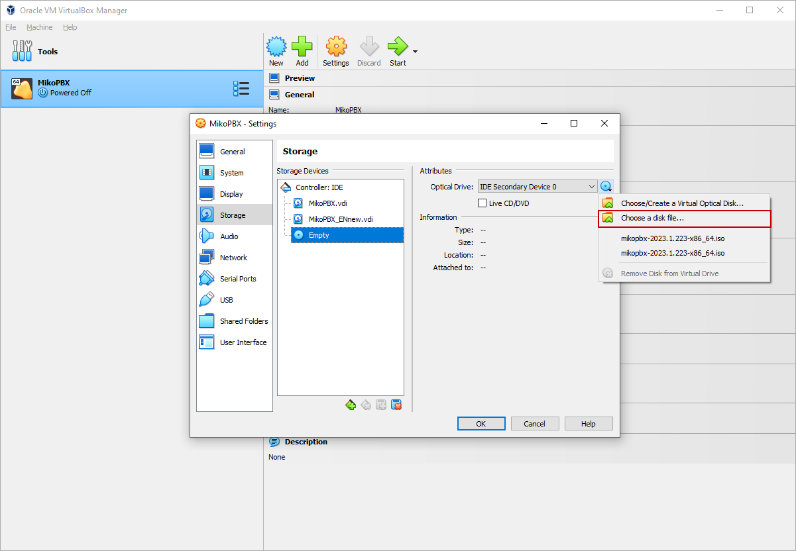
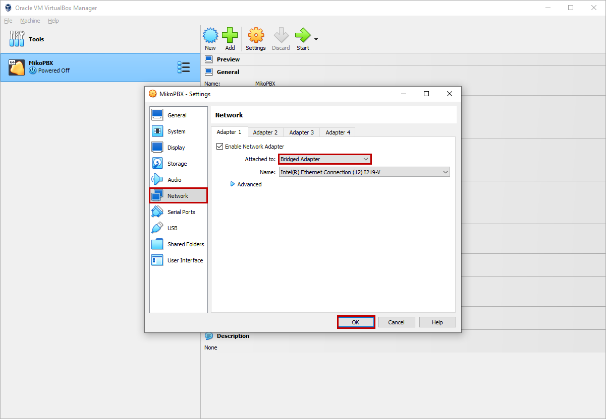
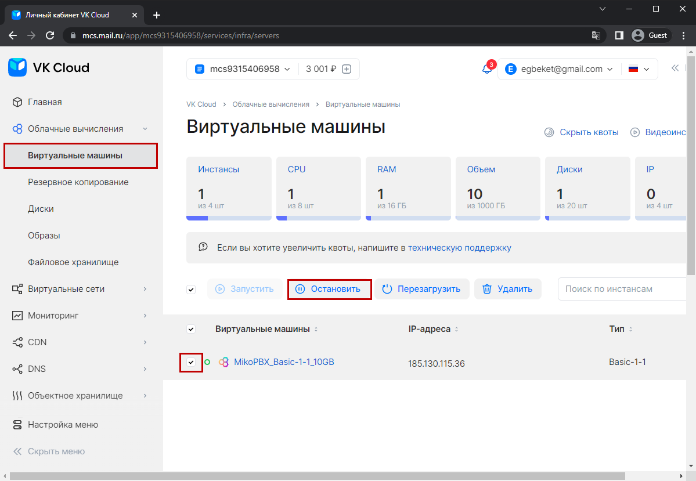
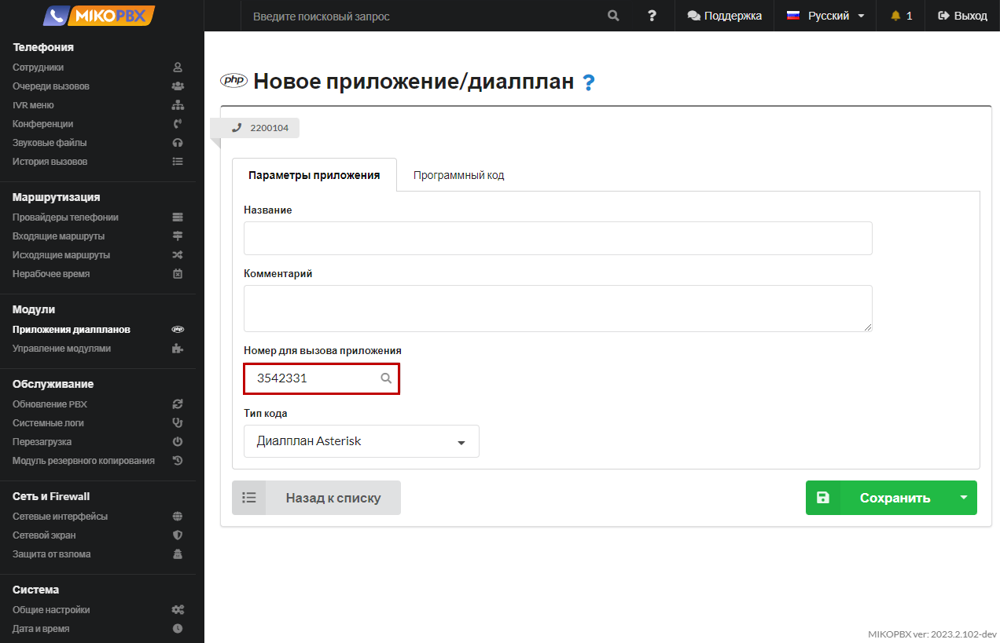
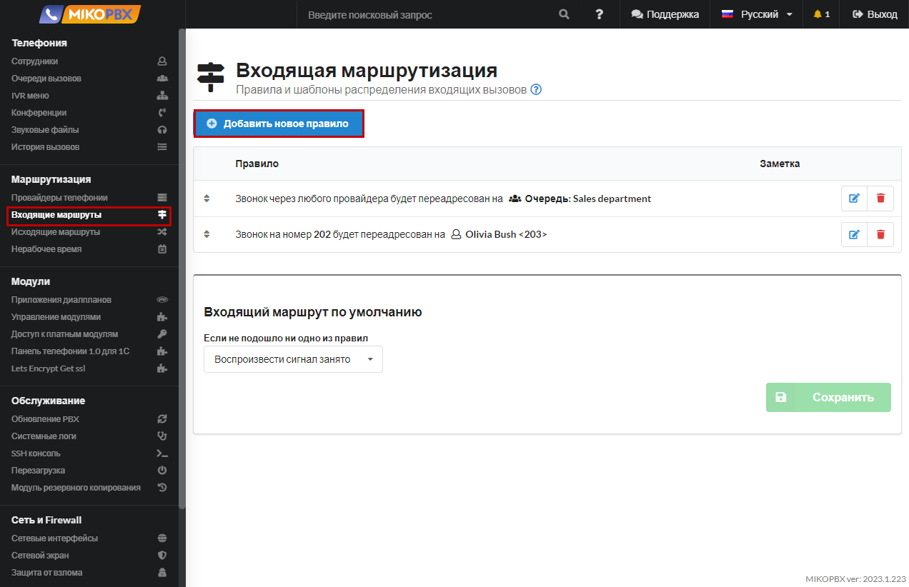
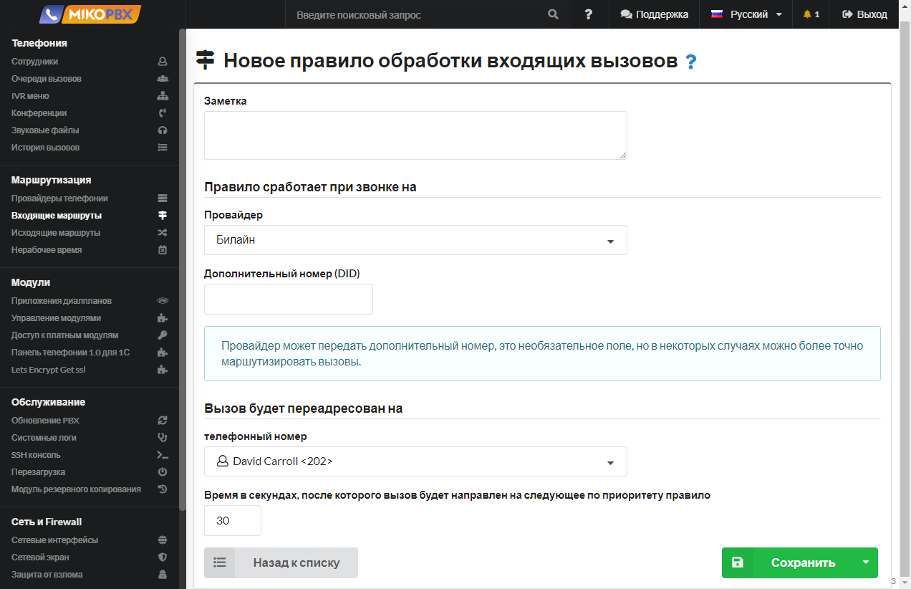
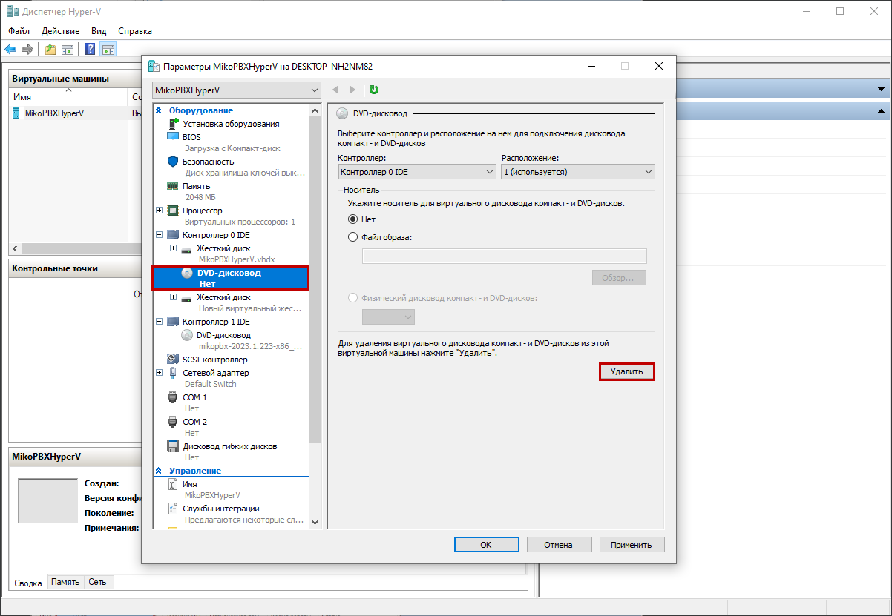
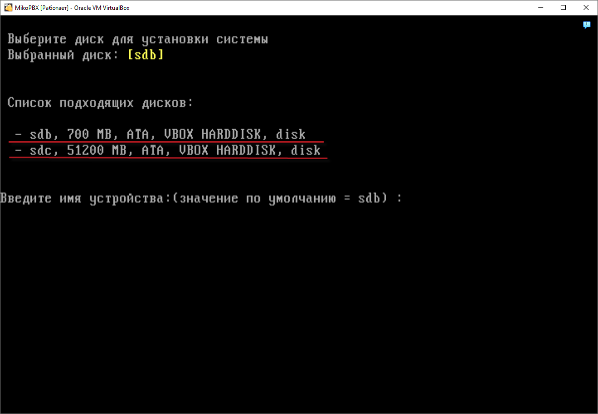
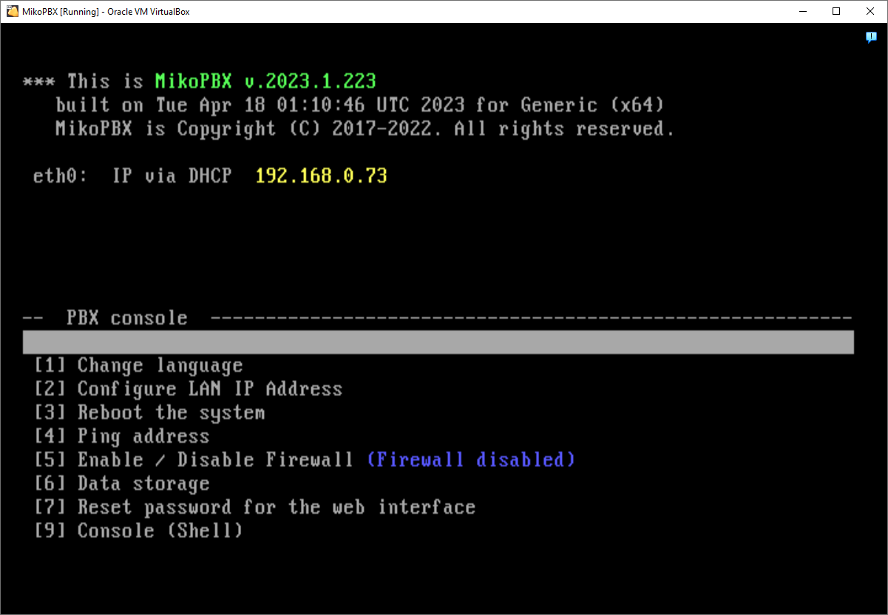

# VirtualBOX


Use versions of MikoPBX below 2024.1.114 for installation on VirtualBOX

Version 2024.1.114 temporarily does not support installation on VirtualBOX




## Create a virtual machine

1. Download **Virtual Box** from the [link](https://www.virtualbox.org/wiki/Downloads) and install it.
2. Create a new virtual machine.

.png>)

3. Specify the **Machine Name** and **Folder**.

**Type** - <mark style="color:green;">Linux.</mark>

**Version -** <mark style="color:green;">Other Linux (64Bit).</mark>

Click **Next**.

.png>)

4. Specify the size of the base memory - **1024 MB**, as well as the number of processors - **2**

Press **Next**.

.png>)

5. Select Create a new virtual hard disk. Enter a disk size of **700 MB**, and also check the box **"Pre-allocate Full Size"**

Click **Create**.

.png>)

6. Confirm the creation of the virtual machine: click **Finish**.

<figure><figcaption>
Summary configuration
</figcaption></figure>

## Setting up a virtual machine

1. Go to the settings of the created virtual machine.

To do this, click "**Settings" in the upper menu**.

2. Click the "**Storage"** tab. Add a new hard drive to store call records.

.png>)

3. In the window that appears, click **Create**.

.png>)

4. Select the hard disk format - **VDI (VirtualBox Disk Image).**

Click **Next.**

.png>)

5. The hard disk must be of a **fixed size**.

Check the box next to **"Pre-allocate Full Size"**

Click **Next.**

.png>)

6. Specify the **Name** of the created disk.

Set the Disk Size to about **50 GB**.

Click **Finish.**

.png>)

7. Choose the newly created drive and click **Select**.

.png>)

8. The created drive will appear in the media list.

.png>)

9. Please mount the MikoPBX image onto an optical disc. To do this, select the optical disc in the 'Media' section and click on the image file selection button in the 'Attributes' section.

.png>)

10. In the appeared menu, click on '**Choose a disk file..**.'

11. Select the downloaded **ISO disk image**.

<figure><figcaption>
List of MikoPBX images option. You need .iso image!
</figcaption></figure>

12. "Go to the '**Network**' tab.

Set the Connection Type to '**Bridged Adapter**'. Click '**OK**' to save all the settings you have made.

## Installantion MikoPBX 

1. Start the created virtual machine.

2. The command interface of the PBX will open. The PBX will start booting.

At this stage, MikoPBX is booting from the optical disc containing the ISO image. This is indicated by the message: '<mark style="color:red;">The system is loaded in Recovery mode</mark>'.


You can navigate through the menu items using the [arrow keys](https://en.wikipedia.org/wiki/Arrow_keys).

To select a menu item, press the Enter key.

Alternatively, you can select a menu item by pressing the corresponding [number on the alphanumeric keypad](https://en.wikipedia.org/wiki/Numeric_keypad)."


3. Install MikoPBX.


All data on the disk where MikoPBX is being installed will be lost


Click **Install.**

4. Information about all available disks will be displayed (in this example: sdb, sdc).


The disk where MikoPBX will be installed is referred to as the system disk (SYSTEM). You can choose a disk with a size larger than 500MB as the system disk.


5. Enter the name of the disk you referred to as the 'system disk' from the keyboard, in this case **sdb**, and press **Enter**. (If it is selected by default, you can simply press Enter).
6. The system will prompt for confirmation. Enter '**y**' and press **Enter**.

7. After completing the installation, you will be prompted to select a disk for storing call records.


Approximately, **1 hour** of conversation takes up **14MB** of disk space.


Enter the disk name (in this example, the only available disk is 'cdc') and press Enter.

8. After the installation is complete, the system will reboot.

MikoPBX will now run from the sdb drive where you installed it.

We will see that the line "<mark style="color:red;">The system is loaded in Recovery mode</mark>" is missing.

## The first login to MikoPBX

To access the control panel, you need to enter the IP address of your virtual machine in the browser's address bar.

<figure><figcaption>
IP address of your MikoPBX
</figcaption></figure>

<figure><figcaption>
Web-interface of MikoPBX
</figcaption></figure>


Default creditionals for the first login are:

Username - admin

Password - admin

System will ask to change them after the first login. It is important for the security of your MikoPBX.


The installation of MikoPBX using VirtualBOX is now complete.
