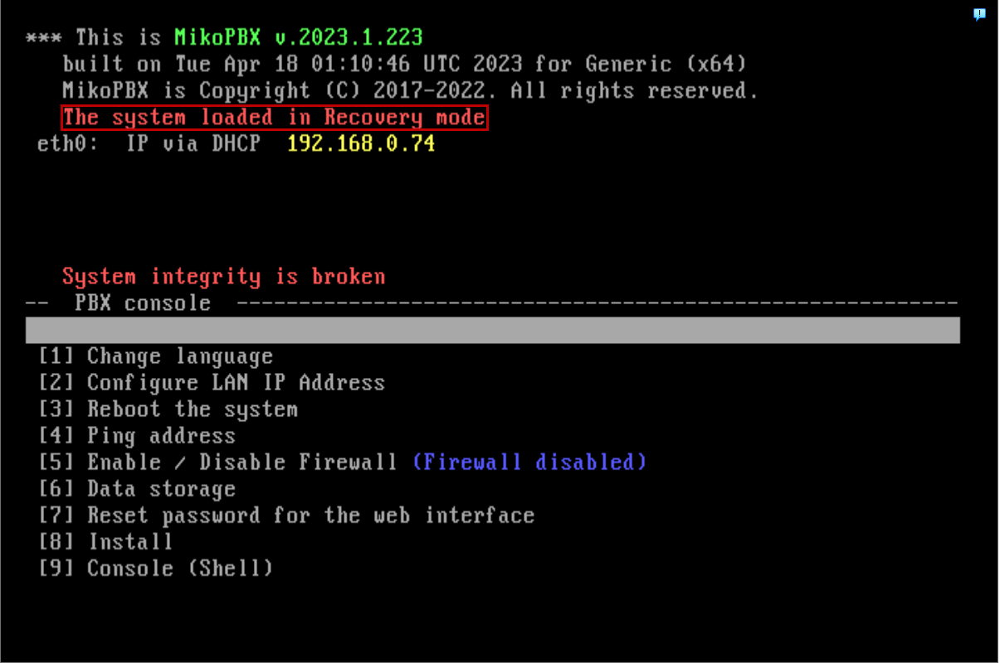
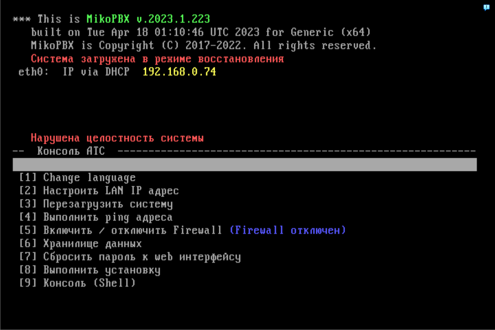
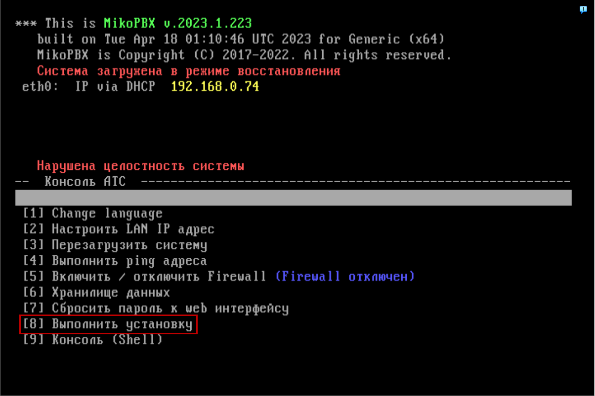
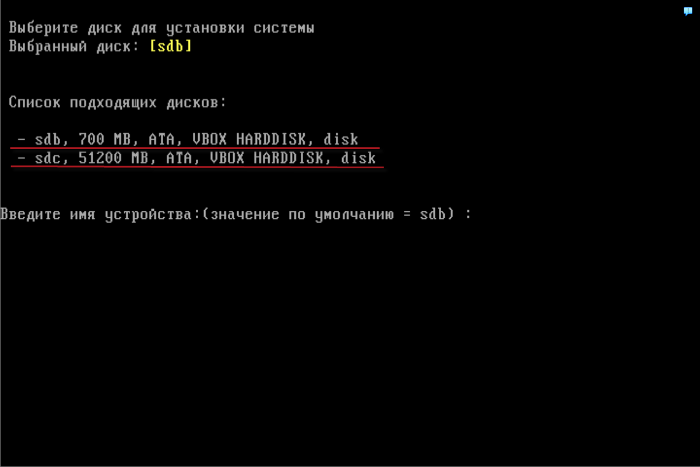
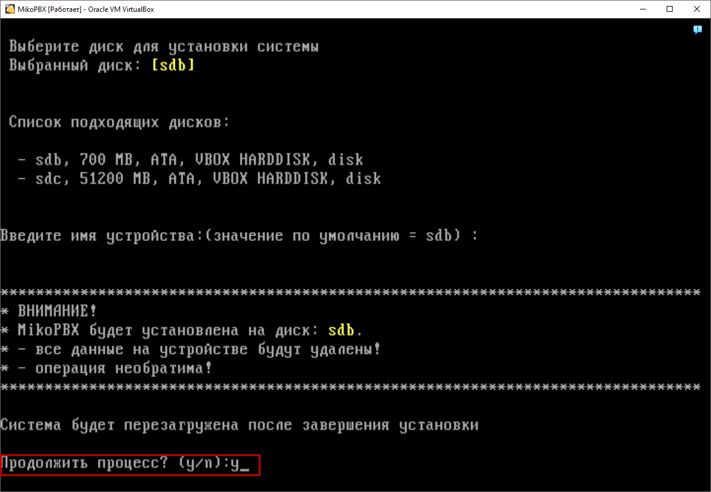
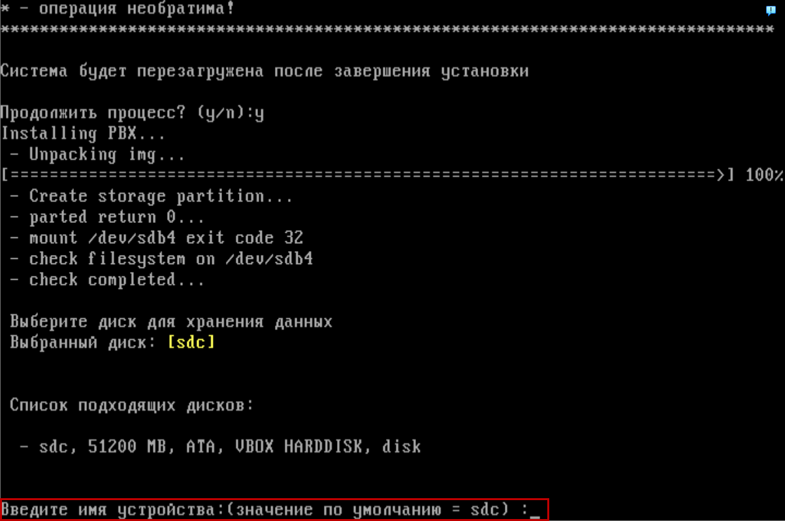
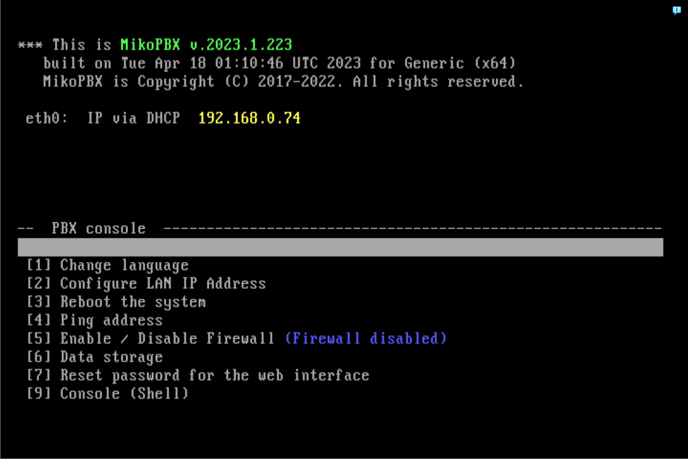
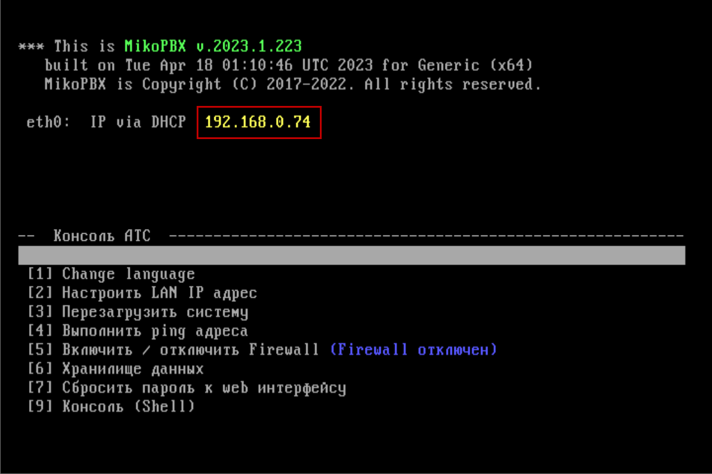
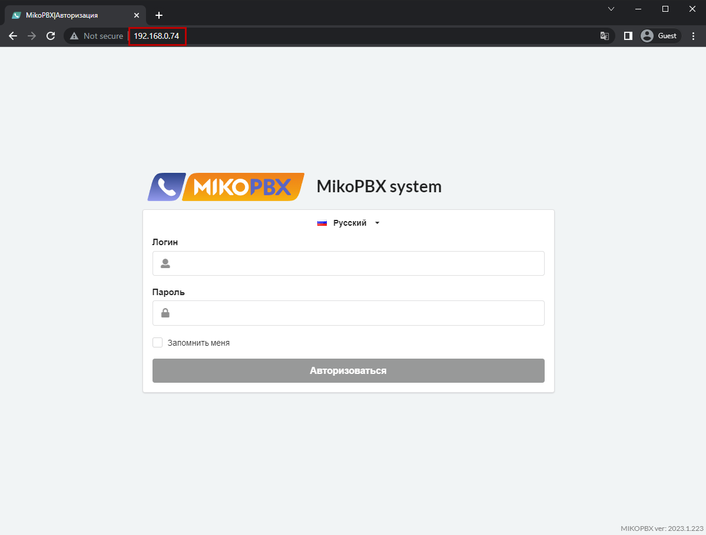

# VMware ESXi

## Создание виртуальной машины 

1. Создаём новую виртуальную машину
2. Указываем **Имя**, **Тип** и **Версию** виртуальной машины, как показано на изображении ниже.

<figure><figcaption>
Имя, Тип и Версия виртуальной машины
</figcaption></figure>

3. Выбираем хранилище для создания.
4. Для данной виртуальной машины выделяем объём оперативной памяти **1024 Мб**. Создаём **новый** виртуальный жёсткий диск для основной системы размером **500 Мб**.

<figure><figcaption>
Размер оперативной памяти и памяти для системного жесткого диска
</figcaption></figure>

5. Выбираем тип контроллера SCSI и тип адаптера, как на изображении ниже

<figure><figcaption>
Тип контроллера и тип адаптера 
</figcaption></figure>

6. Выбираем **BIOS** в качестве **Firmware**.

<figure><figcaption>
Раздел "Boot options"
</figcaption></figure>

7. Проверяем и сохраняем изменения.

## Настройки виртуальной машины 

1. Перейдём к настройкам созданной виртуальной машины. Создайте новый жесткий диск для хранения записей разговоров.


Для такого диска, мы рекомендуем указывать размер не менее, чем 50 ГБ


2. Переходим на вкладку носителей CD/DVD Drive. Загружаем iso-образ для установки. Ставим галочку слева от пункта "Connect as power on"

<figure><figcaption>
Загрузка образа системы
</figcaption></figure>

## Установка MikoPBX 

1. Запустите созданную виртуальную машину.
2.  Откроется командный интерфейс АТС. АТС начнет загружаться. &#x20;

    На данном этапе MikoPBX загружается с оптического диска, на который записан ISO-образ. На это нам указывает строчка: "<mark style="color:red;">**The system is loaded in Recovery mode**</mark>".

<figure><figcaption></figcaption></figure>


Перемещаться по пунктам меню можно [клавишами управления курсором](https://ru.wikipedia.org/wiki/%D0%9A%D0%BB%D0%B0%D0%B2%D0%B8%D1%88%D0%B8\_%D1%83%D0%BF%D1%80%D0%B0%D0%B2%D0%BB%D0%B5%D0%BD%D0%B8%D1%8F\_%D0%BA%D1%83%D1%80%D1%81%D0%BE%D1%80%D0%BE%D0%BC).

Выбрать пункт меню - клавиша **Enter**.

Также можно выбирать пункт меню нажав на [буквенно-цифровом блоке клавиатуры](https://ru.wikipedia.org/wiki/%D0%9A%D0%BE%D0%BC%D0%BF%D1%8C%D1%8E%D1%82%D0%B5%D1%80%D0%BD%D0%B0%D1%8F\_%D0%BA%D0%BB%D0%B0%D0%B2%D0%B8%D0%B0%D1%82%D1%83%D1%80%D0%B0#%D0%91%D1%83%D0%BA%D0%B2%D0%B5%D0%BD%D0%BD%D0%BE-%D1%86%D0%B8%D1%84%D1%80%D0%BE%D0%B2%D0%BE%D0%B9\_%D0%B1%D0%BB%D0%BE%D0%BA) соответствующую пункту цифру.


3. Переключите язык интерфейса на русский. Для этого выполните **Change Language -> Русский**. Меню примет вид:

<figure><figcaption></figcaption></figure>

4. Произведите установку MikoPBX.&#x20;


Все данные на диске, куда устанавливается MikoPBX, будут потеряны.


Нажмите **Выполнить установку.**

<figure><figcaption></figcaption></figure>

5. Отобразится информация о всех **доступных** дисках (в данном примере: **sdb**, **sdc**).

<figure><figcaption></figcaption></figure>

6. Введите с клавиатуры имя диска, который вы подразумевали под "системный", в текущем случае **sdb** и нажмите **Enter** (Если он выбран по умолчанию можно просто нажать **Enter**).
7. Система запросит подтверждение. Введите - **y** и нажмите **Enter**.&#x20;

<figure><figcaption></figcaption></figure>

8. После выполнения установки будет предложено выбрать диск для хранения записей разговоров.


Ориентировочно, **1 час** разговора занимает **14Мб** места на диске.


Введите имя диска (в данном примере - единственный доступный диск **sdc**) и нажмите **Enter.**

<figure><figcaption></figcaption></figure>

9. После завершения установки система перезагрузится.

Теперь MikoPBX будет запускаться с диска **sdb**, на который вы ее установили.\
Увидим, что строчка «<mark style="color:red;">**The system is loaded in Recovery mode**</mark>» отсутствует.

<figure><figcaption></figcaption></figure>

На этом установка MikoPBX завершена.

## Первый вход в MikoPBX

Для того, чтобы открыть панель управления вам надо вбить в строку браузера IP-адрес вашей виртуальной машины.

<figure><figcaption>
IP-адрес MikoPBX
</figcaption></figure>

<figure><figcaption>
Окно входа в веб-интерфейс 
</figcaption></figure>

Логин и пароль по умолчанию - **admin**

На этом установка MikoPBX на завершена.
